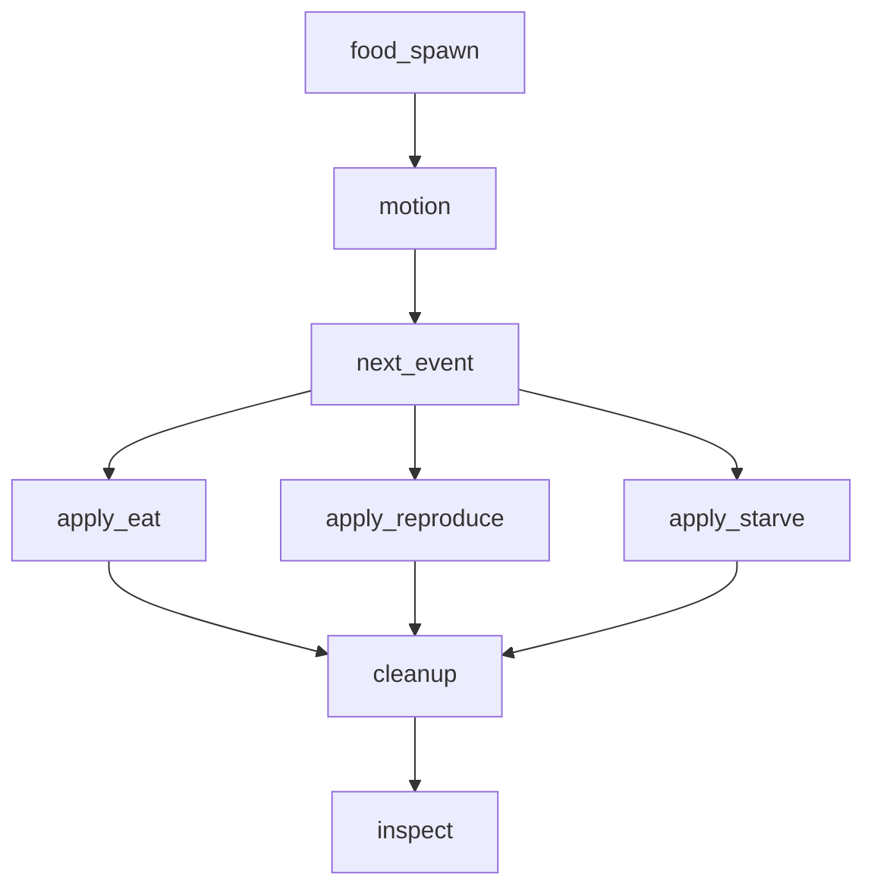
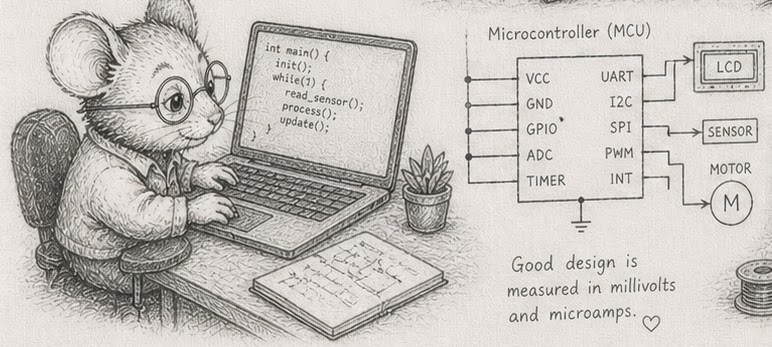

# An Introduction to Programming, using ECS & EBP in Rust

**Read it online: https://root-11.codeberg.page/intro-book/**

A book that teaches programming from first principles of data-oriented design, entity-component-systems (ECS), and existence-based processing (EBP). No prior programming experience assumed.

The through-line is a small ecosystem simulator built in stages from one hundred wandering creatures to a hundred million streamed ones. Forty-three sections; two-to-three pages of prose plus four-to-twelve compounding exercises each.

Found something wrong, unclear, or worth adding? [Open an issue.](https://codeberg.org/root-11/intro-book/issues)

<!-- BOOK_BEGIN -->

<!-- This block is generated by build.py - do not edit by hand. -->

_written by [Bjorn Madsen](mailto:drbjornmadsen@gmail.com)_
_updated: 2026-06-06_

> **Read online:** [Codeberg](https://root-11.codeberg.page/intro-book/) · [GitHub Pages](https://root-11.github.io/intro-book/)
>
> **Clone source** (the public default branch is the rendered book; the runnable code lives on `main`): `git clone --branch main https://codeberg.org/root-11/intro-book.git` · `git clone --branch main https://github.com/root-11/intro-book.git`
>
> **Issues:** [Codeberg](https://codeberg.org/root-11/intro-book/issues) · [GitHub](https://github.com/root-11/intro-book/issues)

<p align="center"></p>

This book teaches programming from first principles of data-oriented design, entity-component-systems (ECS), and existence-based processing (EBP). It assumes no prior programming experience and uses Rust as the only language.

The book is structured around forty-three concepts ([the DAG](concepts/dag.md)) and their canonical wording ([the glossary](concepts/glossary.md)). Sections are short - two to three pages of prose followed by four to twelve compounding exercises. Concepts are *named* only after they are *built*: every section earns its vocabulary through working code, not the other way around.

The through-line is a small ecosystem simulator built in stages from one hundred wandering creatures to a hundred million streamed ones. The simulator's specification is at [`code/sim/SPEC.md`](code/sim/SPEC.md).

This is a work in progress. Section ordering is by the DAG; reading order can be linear (front to back) or by following the cross-links wherever they lead.

## Who this book is for

You want to build something. You are either coming to programming from another field, or you tried it before and found that what got taught did not match what you wanted to make. You can read code; you may have written some; you have not been bitten enough to feel that programming is *yours* yet.

The book is for people who learn by building artifacts and want technical depth that *compounds* - where each new idea makes the previous one more useful, not just adds another tool to a pile. The through-line is a small ecosystem simulator that grows from a hundred creatures to a hundred million; everything you learn earns its keep on that one program, then transfers everywhere else.

It is not aimed at the median CRUD-application job market. If your goal is "any programming job, fastest," there are faster paths. If your goal is "the kind of programmer whose programs work," this is one of them.

## Background

You should be comfortable with high-school algebra and a command line - running a command, changing directories, reading error messages without panic. A laptop with internet is enough for the first ten sections; for the rest, you will install a Rust toolchain locally.

You do *not* need prior programming experience, calculus, a maths degree, or any prior contact with Rust. The book teaches Rust syntax as each section needs it; the language is a vehicle, not the subject.

## A first taste

Before any vocabulary is named, here is what an ECS world looks like in fifteen lines of Rust. One hundred creatures, each with a position and a velocity, moving for thirty ticks of simulated time. No structs, no traits, no libraries - four `Vec`s indexed in lockstep, and a function (the `for i in 0..x.len()` loop) that advances every creature one step.

```rust,editable
fn main() {
    let mut x:  Vec<f32> = (0..100).map(|i| (i as f32) * 0.1).collect();
    let mut y:  Vec<f32> = (0..100).map(|i| (i as f32).sin()).collect();
    let     vx: Vec<f32> = (0..100).map(|i| ((i * 7) % 11) as f32 * 0.01 - 0.05).collect();
    let     vy: Vec<f32> = (0..100).map(|i| ((i * 13) % 7) as f32 * 0.01 - 0.03).collect();

    for tick in 0..30 {
        for i in 0..x.len() {
            x[i] += vx[i];
            y[i] += vy[i];
        }
        if tick % 10 == 0 {
            println!("tick {tick}: creature 17 at ({:.2}, {:.2})", x[17], y[17]);
        }
    }
}
```

Click play. The simulator runs in your browser, prints three lines, and stops. That is the entire shape of what the rest of the book grows: tables (the `Vec`s), a tick (the outer loop), a system (the inner loop). Everything that follows is the discipline that lets this same shape carry a hundred million creatures without falling apart.

## Running the code

Most code blocks in the early chapters have a play button that runs the code in your browser via the [Rust Playground](https://play.rust-lang.org). Click it, edit, see the result. No setup required. The deck-game exercises in §5, §9, and §10 are designed to be run this way - open the page, hit play, work through the exercises in the editor that appears.

From the simulator chapters onward, the exercises stop being self-contained snippets. They build the through-line: a working Rust program that grows from one hundred wandering creatures to a hundred million streamed ones. Running them needs a local Rust toolchain, a project that holds state between runs, and the ability to time loops on your own hardware. By that point you will want a clone of the book's repo:

```sh
git clone https://codeberg.org/root-11/intro-book.git
cd intro-book
cargo run --release --bin sim
```

For the timing exercises in §1, the play button works but the numbers it produces are not yours - they come from a shared server the playground happens to be running on. The exercise asks "how fast does *your* machine run this?", and that question only has a real answer locally. Click play for a first taste; then run on your own hardware for the numbers the rest of the book references.

The threshold between *playground* and *local* is fuzzy by intent. A reader on a phone or in a classroom can stay in the browser through §10. Beyond that, treat a local toolchain as part of the curriculum.

## The companion edition

If you want to read the same book in a slow language and see what *discipline* must replace what the type system here enforces for you, the [Python edition](https://root-11.codeberg.page/intro-book-python/) covers the same forty-four sections in Python and `numpy`. The architecture is identical; the language differs. Many readers find Python a useful contrast: every borrow-check error here is a runtime mistake there, and the per-chapter Python commentary names the cost.


# Nomenclature

Quick reference for symbols, notation, and abbreviations the book uses. Concept *definitions* live in the [glossary](concepts/glossary.md); this page covers the shorthand only.

## Symbols

| Symbol | Meaning |
|---|---|
| §N | Section number - e.g., §5 refers to section 5. |
| → | Leads to / becomes / transitions to. Appears in section titles (e.g., §29 "10K → 1M") and prose. |
| `[!NOTE]` / `[!TIP]` / `[!WARNING]` | Callout box - content the reader should pay particular attention to. |

## Text formatting

| Form | Meaning |
|---|---|
| `monospace` | Code: types, variable names, function names, file paths. |
| *italic* | First definition of a term, or emphasis. |
| **bold** | A term being highlighted as load-bearing in the current paragraph. |

## Variables you will see across chapters

| Variable | Meaning |
|---|---|
| `i`, `j` | Index into a table. `i` is the index of the row currently under discussion. |
| `t` or `tick` | Tick number - the simulator's step counter. |
| `id` | Stable entity identifier (an integer). |
| `gen` | Generation counter, paired with a slot index to detect stale references (§10). |
| `pos`, `vel` | Position and velocity of a creature. |
| `to_remove`, `to_insert` | Buffers of pending mutations applied at end-of-tick (§22). |

## Rust types used in code

| Type | What it is |
|---|---|
| `Vec<T>` | Heap-allocated, growable array of `T`. The book's "table." |
| `&[T]` | Read-only borrow of a contiguous slice. |
| `&mut [T]` | Mutable borrow of a contiguous slice. |
| `usize` | Pointer-sized unsigned integer. Used for table indices. |
| `u8` / `u16` / `u32` / `u64` | Unsigned integers, sized in bits. |
| `f32` / `f64` | 32-bit and 64-bit floats. |

## Abbreviations

| Acronym | Expanded |
|---|---|
| ECS | Entity-Component-Systems |
| EBP | Existence-Based Processing |
| DOD | Data-Oriented Design |
| SoA | Structure of Arrays - each field is its own column. |
| AoS | Array of Structures - each row is its own struct. |
| DAG | Directed Acyclic Graph |
| IOPS | I/O Operations Per Second |
| TDD | Test-Driven Development |
| LRU | Least Recently Used (cache eviction policy) |

*EBP* is this book's shorthand. The spelled-out term - *existence-based processing* - is Richard Fabian's, from [*Data-Oriented Design*](https://www.dataorienteddesign.com/dodbook/); §17 introduces it from the simulator. An acronym index will not list "EBP" because the source literature spells the term out rather than abbreviating it.

## Naming in code

- `snake_case` for variables, functions, fields.
- `PascalCase` for types and traits.
- `SCREAMING_SNAKE` for constants.
- File names mirror their dominant content: `creatures.rs` defines the creature table, `motion.rs` the motion system.


# 1 - The machine model

<p align="center"></p>

Most explanations of "how a computer works" use a diagram with a CPU and a single big block called *memory*. The diagram is wrong. Memory is many things at different speeds, and which one your data sits in decides whether your program is fast or slow.

Inside the CPU there is **L1 cache** - small, sometimes only 32 KB per core, but a read from it costs about one nanosecond. Around it sits **L2** - a few hundred KB, around 3-4 ns. Then **L3** - measured in megabytes, around 10 ns. Outside the CPU sits **main memory (RAM)** - gigabytes, around 100 ns per read. The numbers vary by chip, but the *ratios* are stable: L1 is roughly a hundred times faster than RAM. Cache and RAM are the same kind of thing - bytes that the CPU reads - but they sit at very different distances from the arithmetic units.

When your code reads `vec[17]`, the CPU does not pull just byte 17. It pulls a whole 64-byte chunk - a *cache line* - and keeps that line in L1. The next read of `vec[18]` is then almost free. Reading sequentially through a `Vec` is fast because every line that gets loaded is mostly used before it gets evicted. Reading at random is slow because every read costs a fresh trip to RAM.

A pointer is an address in memory. Following one - `*ptr` - is one memory read at an address the CPU does not get to predict. If the address is in cache, the read is fast; if not, you wait the full ~100 ns. A program with many objects and many pointers between them is a program with many of those waits.

That asymmetry is the dominant fact about modern CPUs. The arithmetic - adding, multiplying, branching - is virtually free; the cost is *getting the data to the arithmetic*. A program that respects this is fast. A program that ignores it can be a hundred times slower<sup>2</sup> than a program that does the same work, with the same number of additions, but in a layout the cache likes.

This is also what makes "complexity class" misleading on its own. An O(N log N) algorithm that hits the cache hard can outrun a "faster" O(N) algorithm that scatters reads across RAM. Big-O describes how cost grows with N; layout describes the constant factor that gets multiplied in. At the scales this book targets, the constant factor often wins.

You will *measure* this in the next two sections. The numbers above are nominal - the chip in front of you may be slightly faster or slightly slower, and the ratios are what matters. Once you have felt how big the gap is, the rest of the book's reasoning about layout, SoA, locality, and parallelism follows naturally.

## Measurements

Reference values for these calibrations - yours will differ by machine, and the spread is the point. Full per-machine output: `code/README.md`.

| # | measurement | Ryzen 9 (modern) | i7-3610QM (2012) | i3-5010U (2015) | Pi 4 |
|---|---|---|---|---|---|
| 1 | Vec sum, ns/element at N = 100M | 0.14 | 0.44 | 0.70 | 2.03 |
| 2 | pointer-chase vs Vec sum, 1M (random ÷ sequential) | 270x | 120x | 103x | 63x |
| 3 | cache cliffs visible in the ns/element staircase | 1 (L3→RAM) | 3 | 2-3 | 3 |

## Exercises

These exercises are calibrations. Run them on your machine and write the numbers down - the rest of the book references them.

1. **Look up your cache sizes.** On Linux, `lscpu | grep -i cache` lists L1d, L1i, L2, L3 per core. Write them down. (On macOS: `sysctl -a | grep cache`.) These are the budgets node 25 will hold you to later.
2. **Time a sequential sum.** Build a `Vec<u64>` of 100,000,000 elements (use `vec![1u64; 100_000_000]`), then time `vec.iter().sum::<u64>()`. Use `std::time::Instant`. Note the time per element in nanoseconds.
3. **Time a random-access sum.** Build the same `Vec<u64>`, plus a `Vec<usize>` of 100,000,000 random indices. Time the loop `let mut s = 0u64; for &i in &indices { s += vec[i]; }`. Compare with exercise 2.
4. **Find the cache cliffs.** Repeat exercise 2 at sizes 1K, 10K, 100K, 1M, 10M, 100M. Plot `time/element` (or just print it). Note the size at which it jumps - that's where you spilled out of L1, then L2, then L3.

> [!NOTE]
> What you see depends on your CPU. On older or smaller chips (Raspberry Pi 4 Cortex-A72, 2012 i7-3610QM, 2015 i3-5010U), the L1, L2, and L3 transitions appear as a graded staircase in ns/element. On modern desktop chips, a stronger prefetcher and wider SIMD often merge L1/L2/L3 into a single visible cliff at the L3→RAM boundary. Both are correct - both teach the same point. If you see one cliff on your machine, repeat the exercise with random indices (the §1.3 pattern) to surface the others.

5. **Pointer chasing.** Build a linked list of 1,000,000 `Box<Node>` where `Node { value: u64, next: Option<Box<Node>> }`. Time a sum that walks the list. Compare with the same sum on a `Vec<u64>` of the same length. The ratio is roughly the L1-to-RAM ratio.

> [!NOTE]
> The ratio depends on your CPU. Measured: ~60× on a Raspberry Pi 4, ~90-115× on mid-2010s Intel laptops, ~270× on a Ryzen 9 270. The wider gap on newer hardware reflects faster cores running ahead of an unchanged DRAM latency. The order of magnitude (60-270×) is robust; the exact factor is not. Note also: a list built by `for i in (0..N).rev() { Box::new(...) }` allocates the boxes at *sequential* heap addresses - the chase looks free. Shuffle the order in which you thread them to surface the real cost.

6. *(stretch)* **Read your `lscpu` output to your benchmarks.** With your cache sizes from exercise 1 and your timings from exercise 4, identify which level of cache each size step is leaving. The transitions are not always clean - annotate where they are noisy.

Reference notes for these exercises in [01_the_machine_model_solutions.md](https://root-11.codeberg.page/intro-book/trunk/01_the_machine_model_solutions.html).

## What's next

The numbers you wrote down in exercise 1 and the cliffs you found in exercise 4 are the constants behind the whole book. [§2 - Numbers and how they fit](#2---numbers-and-how-they-fit) takes the next step: how big is each unit of data, and how many fit in a cache line?


# 2 - Numbers and how they fit

<p align="center"></p>

A cache line is 64 bytes on x86 and most ARM chips - the unit of memory the CPU loads at a time. (A few designs differ: some Apple Silicon cache levels use 128; §33 has the details.) This book assumes 64 throughout. Everything you do with data is, in part, a question of how many things fit in one cache line.

Rust gives you several integer widths: `u8` (one byte, 0 to 255), `u16` (two bytes, 0 to 65 535), `u32` (four bytes, around four billion), `u64` (eight bytes, around 1.8×10¹⁹). The signed versions - `i8`, `i16`, `i32`, `i64` - use one bit for the sign and the rest for magnitude. For floating-point: `f32` (four bytes, ~7 decimal digits of precision), `f64` (eight bytes, ~15 decimal digits).

A `Vec<u8>` of length N is N bytes. A `Vec<u64>` is 8N bytes. So a `Vec<u8>` fits 64 elements per cache line; a `Vec<u64>` fits 8. Walk the whole vector and the `u64` version pulls in 8× as many cache lines as the `u8` version: the same element count, eight times the bytes<sup>1</sup>.

This is the *width budget*. Picking a wider type than you need is not free; it costs cache lines, and at the scales this book targets, cache lines are the budget you spend.

The rule is simple: pick the narrowest type that holds your range, and write down why. A 52-card deck's `suits` need 4 values, `ranks` need 13, `locations` need maybe 8 - all fit in `u8`. A creature's `pos` needs about ten kilometres of grid resolved to centimetre precision; that fits in `f32`. A timestamp in microseconds for a year-long simulation needs something like 3×10¹³, which does not fit in `u32` (4×10⁹) but fits comfortably in `u64`. Choose, and write the choice down.

Floats are the trickier case. They look like real numbers but are not. There are only about 4 billion `f32` values; there are only about 18 quintillion `f64` values; that is finite. Operations have edges: `1.0 / 0.0 = inf`, `0.0 / 0.0 = NaN`, and `NaN != NaN` - yes, equality is broken on purpose, because there is no reasonable answer. Subtracting two nearly equal floats loses most of their precision (this is *catastrophic cancellation*). Adding a tiny float to a large one quietly drops the tiny one (this is *absorption*). None of this is a problem if you know it is there; all of it is a problem if you assume floats are mathematics.

Most of this book uses `u8`, `u16`, `u32`, `f32`, and `u64` for time. `i*` and `f64` appear when the range or precision genuinely demands it. The choice is documented at every column declaration.

## Measurements

Eight times the bytes is *less* than eight times the time - the sum is bandwidth-bound, not purely line-count-bound, and a wider type also feeds the prefetcher more to chew on. Full output: `code/README.md`.

| # | measurement | Ryzen 9 (modern) | i7-3610QM (2012) | i3-5010U (2015) | Pi 4 |
|---|---|---|---|---|---|
| 1 | u8 vs u64 sum, N = 100M | 1.8x | 2.0x | 2.5x | 4.6x |

## Exercises

1. **Sizes.** Print `std::mem::size_of::<u8>()`, `<u16>`, `<u32>`, `<u64>`, `<i32>`, `<f32>`, `<f64>`, `<usize>`. Confirm `usize` is 8 on a 64-bit machine.
2. **Cache-line packing.** For each type above, compute how many fit in a 64-byte cache line. A `Vec<u32>` of 16 elements is exactly one line; a `Vec<u64>` of 8 elements is exactly one line.
3. **Width and speed.** Sum a `Vec<u8>` of 100,000,000 ones, then a `Vec<u64>` of the same length. Compare times. Some of the difference is memory bandwidth (8× more bytes); some is cache pressure.
4. **Float weirdness.** Compute `0.0_f64 / 0.0_f64`, `1.0_f64 / 0.0_f64`, and `(0.0_f64).sqrt()`. Print them. Then check `let nan = 0.0_f64 / 0.0_f64; assert!(nan != nan);` - confirm it does not panic.
5. **Catastrophic cancellation.** Compute `1e10_f32 - (1e10_f32 - 1.0_f32)`. The result should be `1.0`; on `f32` it usually is not. Repeat with `f64` and observe it gets closer.
6. **Choose a width.** For each of these columns, write down the type you would pick and why: a creature's age in ticks at 30 Hz over a year-long simulation; a card's suit; the pixel count of a 4K screen; the user id in a system with up to 100 million users; an audio sample value in 16-bit PCM.
7. *(stretch)* **The actual range of `f32`.** Read [the `f32` documentation](https://doc.rust-lang.org/std/primitive.f32.html). What is `f32::MAX`? `f32::EPSILON`? What does the latter mean for a sum of small numbers?

## What's next

[§3 - The `Vec` is a table](#3---the-vec-is-a-table) takes the next step: now that you know how big the elements are, what does a `Vec<T>` *do* with them?


# 3 - The `Vec` is a table

<p align="center"></p>

A `Vec<T>` is three things stored on the stack: a pointer to a contiguous run of `T` values on the heap, the current length, and the current capacity. The values themselves live on the heap, side by side, with no padding between them. `vec[i]` computes `ptr + i * size_of::<T>()` and reads.

This is the only container the trunk of this book uses. There are no hash maps, no linked lists, no trees - not because they do not exist, but because almost every problem the book teaches is a problem of "process all the rows of a table", and a `Vec<T>` *is* the table. Adding any other container costs cache, costs allocations, and breaks the sequential-access pattern that nodes 1 and 2 just told you to want.

`vec.push(x)` adds an element. If there is capacity, it writes into the next slot - O(1). If not, it allocates a larger heap region (typically twice the current capacity), copies everything across, and frees the old one. Amortised over many pushes that is O(1), but each individual push *might* be expensive. If you know how many elements you are going to insert, `Vec::with_capacity(n)` allocates once and avoids the copies.

`vec.swap_remove(i)` removes the element at `i` in O(1) by moving the last element into the freed slot. Order is sacrificed for speed. This will earn its keep at [§21](#21---swap_remove).

`vec.iter()` walks the slots in order. The compiler can usually turn this into a tight memory-bandwidth-bound loop with auto-vectorisation. `vec.iter_mut()` does the same, with mutation.

A `&[T]` is a *slice* - a pointer plus a length, without the capacity. It is what functions usually take when they want to read a `Vec` without owning it. `&mut [T]` is the same with mutation. Most systems in this book have signatures like `fn motion(px: &mut [f32], py: &mut [f32], vx: &[f32], vy: &[f32])` - read these, write those, no ownership taken.

That is the full vocabulary you need from `Vec` for the next several phases. Everything else (`HashMap`, `BTreeMap`, `Box<Node>`, `Rc<RefCell<T>>`, `LinkedList`) is something you will reach for only when an exercise demands it and the from-scratch test (node 40) shows it earns its weight.

## Measurements

Order of magnitude (60-200×) is the durable claim; the exact factor widens with the machine because the `Vec` sum vectorises and prefetches and `HashMap::get` cannot. Full output: `code/README.md`.

| # | measurement | Ryzen 9 (modern) | i7-3610QM (2012) | i3-5010U (2015) | Pi 4 |
|---|---|---|---|---|---|
| 1 | Vec index vs HashMap get, 1M | 160x | 89x | 77x | 65x |

## Exercises

1. **Layout.** Print `std::mem::size_of::<Vec<u32>>()`. It should be 24 on a 64-bit machine - three pointer-sized fields. Notice that the size of the *Vec value* does not depend on how many elements it holds.
2. **Capacity vs length.** Build `let mut v: Vec<u32> = Vec::new();`. In a loop from 0 to 100, print `v.len()` and `v.capacity()` after each `v.push(i)`. Observe the capacity doubling pattern: 0, 4, 8, 16, 32, 64, 128.
3. **Pre-size.** Build `let mut v = Vec::with_capacity(100);` and push 100 elements. Print `len` and `capacity` once at the end. There were no reallocations.
4. **Indexing cost.** Time `vec[i]` on a 1M `Vec<u32>` accessed sequentially. Compare with the same access on a `HashMap<usize, u32>` of the same size. Sequential `Vec` reads should be ~10-100× faster<sup>1</sup>.

> [!NOTE]
> Measured ratios: ~65× on a Raspberry Pi 4, ~90-95× on mid-2010s Intel laptops, ~160× on a Ryzen 9 270. All use Rust's default `HashMap` (SipHash). Modern hardware widens the gap because the `Vec` sum is auto-vectorized and well-prefetched; `HashMap::get` cannot be either. Order-of-magnitude (60-200×) is the durable claim.

5. **`swap_remove` vs `remove`.** Build a `Vec<u32>` of 1,000,000 elements. Time removing 100 elements from the middle with `vec.remove(500_000)` (in a loop, because each `remove` shifts roughly half the vector). Time the same with `vec.swap_remove(500_000)`. Note the orders-of-magnitude difference.
6. **Slices in function signatures.** Write `fn sum(xs: &[u32]) -> u64`. Call it with `sum(&v)` where `v: Vec<u32>`. Note that you did not have to write `&v[..]` - the conversion is automatic.
7. *(stretch)* **A from-scratch `MyVec<u32>`.** Implement `MyVec` with a raw pointer, length, and capacity. Implement `new`, `push`, `get`, and `Drop`. (You will use `unsafe`. Read [the Rustonomicon's `Vec` chapter](https://doc.rust-lang.org/nomicon/vec/vec.html) when stuck.) Convince yourself a `Vec<T>` is a few hundred lines of careful work, no magic.

## What's next

[§4 - Cost is layout, and you have a budget](#4---cost-is-layout---and-you-have-a-budget) is where the layout reasoning from §1 and §2 meets the per-tick clock the rest of the book runs on. After that, [§5 - Identity is an integer](#5---identity-is-an-integer) is the card game.


# 4 - Cost is layout - and you have a budget

A program runs at some *target rate*. A game runs at 30 Hz or 60 Hz; an audio loop at 48 kHz; a control loop at 1 kHz; an interactive shell at "as fast as a human can type". The target rate sets a *budget* - the time available for one tick of work.

|     Target rate | Budget per tick |
|----------------:|----------------:|
|           30 Hz |          33 ms  |
|           60 Hz |          17 ms  |
|         1000 Hz |           1 ms  |
|       1 000 000 |        1 µs     |

Every operation the program does in one tick spends from that budget. Operations have very different costs: the arithmetic is virtually free, an L1 read is around 1 ns, an L3 read is around 10 ns, a RAM read is around 100 ns, a disk read is around 100 µs, a network round-trip is around 100 ms. A 30 Hz program spending one disk read per tick has lost a third of its budget on one operation.

> [!NOTE]
>
> Three regimes are worth naming, because the rest of the book references them. A loop is **compute-bound** when its cost is dominated by arithmetic - typically when the data fits in L1 and the inner instructions are heavy (dot products, transcendentals, integer divides). It is **bandwidth-bound** when its cost is dominated by how fast the memory subsystem can deliver bytes - typically when the working set is bigger than L3 *but* the access pattern is sequential, so the prefetcher can fill lines ahead of demand. It is **latency-bound** when its cost is dominated by individual memory round-trips - typically when the access pattern is random, so the prefetcher cannot help. The three regimes have very different time budgets and very different power profiles. A sequential `Vec<u64>` sum on a modern desktop is bandwidth-bound at ~50 GB/s, roughly 0.15 ns per element. The same `Vec` accessed by random index is latency-bound at one full RAM round-trip per element, roughly 50-100 ns per element - three orders of magnitude slower, despite the same arithmetic. The lesson of node 4 is that complexity-class reasoning cannot tell these regimes apart, but they are the difference between a program that meets its tick budget and one that does not.

The unit of accounting is **time** - microseconds for most real-time work, nanoseconds for tight inner loops. A 30 Hz tick has 33 ms (33 000 µs) of budget; a 1 kHz tick has 1 000 µs; a 1 MHz tick has 1 µs. When a teacher asks you "what does this function cost?", they are asking how many microseconds it takes. A function that costs 100 µs out of a 33 000 µs budget is fine - about 0.3% of the tick. The same function in a 1 000 µs budget is 10% of the tick. The same function in a 1 µs budget does not exist; there is no room for it.

Cost is also *layout*. The same algorithm that costs 100 µs on a sequential `Vec` may cost 5 ms on a hash map of the same size, because the loads scatter. Two programs with the same big-O complexity can differ by an order of magnitude on the same hardware, just because of where their data sits.

This gives you a design rule. *Decide your target rate before you decide anything else.* That sets the budget. Then when you choose data structures, ask whether the resulting working set fits in cache; ask how many memory loads per row your inner loop does; ask whether any single operation in the loop dominates the budget. Most decisions become forced once the budget is named.

The reverse direction is also useful. If you find yourself wanting to *add* something to the inner loop - a database query, a HashMap lookup, an allocation - count its cost in microseconds against the budget. Often the answer is "this single addition uses 80% of my tick", and the right move is not to optimise it but to lift it out of the inner loop entirely.

<p align="center"></p>

The shape of this thinking is familiar to engineers in other domains. An electrical engineer designs a circuit by counting milliamps against a current budget. A structural engineer counts kilonewtons against a load budget. The data-oriented programmer counts memory loads and microseconds against a tick budget. *Good design is measured in millivolts and microamps* - and in nanoseconds and microseconds.

> [!NOTE]
>
> *Time is one budget. Power is another.* Cache hits are energetically nearly free - the data is already next to the arithmetic units. Cache misses fire up the memory controller, the bus drivers, sometimes a DRAM refresh; that is where the watts go. A loop that fits in L2 spends most of its time on cheap arithmetic; a loop that pointer-chases through RAM spends most of its time *waiting*, and during the waiting the CPU drops clocks and the chip stays cool. The same SoA-and-sequential-access discipline that fits the time budget also fits a power budget. For embedded, mobile, control, and battery-powered work, power is the *primary* budget; time is downstream of it. The "millivolts and microamps" line above is literal, not metaphor.

## Exercises

1. **Pick your rates.** For each of these systems, name a plausible target rate and the resulting per-tick budget: a card game; a real-time strategy game; a market data feed; an embedded sensor controller; a web API endpoint a user is waiting for; an offline batch job that processes a billion rows.
2. **Count an operation.** Time a single `HashMap::get` on a map of 1 000 000 entries. Note its cost in microseconds. How many can you fit in a 30 Hz tick (33 ms)? In a 1 kHz tick (1 ms)?
3. **The layout difference.** Sum 1 000 000 `u64`s in a `Vec<u64>`. Sum 1 000 000 `u64`s in a `HashMap<u32, u64>`. Both are O(N). What is the per-element time difference (in nanoseconds)? Where did it go?
4. **The cliff.** With your numbers from [§1 exercise 4](#1---the-machine-model#exercises), pick a `Vec` size that just fits in L2 and one that just doesn't. Time a sum loop at each size. The cliff is real.
5. **Working backwards from the budget.** You target 60 Hz; your inner loop runs over 100 000 entities; each entity touches one cache line. Estimate the cost of the loop in microseconds and compare to your 60 Hz budget (16 666 µs). Where is your headroom?
6. **A bad design.** Construct a design that is "obviously fast" by big-O reasoning but blows the 30 Hz budget on a million entities. (Hint: object-graph traversal with one heap allocation per node is a classic.)
7. **Find your CPU's TDP.** Look up your CPU's rated thermal design power on the manufacturer's spec sheet, or read it locally on Linux with `sudo dmidecode -t processor | grep -i 'power\|TDP'`. Note the value. TDP is what the chip can dissipate sustained without thermal throttling - burst can be 1.5-2× higher for tens of seconds; sustained settles back to TDP.
8. **Battery budget.** A typical laptop battery holds about 50 Wh. Your simulator runs at 30 Hz and draws an average of 8 W (mostly memory bandwidth on the inner loop). How many hours of simulation does a full charge buy? If a layout change pushes more loads to RAM and raises the average draw to 14 W, how many hours then? Express the cost of the layout change as a percentage of battery life.
9. **Measure delta power.** A ready-made workload generator lives at `code/measurement/`. In one terminal: `cargo run --release --bin power_loop -- sequential` (then in a second run: `... -- random`). In another terminal, while the loop is running: `sudo perf stat -a -e power/energy-pkg/ -- sleep 30` reads the package-energy counter over 30 seconds. Run the perf command three times - idle, sequential, random - and write the joules down. Convert each to average watts. The random-access run should draw more watts than the sequential one, which should draw more than idle.

   While you are there: from `power_loop`'s iteration count, compute your sequential read bandwidth - `iterations × 10⁷ × 8 / 45` gives bytes per second - and compare to the published peak of your DDR generation. If you get within a factor of two of peak, your inner loop is *bandwidth-bound* (the regime named in the prose). The `random` mode's iteration count, divided into wall time, gives your effective per-element latency in nanoseconds; that is the *latency-bound* regime.
10. *(stretch)* **Joules per access.** Approximate energies per memory read: L1 hit ≈ 0.1 nJ, L2 ≈ 1 nJ, RAM ≈ 30 nJ (rough; published numbers vary by chip and process). Estimate the total energy of summing 10⁷ `u64`s sequentially (mostly prefetched, near-L1 cost) versus by random indices (mostly RAM misses). Convert both to milliwatt-hours and express as a fraction of a 50 Wh battery. The absolute numbers are tiny; the *ratio* is what your battery life and your data-centre electricity bill care about.

## What's next

You now have the machine model (§1), the data widths (§2), the table primitive (§3), and the budget calculus (§4). The next section is the conceptual heart of the book: [§5 - Identity is an integer](#5---identity-is-an-integer). The card game is waiting.


# 5 - Identity is an integer

<p align="center"></p>

Hand a programmer fifty-two cards and tell them to write code that shuffles, sorts, and deals. Ask how long.

Most will start drawing classes - `Card`, `Deck`, `Hand`, `Player`, maybe a `Game` - and quote you four hours. They are being honest. The class hierarchy is real work. There will be constructors, copy semantics, and a vague unease about whether `Hand` should hold pointers or values, whether `Deck` owns its cards or borrows them, whether shuffling should mutate the deck or return a new one.

The whole problem fits in three lines. The way it fits is the lesson of this section.

A deck of cards has three pieces of information per card: its suit (♠ ♥ ♦ ♣), its rank (A, 2, ..., K), and its current location (in the deck, in someone's hand, in the discard pile). That is three columns. The deck itself is fifty-two rows.

In Rust:

```rust
let suits:     Vec<u8> = vec![ /* 52 entries: 0..4 */ ];
let ranks:     Vec<u8> = vec![ /* 52 entries: 0..13 */ ];
let locations: Vec<u8> = vec![ /* 52 entries: 0=deck, 1=hand1, ... */ ];
```

That is the deck. There is no `Card` struct. There is no `Deck` class. The card at index `17` has its suit at `suits[17]`, its rank at `ranks[17]`, and its current location at `locations[17]`. The card *is* the index.

Dealing a card from the deck to player 1 is one line:

```rust
locations[17] = 1; // card 17 is now in player 1's hand
```

Asking *what's in player 1's hand* is one loop:

```rust
let mut hand: Vec<usize> = Vec::new();
for i in 0..52 {
    if locations[i] == 1 {
        hand.push(i);
    }
}
```

Asking *how many cards are left in the deck* is one counter:

```rust
let mut count = 0u32;
for i in 0..52 {
    if locations[i] == 0 { count += 1; }
}
```

Shuffling - the move students expect to be hard - is shuffling the order of indices. `0..52` becomes `[7, 32, 1, 19, ...]`, and you read your way through the cards in that order:

```rust
let mut order: Vec<usize> = (0..52).collect();
fisher_yates(&mut order, &mut rng); // 5 lines, written below
```

Look at what just happened. Nothing about the cards changed. `suits[17]`, `ranks[17]`, and `locations[17]` are exactly the values they were before. The shuffle moved indices, not data.

Sorting works the same way. To sort by suit then rank, you sort the indices by `(suits[i], ranks[i])`:

```rust
order.sort_by_key(|&i| (suits[i], ranks[i]));
```

The cards do not move. Their identifiers are reordered.

That's the deck of cards in maybe twenty lines of Rust. It includes shuffle, sort, deal, and several queries. It is not a stylistic shortcut; it is what a deck of cards *is*. The OOP version's four hours of work was the cost of pretending a card was an object that owned its suit and rank, when actually a card is one number - an index - and its suit and rank are values stored in arrays at that index.

We call this **identity-is-an-integer**, and it is the precondition for every economy the rest of this book buys you. Persistence will work because tables are easy to serialise. Parallelism will work because indices are cheap to partition. Replay will work because a deck is just three arrays in a state. None of it works if you reach for `class Card`.

> [!NOTE]
>
> *The strong form, which we will return to later:* sometimes you do not even need the index. The pair `(suit, rank)` already uniquely identifies a playing card - there are only fifty-two such pairs. The index is a *surrogate key*; the pair is a *natural key*. For variable-quantity tables (creatures that come and go) you usually need a surrogate, because two creatures can be identical. For a constant-quantity 52-card deck, you do not.

## Exercises

The first time through, write everything from scratch in `src/main.rs`. Resist the urge to add a `Card` struct or helper methods. Three `Vec`s.

1. **Build the deck.** Write `fn new_deck() -> (Vec<u8>, Vec<u8>, Vec<u8>)` that returns the suits, ranks, and locations for a fresh, ordered deck (all 52 in `location 0 = deck`).
2. **Print a card.** Write `fn card_to_string(suit: u8, rank: u8) -> String` that returns strings like `"A♠"`, `"10♥"`, `"K♦"`. Use it to print the whole deck.
3. **Shuffle.** Write a tiny LCG random function (one-liner) and use it to implement Fisher-Yates on a `Vec<usize>`. Print the deck in shuffled order. Confirm by inspection that the `suits`, `ranks`, and `locations` arrays are unchanged.
4. **Sort by suit then rank.** Sort the `order` vector so suits come out grouped, ranks ascending within each suit. Print again. Once again, the deck arrays are unchanged.
5. **Deal a hand.** Move the first 5 cards from the deck (location 0) to player 1 (location 1). Print player 1's hand using `card_to_string`.
6. **Hand query.** Write `fn cards_held_by(locations: &[u8], player: u8) -> Vec<usize>` returning all card indices currently held by a given player.
7. **Count by location.** Write a function that returns counts grouped by location: how many in the deck, in each hand, in discard.
8. **Deal four hands.** Deal 5 cards to each of players 1, 2, 3, 4. Print all four hands.
9. *(stretch)* **Drop the index.** Rewrite `cards_held_by` to return `Vec<(u8, u8)>` of (suit, rank) pairs directly - no indices. What does this make easier? What does it make harder? (Hint: you cannot move the cards back to the deck without knowing which `i` they were.)
10. *(stretch)* **The sort hazard.** While player 1 is holding indices `[3, 17, 21, 28, 41]`, sort the deck arrays themselves (not just the order) by suit. What does player 1 think they hold now? This is the bug node 9 ("[sort breaks indices](concepts/dag.md)") was written for. Don't fix it yet - observe it.

Reference solutions for exercises 1-3 in [05_identity_is_an_integer_solutions.md](https://root-11.codeberg.page/intro-book/trunk/05_identity_is_an_integer_solutions.html). Solutions for the rest follow the same shape.

## What's next

Exercise 10 leaves you with a bug. The next section ([§9 - Sort breaks indices](#9---sort-breaks-indices)) is the fix; it teaches you to keep a stable id alongside the position so external references survive reordering.


# 6 - A row is a tuple

<p align="center"></p>

In §5 you built a deck of 52 cards as three `Vec`s. The card at index 17 is the triple `(suits[17], ranks[17], locations[17])`. Together those three values are *the row*. There is no `Card` struct. The row exists *implicitly* in the alignment: the same index, used in every column, recovers all the data about one card.

This is what we call a *row* throughout the rest of the book - a coherent set of values that belong to the same entity. In a `creature` table the row is `(pos[i], vel[i], energy[i], birth_t[i], id[i], generation[i])`. In a `food` table it is `(pos[i], value[i], id[i])`. The fields belong to the same entity by virtue of all sharing index `i`. There is no struct holding them; there is only the discipline that whatever index `i` you used to read one column, you also use to read every other column of the same table.

The cost of implicit binding is that you must *keep the indices aligned*. If you sort `suits` without also sorting `ranks` and `locations`, the row at every index is corrupted - the deck still has 52 entries in 52 slots, but each slot now holds the suit of one card, the rank of another, the location of a third. This is not a hypothetical bug; [§9](#9---sort-breaks-indices) will produce it deliberately so you can feel the consequences. The structural fix in this book is simple: every operation that reorders any column of a table must reorder *all* columns of that table together.

The discipline that makes alignment maintainable is **single-writer-per-column**. If only one system writes to `locations`, and that system writes consistently, alignment is never violated. Multiple writers to the same column race against each other and produce inconsistent rows. This is what node 25 (one writer, many readers) enforces: each table is written by exactly one system, and a row is a tuple precisely because that one writer kept all its columns in step.

A row is a tuple - assembled from columns indexed by the same entity, kept aligned by discipline rather than by any container holding it together.

## Exercises

These extend your `src/main.rs` from §5.

1. **Print row 17.** Write `fn row(suits: &[u8], ranks: &[u8], locations: &[u8], i: usize) -> (u8, u8, u8)`. Use it to print the suit, rank, and location of card 17.
2. **Mishandle the alignment.** Sort *only* `suits` (using `suits.sort()` directly, no order vector). Print row 17 again. The values are now from three different cards - exactly the bug.
3. **Lockstep sort.** Reset the deck. Now sort all three columns *together* using an order vector (the technique from §10). Print row 17 again. The values are from one card.
4. **Add a fourth column.** Add `let mut dealt_at: Vec<u32> = vec![u32::MAX; 52];` (when a card is dealt, write the current tick number into `dealt_at[i]`). Modify your lockstep sort to also reorder this column. Verify by spot-check that a row is still consistent after a sort.
5. **The single-writer rule.** Write `fn reorder_deck(suits: &mut Vec<u8>, ranks: &mut Vec<u8>, locations: &mut Vec<u8>, dealt_at: &mut Vec<u32>, order: &[usize])`. This function is the *only* one that should ever reorder any column of the deck. Document that contract in a comment above the function.
6. *(stretch)* **When alignment is moot.** A query that uses only `(suits[i], ranks[i])` to identify a card - for instance, "is this the Ace of Spades?" - does not depend on `locations` or `dealt_at`. Write such a query. The natural-key view from §5's strong form means this query survives reorderings of unrelated columns; only `suits` and `ranks` need to be aligned with each other.

## What's next

[§7 - Structure of arrays (SoA)](#7---structure-of-arrays-soa) names the layout choice you have been making implicitly: each field its own column. The next section defends that choice against its alternative.


# 7 - Structure of arrays (SoA)

<p align="center"></p>

Your deck has three `Vec`s: `suits`, `ranks`, `locations`. Each field lives in its own array, indexed by entity. This layout is called *Structure of Arrays* - SoA. The opposite layout - a single `Vec<Card>` where each element is a struct holding all three fields - is called *Array of Structs* - AoS. They are different choices about *where the same data lives*.

```rust,no_run
// SoA: three columns, indexed in lockstep
let suits:     Vec<u8> = vec![/* 52 */];
let ranks:     Vec<u8> = vec![/* 52 */];
let locations: Vec<u8> = vec![/* 52 */];

// AoS: one column of structs
struct Card { suit: u8, rank: u8, location: u8 }
let cards: Vec<Card> = vec![/* 52 */];
```

Most programmers reach for AoS by default because it groups "related" data together. The trouble is that in a real loop "related" is whatever the inner loop reads, not whatever the data model says belongs together. A system that counts cards in player 1's hand reads only `locations` - it does not need suits or ranks at all. With SoA, that loop reads exactly 52 bytes from `locations`. With AoS, the loop reads all three bytes of each `Card` (because they live next to each other in memory and arrive on the same cache line) and ignores two of them - three times the memory traffic for the same answer.

At 52 cards the difference is invisible. At one million creatures with six fields each, the difference is the difference between a 30 Hz simulation and a 5 Hz one<sup>1</sup>. The motion system in §1's simulator reads only `pos`, `vel`, and `energy` - three of six creature fields. With SoA it reads three sequential streams of exactly the bytes it needs. With AoS it reads all six fields of every creature, paying twice the memory bandwidth for half the data it actually wants.

This is the bandwidth-bound regime named in §4. SoA keeps the inner loop's working set small; AoS bloats it with fields the loop ignores. At cache-spilling sizes (any working set bigger than L3) the bloat becomes the dominant cost.

SoA is therefore the default in this book. AoS is sometimes the right choice - for example when every system reads every field, or when N is so small the cache line is dominated by per-row overhead either way. But this is a tradeoff to *earn* by measurement, not to assume by habit. Write SoA first; switch to AoS only when a benchmark forces you to.

## Measurements

How far SoA beats a padded array-of-structs grows with the cache budget: the small-cache Pi pays for every wasted byte (5.7x), a modern desktop with generous L3 mutes it (1.6x). The principle holds on every machine. Full output: `code/README.md`.

| # | measurement | Ryzen 9 (modern) | i7-3610QM (2012) | i3-5010U (2015) | Pi 4 |
|---|---|---|---|---|---|
| 1 | SoA vs padded AoS, count loop at 10M (row 3 B → 20 B) | 1.6x | 2.4x | 1.9x | 5.7x |

## Exercises

You will need a stopwatch (`std::time::Instant`) for some of these.

1. **Build both layouts.** Take your §5 deck and add an AoS twin: a `Vec<Card>` of 52 entries, where `Card { suit: u8, rank: u8, location: u8 }`. Build both and verify they hold the same logical content.
2. **Count cards in a player's hand, both ways.** Write `fn count_held_soa(locations: &[u8], player: u8) -> usize` and `fn count_held_aos(cards: &[Card], player: u8) -> usize`. Confirm they return the same number on the same deck.
3. **Time the count at 10,000 entries.** Make `Vec<u8>` and `Vec<Card>` of length 10,000 (replicate the deck 192-fold, or fill arbitrarily). Time each `count_held_*` function. Note the ratio.
4. **Scale to 1,000,000 entries.** Repeat at length 1,000,000. The SoA version reads 1 MB; the AoS version reads 3 MB (assuming `size_of::<Card>() == 3` plus padding). On most chips L2 fits one but not the other. Note where the cliff appears.
5. **The wide-field case.** Extend the row with a 16-byte `nickname: [u8; 16]`. Rebuild both. Now AoS reads 19+ bytes per element while SoA still reads 1. Time the count again. The gap should widen sharply.

> [!NOTE]
> How sharp depends on your memory hierarchy. Measured ratios at N=10M: ~2× on machines with generous L3 (modern desktops, mid-2010s Intel laptops), ~6× on a Raspberry Pi 4 (no L3, narrow LPDDR4 channel). The principle is the same; the slope of the cliff scales with how badly the AoS row blows the cache budget.

6. **A case where AoS wins.** Write a function that updates *every* field of one specific card. SoA writes to three different lines; AoS writes to one. For the case "update every field of every card" (rare in practice), AoS may even tie or win. Time it and discuss.
7. *(stretch)* **A from-scratch `SoaDeck` struct.** Wrap the three (or four) columns in one struct that owns them all. Provide `fn reorder(&mut self, order: &[usize])` as the only public mutator. What do you gain in correctness? What do you lose in flexibility?

## What's next

[§8 - Where there's one, there's many](#8---where-theres-one-theres-many) is the universalising principle. The deck taught it implicitly; the next section names it.


# 8 - Where there's one, there's many

<p align="center"></p>

Code is written for the array. A function that operates on one entity is just the special case of N = 1; it does not need its own abstraction. A card game with 52 cards is three arrays - suit, rank, location - not 52 objects. A simulation with 100 creatures is six arrays of length 100, not 100 instances of `Creature`. The plural is the primary unit; the singular is the trivial case.

The pattern is simple. Write the array version first. The singleton drops out as a one-element slice. To shuffle one card you swap two indices in the `order` vector - same as shuffling the whole deck. To find the highest-rank card in player 1's hand you scan the (small) hand vector - same shape as scanning all 52. To deal one card you write one cell in `locations` - same shape as dealing many cells.

This stands against an instinct most programmers acquire from OOP: the urge to write `card.shuffle()` or `creature.update()` and then puzzle over how to do it for many. The puzzle does not exist when you write for arrays from the start. `shuffle(&mut deck)` is one function that works for any deck, including a deck of one. `update(&mut creatures)` is one function that works for any population, including a population of one.

A useful test: when you find yourself writing a method on a struct, ask *what does this look like over an array?* If the array version is shorter, drop the method. If the array version is the same length, keep the method as a function over a slice - `fn shuffle(deck: &mut Deck)`, not `impl Deck { fn shuffle(&mut self) }`. Either way, the singleton was never the right unit of code.

There is also a cost reason, though it does not bite at 52 cards. A method that runs on one entity at a time forces its caller to invoke it N times: N opaque calls the optimiser cannot fuse into a loop. A function over a slice is *one* call - the compiler sees the whole loop and can lift invariants, reorder, and vectorise it. Writing for the array keeps the work visible to the optimiser; writing for the singleton hides it. The bill for that hiding does not arrive until the simulator is walking a million rows a tick, and [§19](#19---ebp-dispatch) measures it there. At deck scale this is a reason to prefer the array form, not yet a speed you can feel.

"Where there's one, there's many" is therefore not an architectural slogan but a daily practice. It costs nothing the first time. It costs everything the first time you forget.

## Exercises

These extend the deck again. The aim is to feel the array-first pattern in your fingertips before §5 turns into the rest of the book.

1. **The function over a slice.** Write `fn highest_rank_in_hand(hand: &[u32], ranks: &[u8]) -> Option<u8>` returning the highest rank held in the supplied set of card ids. Use it on a 5-card hand. Then use it on a 1-card hand. Then use it on an empty hand. Same function, three N values.
2. **Reverse the urge.** Given an OOP-style `Card::is_face_card(&self) -> bool`, rewrite it as `fn face_cards(ranks: &[u8]) -> Vec<bool>` - a function over the whole `ranks` array returning a parallel mask. Apply it to all 52 cards in one call.
3. **The N = 0 case.** What does `highest_rank_in_hand` do for an empty `hand`? Should it panic, return `None`, or return some sentinel? Pick one and justify.
4. **Predicate over a single value.** Suppose you want `is_red(suit: u8) -> bool` for a single card (suits 0 and 1 are hearts/diamonds). Write the array version `fn red_mask(suits: &[u8]) -> Vec<bool>` first. Then convince yourself the singleton case is `red_mask(&[suit])[0]` - the array version covers it.
5. *(stretch)* **From a tutorial.** Find any Rust tutorial that uses a `struct Card` with methods (`new`, `is_face`, `display`, etc.). Rewrite their full card game as three (or four) `Vec`s plus free functions. Compare line counts. Compare clarity. Compare what happens when you want to query "all face cards across the table" - one function call versus a loop over per-card method calls.

## What's next

You have closed Identity & structure. Cards behave; rows align; layouts are SoA; the singleton drops out. The next phase is *Time & passes*, starting with [§11 - The tick](#11---the-tick). The ecosystem simulator from `code/sim/SPEC.md` is about to start running.


# 9 - Sort breaks indices

<p align="center"></p>

In [§5 - Identity is an integer](#5---identity-is-an-integer), exercise 10 left you with a bug. Player 1 was holding the index list `[3, 17, 21, 28, 41]`. The dealer sorted the deck columns by suit. Player 1's hand was now wrong - the same indices, the same slots, but different cards.

That bug is the structural fact this section names. Sorting did not damage anything; the player's reference was never robust to begin with. An index points at a *slot*, not at a *thing*. When the slot's contents change, the index quietly changes meaning.

It is not only sorting. Any rearrangement does it: `swap_remove` (a O(1) deletion that moves the last row into the freed slot, coming in [§21](#21---swap_remove)), reshuffling for locality ([§28](#28---proximity-is-a-property-of-position)), compacting after a batch of deletions. The same index, the same array, the same line of code, now means a different card.

This is uncomfortable. In OOP you held a `Card` reference and the card stayed put because `Card` was a thing. In data-oriented code the card *is the slot*, and the slot does not have permanent meaning. The card you saved a reference to yesterday may be a different card today, if the deck has been touched.

There are two ways forward. The lazy one is to never rearrange the deck. That works for fifty-two cards, fails for ten thousand creatures, and becomes catastrophic for a million. The book is going to need rearrangements - sorting, deletion, compaction - at every scale beyond §0. So we need the other fix: a stable name that survives the slot it currently occupies.

That is what [§10 - Stable IDs and generations](#10---stable-ids-and-generations) does. This section's only job is to make the *slot vs name* distinction concrete enough that §10's solution feels inevitable rather than ceremonial.

> [!NOTE]
>
> *Why feel the pain first?* Because the fix in §10 is small - one extra column - and small fixes only stick if the student knows what they fix. Reading "always store an id" without first feeling the bug produces students who add ids cargo-culted, then drop them when the codebase looks too cluttered. Reading it after watching player 1 lose their hand produces students who never drop them.

## Exercises

You should still have your `src/main.rs` from §5. These exercises extend it.

1. **Reproduce the bug.** With player 1 holding `[3, 17, 21, 28, 41]`, sort the deck *columns themselves* (`suits`, `ranks`, and `locations` in lockstep) by suit. Print player 1's hand using `card_to_string`. Confirm the cards have changed.
2. **A second rearrangement.** Instead of sorting, swap two cards' positions:
   ```rust
   suits.swap(3, 17);
   ranks.swap(3, 17);
   locations.swap(3, 17);
   ```
   Print player 1's hand again. Same bug shape, different cause.
3. **A third rearrangement.** Remove the card at slot 3 with `swap_remove(3)` on each column. Print player 1's hand. Note that the cards at slots `[17, 21, 28, 41]` are unchanged but slot 3 may now hold what was previously the last card; meanwhile slot 51 has silently been deleted.
4. **Quantify the breakage.** Write a function that takes the original `[3, 17, 21, 28, 41]` plus a freshly built deck, applies a Fisher-Yates shuffle to the deck columns themselves, and counts how many of the five references still point at the same `(suit, rank)` value. Run it 100 times. Roughly what fraction of references survive a random shuffle of the deck?
5. **A reference that *can* survive.** Without writing any new code - on paper - describe what kind of reference would survive a shuffle. (Hint: you already know. The card's `(suit, rank)` is unique to that card. The reference that survives is the one that does not depend on the slot.)
6. *(stretch)* **The cost of never rearranging.** Suppose you decide to *never* sort, swap, or remove from the deck columns, to avoid this bug forever. How would shuffling work? How would discarding a card work? Why does this not scale to ten thousand creatures?

Reference notes for these exercises in [09_sort_breaks_indices_solutions.md](https://root-11.codeberg.page/intro-book/trunk/09_sort_breaks_indices_solutions.html).

## What's next

Exercise 5 points at the answer; exercise 6 makes the never-rearrange option look bad. The real fix is to store identity *separately from position* - an `id` column that travels with the row across rearrangements, with a generation counter on top for variable-quantity tables. [§10 - Stable IDs and generations](#10---stable-ids-and-generations) builds it.


# 10 - Stable IDs and generations

<p align="center"></p>

In [§9](#9---sort-breaks-indices) you watched a player's reference go stale because they were holding *slots*, not *names*. The fix is to give each row a name - a stable identifier - that travels with the row when it moves.

A stable id is one extra column. For the deck:

```rust
let mut ids: Vec<u32> = (0..52).collect();
```

Now every card has both a *slot* (its current index in the columns) and an *id* (its name). When you sort the columns, you reorder `ids` in lockstep:

```rust
// sort by suit, taking ids along
let mut order: Vec<usize> = (0..52).collect();
order.sort_by_key(|&i| suits[i]);

let new_suits:     Vec<u8>  = order.iter().map(|&i| suits[i]).collect();
let new_ranks:     Vec<u8>  = order.iter().map(|&i| ranks[i]).collect();
let new_locations: Vec<u8>  = order.iter().map(|&i| locations[i]).collect();
let new_ids:       Vec<u32> = order.iter().map(|&i| ids[i]).collect();
```

The card with `id = 17` is still the same card - its suit, rank, and location are unchanged. It is just at a different *slot*.

To find a card by id, scan the `ids` column:

```rust
fn slot_of(ids: &[u32], target: u32) -> Option<usize> {
    for i in 0..ids.len() {
        if ids[i] == target {
            return Some(i);
        }
    }
    None
}
```

That is O(N), which is fine for a 52-card deck and slow for a million creatures. The fix - an `id_to_slot` map maintained on every rearrangement - is [§23 - Index maps](#23---index-maps). For now the linear scan is honest pedagogy.

## Generations: when slots are reused

The deck is constant-quantity. Always 52 cards, never more, never less. The simple `id` column is enough.

For variable-quantity tables - creatures that are born and die, packets that arrive and are processed, sessions that come and go - slots get *reused*. A new creature is born in the slot that just held a dead one. Now imagine a player who held a reference to the dead creature: their reference points at the same slot with the same id, but the row at that location is a different creature.

One more column fixes it: a `generation` counter that increments every time a slot is recycled. A reference is now a pair `(id, generation)`. To dereference it, you check that the row's stored `generation` still matches the reference's `generation`. If it does, the reference is live. If it does not, the slot has been recycled since the reference was taken, and the dereference returns `None`.

```rust
struct CreatureRef {
    id:  u32,
    generation: u32,
}

fn get(creatures: &Creatures, r: CreatureRef) -> Option<usize> {
    let slot = creatures.id_to_slot.get(r.id as usize).copied()?;
    if creatures.generation[slot] == r.generation {
        Some(slot)
    } else {
        None
    }
}
```

This is the pattern called a *generational arena*. It is the single mechanism behind every "handle" type in every ECS engine: Bevy's `Entity`, `slotmap::SlotMap`, C++'s `entt::registry`. They differ in details - width of the id, packing into a `u64`, generation overflow handling - but the structural idea is the same: one column for identity, one for generation, a checked dereference.

That is enough machinery for the rest of the book to lean on. Sorting now works because the id column travels with the row. Deletion now works because the generation counter rejects stale references. Append-only and recycling tables ([§24](#24---append-only-and-recycling)) are two policies on the same machinery.

> [!NOTE]
>
> *The strong form of [§5](#5---identity-is-an-integer) still applies.* If your row has a natural key - `(suit, rank)`, `(date, ticker)`, `(species, position)` - you do not need a surrogate id. The card-game deck can be played without ids; the reference that survives is the `(suit, rank)` pair, because the data is unique by construction. Surrogate ids and generations earn their keep when the data has no natural unique tuple - which is most of the time once you start producing rows at runtime.

## Exercises

These extend the §5 deck once more, then take a step toward the simulator's variable-quantity case.

1. **Add the id column.** Add `let ids: Vec<u32> = (0..52).collect();` to your deck. Modify your sort so it reorders `ids` along with the other columns. Verify the original ids are still there, just in a new order.
2. **Find a card by id.** Implement `slot_of(ids: &[u32], target: u32) -> Option<usize>` as in the prose. Use it to look up the card with `id = 17` after a sort.
3. **Resolve the §9 bug.** With player 1 holding *ids* `[3, 17, 21, 28, 41]` (not slots), sort the deck. Use `slot_of` to translate ids to slots and print the hand. Confirm the cards are unchanged.
4. **Permutation-friendly hand query.** Rewrite `cards_held_by(locations, ids, player) -> Vec<u32>` to return *ids*, not slots. The player now holds names. Test by sorting the deck after a deal and confirming `cards_held_by` still returns the same five cards.
5. **A first generation counter.** Add `let mut generation: Vec<u32> = vec![0; 52];`. The 52-card deck does not actually recycle, but extend a small `swap_remove`-like operation: pop the last card from the deck (location 0), insert a "fresh" card at the freed slot, and bump that slot's `generation` by one. Take a `CreatureRef`-style `(id, generation)` reference *before* the operation. After the operation, look up the slot by id; check `generation[slot]` against the reference's `generation`. Confirm the dereference correctly reports stale.
6. *(stretch)* **A tiny generational arena.** Outside the deck, build a `Creatures` struct with `pos: Vec<f32>`, `generation: Vec<u32>`, plus `free: Vec<u32>` of slots awaiting reuse. Implement `insert(pos) -> (slot, generation)`, `remove(slot)`, and `get(slot, generation) -> Option<f32>`. Convince yourself by example that stale references cannot read a fresh creature's data.
7. *(stretch)* **Compare with `slotmap`.** Read [`slotmap::SlotMap::insert` and `get`](https://docs.rs/slotmap/latest/slotmap/). Identify which of your fields and operations correspond. What does `slotmap` add that you didn't need for the simulator? Decide consciously whether to adopt it. (This is the from-scratch-then-price-the-crate move from [§41 - Deferred abstraction](#41---deferred-abstraction) and [§42 - You can only fix what you wrote](#42---you-can-only-fix-what-you-wrote).)

Reference solutions for the deck exercises (1-5) in [10_stable_ids_and_generations_solutions.md](https://root-11.codeberg.page/intro-book/trunk/10_stable_ids_and_generations_solutions.html). The arena and `slotmap` exercises follow the same shape and are worth working without reference.

## What's next

You now have stable references. The next thing the simulator will need is to look up a row by id in O(1) rather than O(N) - an `id_to_slot` map maintained on every reordering. That is [§23 - Index maps](#23---index-maps). It is one extra `Vec<u32>`, updated whenever the columns move.


# 11 - The tick

<p align="center"></p>

A program's life has a shape:

- **Start-up** - initialisation. Tables are allocated, inputs are opened, the RNG is seeded, the world reaches a known state.
- **Steps** - ticks of the clock in a simulation, turns in a card game, event handlers in a server. The repeating unit of forward motion.
- **Save and load** - the in-memory state is preserved to disk so a future run can resume from where this one left off. Optional, but if you want it, it lives here.
- **Exit** - resources are returned to the kernel. Memory, file handles, sockets, lockfiles. Failure to do this cleanly is called a *memory leak* (or a stale lock, or a broken socket).

This section is about the step. The step is where the time budget binds, where the system DAG runs, where determinism either holds or breaks. The other phases are real and important - the book returns to save and load when persistence is named at [§36](#36---persistence-is-table-serialization), and exit is mostly the operating system's job - but the inner step is what makes or breaks every other property the book builds on.

Each step is a *tick*. State at the start of a tick is read; state at the end is written; nothing is half-updated mid-tick. Even an interactive program - a card game waiting for the next move, a text editor waiting for a keystroke - is a tick loop, just with an external trigger driving it. A program that does a single pass over a file and exits is a degenerate tick loop with one tick: it has the same start-of-tick / end-of-tick contract, just with N=1.

Ticks come in two natural shapes.

A **time-driven** tick fires at a fixed rate. The simulator from [`code/sim/SPEC.md`](code/sim/SPEC.md) runs at 30 Hz: one tick every 33 ms. The loop wakes up, advances every system by one step, sleeps until the next tick. Most simulations, games, control loops, audio engines, and animation systems are time-driven. The rate is a contract with the rest of the world: at this rate, output appears.

A **turn-based** tick fires when an event arrives. A card game ticks when a player makes a move. A chess engine ticks when its opponent moves. A discrete-event simulator ticks at the timestamp of the next pending event, however far in the future that is. The clock advances *with* the events, not under them. Turn-based ticks have no fixed rate; their pace is set by the input stream.

Both are ticks. The difference is what triggers the next pass:

```rust,no_run
// time-driven
use std::time::{Duration, Instant};
const TICK: Duration = Duration::from_millis(33);

loop {
    let start = Instant::now();
    run_all_systems(&mut world);
    let elapsed = start.elapsed();
    if elapsed < TICK {
        std::thread::sleep(TICK - elapsed);
    }
}
```

```rust,no_run
// turn-based
loop {
    let event = wait_for_next_event();
    apply_event(&mut world, event);
}
```

The §0 simulator runs time-driven. The card game from §5 ran turn-based - every card you dealt was one tick. Both are valid; both fit the same framework.

Within each tick, the systems run in an order specified by the system DAG ([§14](#14---systems-compose-into-a-dag)'s topic). Each tick has a *budget*: 33 ms at 30 Hz, the ms-per-move in a card game played at human speed. The budget binds the design: at 30 Hz with 1 000 000 creatures, each motion update has 33 nanoseconds, which only fits if the data layout cooperates ([§4](#4---cost-is-layout---and-you-have-a-budget) made this precise).

A subtle pitfall worth naming. Mixing turn-based and time-driven thinking in the same loop produces *drift*: the turn-based subsystem's pace bleeds into the time-driven subsystem's budget. The fix is to keep the two cleanly separated - typically, one outer loop and the other as an event source feeding it.

A tick is the unit of forward motion in any program that has forward motion. The next sections name what *fits* in one tick, in what order, and what does not.

## Exercises

You will need a minimal Rust project for these. `cargo new tick_lab` is enough.

1. **A 30 Hz time-driven loop.** Write a `main` that loops at 30 Hz. Each iteration, print the elapsed time since program start. Sleep between ticks to maintain the rate. Run it for 10 seconds. Did you actually get 300 iterations?
2. **The naive sleep mistake.** Replace your sleep logic with `std::thread::sleep(Duration::from_millis(33))` (no measurement). Run for 30 seconds. Does the program drift over time? Why?
3. **Dropped frames.** Inside the loop, sleep for 50 ms - longer than the budget. The loop is now running at 20 Hz; it has *missed frames*. Print a warning when this happens.
4. **A turn-based loop.** Write a tiny REPL: print `> `, read a line, print `you said: <line>`. Each line is one tick. Run it. Note that the loop has no fixed rate - its pace is your typing.
5. **Mixing the two.** Modify exercise 4 so that, while waiting for input, the program also prints the current second once per second. (Hint: spawn a thread, use a non-blocking read, or interleave with timeouts.) Note how mixing the two patterns adds complexity quickly.
6. *(stretch)* **A discrete-event tick loop.** Maintain a `Vec<(f64, String)>` of `(timestamp, message)` events. Pop the smallest-timestamp event, advance a "simulation clock" to that timestamp, print the message, repeat until the queue is empty. This is the structure of a discrete-event simulator and a preview of [§12](#12---event-time-is-separate-from-tick-time).

## What's next

Exercise 6 hints at the next section. The clock can live on the events themselves, independent of how often the loop fires. [§12 - Event time is separate from tick time](#12---event-time-is-separate-from-tick-time) names that separation.


# 12 - Event time is separate from tick time

Most beginners assume the loop's frequency sets the model's time resolution. If the loop runs at 30 Hz, surely the model can only resolve events at 1/30 s = 33 ms? This is wrong, and the confusion costs many simulations their precision.

<p align="center"></p>

The tick rate is *how often the loop runs*. It says nothing about what the loop does inside one tick. Inside one tick, the loop can process events at arbitrary timestamps - microsecond, picosecond, whatever the data carries. The clock lives on the events, not on the loop.

Concretely: a 30 Hz loop receiving 1 000 events per tick, each with microsecond-precision timestamps, processes them in timestamp order - applying each event's effect with the precision the timestamp implies. Output to the rest of the world (rendering, logging, network) happens at 30 Hz, but the *physics inside* runs at microsecond resolution. The tick is a *sampling* rate; the events are the actual phenomena.

This is the model used by:

- **Discrete-event simulators** (queueing networks, traffic, supply chains): events fired at exact times.
- **Game replay systems** (rollback netcode, multiplayer): events arrive late but with their original timestamps.
- **Trade execution engines**: orders carry nanosecond timestamps; the loop processes them in order.
- **Logic simulators** in chip design: gate transitions at picosecond resolution; the simulator advances one transition at a time.

In each case, the tick rate of the host loop is irrelevant to the simulation's resolution. The data carries the time.

This separation is what makes the simulator's `pending_event` table possible. Each tick, the loop builds a list of events that should fire - collisions, eats, reproductions - each tagged with its predicted timestamp. The events fire in timestamp order regardless of which tick they were *predicted in*. A creature that "would have eaten 2 µs into the tick" has its eat applied at that exact moment, not at the start or end of the tick.

The pitfall is hard-coding the tick interval as the simulation's clock granularity. Code that says

```rust,ignore
creature.energy -= 1.0 / 30.0; // "one tick worth of fuel"
```

is conflating the two clocks. The right shape is

```rust,ignore
creature.energy -= elapsed_event_seconds * burn_rate;
```

using the actual elapsed event-time, not the tick interval.

Event time and tick time are decoupled because they answer different questions. Event time answers *when did this thing happen*. Tick time answers *when does the loop wake up*. The same model can be sampled at any tick rate the application needs - visualisation at 30 Hz, recording at 60 Hz, fast-forward replay at 1 kHz - without changing what the model means.

## Exercises

These extend the discrete-event loop from §11 exercise 6.

1. **A tiny event queue.** Use `Vec<(f64, String)>` and `Vec::sort_by`. Push 10 events with random timestamps in `[0, 10]` seconds. Pop them in order; print each as `[t=<sec>] <message>`. Verify the output is timestamp-sorted.
2. **The wrong way: tick-rate clock.** Run a 30 Hz loop. In each tick, advance a counter by `1.0 / 30.0`. Use this counter as your "simulation time". Try to fire an event at `t = 0.005 s` (5 ms). What happens? When does the event fire?
3. **The right way: timestamp on events.** Run the same 30 Hz loop, but each tick pop *all* events with timestamp ≤ current real time, applied in timestamp order. Fire an event at `t = 0.005 s`. Show that the event applies at exactly that time, not at the next tick boundary.
4. **Sampling at different rates.** Run the same model under a 30 Hz loop, then a 60 Hz loop, then a 1 Hz loop. The events should fire at the same simulation times in all three runs (down to whatever precision the loop allows).
5. **Float and time.** What's the smallest time step `f32` can represent for events at `t ≈ 1 hour`? At `t ≈ 1 day`? At `t ≈ 1 year`? When do you need `f64`? (See [§2](#2---numbers-and-how-they-fit).)
6. *(stretch)* **A budget-aware loop.** Modify your 30 Hz loop: at the start of each tick, pop events until either (a) the queue is empty or (b) you have used 25 ms of the 33 ms budget. Defer remaining events to the next tick. This is the soft-real-time pattern used in interactive simulators.

## What's next

[§13 - A system is a function over tables](#13---a-system-is-a-function-over-tables) introduces the building block of every tick: the system. Read-set in, write-set out, no hidden state, no surprises.


# 13 - A system is a function over tables

<p align="center"></p>

A *system* is a function that reads from one or more tables and writes to one or more tables. It declares its inputs (the *read-set*) and its outputs (the *write-set*). It has no hidden state, no global side effects, no interaction with the outside world during a tick. The signature is the contract.

```rust,no_run
fn motion(px: &mut [f32], py: &mut [f32], vx: &[f32], vy: &[f32], dt: f32) {
    for i in 0..px.len() {
        px[i] += vx[i] * dt;
        py[i] += vy[i] * dt;
    }
}
```

Read-set: `vx`, `vy`, `dt`. Write-set: `px`, `py`. That is the entire contract. This system can run any time the velocity columns and `dt` are available and nothing else is writing the position columns.

Every system takes one of three shapes.

An **operation** is 1→1: every input row produces exactly one output row. `motion` is an operation: each creature's position is updated to its new position. Most update functions are operations.

A **filter** is 1→{0, 1}: every input row produces zero or one output rows. `apply_starve` (from `code/sim/SPEC.md`) is a filter: each creature with energy ≤ 0 produces an entry in `to_remove`; creatures with energy > 0 produce nothing.

An **emission** is 1→N: every input row produces zero or more output rows. `apply_reproduce` is an emission: a parent above the energy threshold produces two offspring (a 1→2 emission).

These three shapes are the same shapes a database query takes. `SELECT * FROM t WHERE p` is a filter, `SELECT a + b FROM t` is an operation, `SELECT explode(arr) FROM t` is an emission. A system is a database operation written in Rust against `Vec`s instead of SQL against tables.

The contract that the system has *no hidden state* is what makes systems compose. Two systems with disjoint write-sets can run in parallel without coordination ([§31](#31---disjoint-write-sets-parallelize-freely)). Two systems whose read-set and write-set form a chain must run in order ([§14](#14---systems-compose-into-a-dag)). The contract is the basis for all of this.

Even *observability* is a system. A debug inspector is a system whose read-set is "all tables" and whose write-set is "nothing". It runs alongside the others, gathers data for inspection, and produces no side effects on the world. In production it is *absent*, not gated by a flag - the binary simply does not contain it.

A few patterns to watch for. A function that reads a table, writes to it, and reads it again in the same call is *not* a system - it has implicit ordering inside the body. Either split it into two systems with explicit ordering, or buffer the writes until the function exits. A function that takes `&mut World` and mutates whatever it likes is *not* a system - it has no declared write-set, and you cannot reason about it from its signature.

A system declares its inputs, declares its outputs, and does no more. That is the shape that lets every other discipline in the book work.

## Exercises

Use the deck from §5 or the §0 simulator skeleton; either provides enough tables.

1. **Identify the shape.** Classify each as operation, filter, or emission:
   - Squaring every entry in a `Vec<f32>`.
   - Filtering even integers from a `Vec<u32>`.
   - Splitting each string in `Vec<String>` into words, returning all words.
   - Computing the sum of a `Vec<u32>`.
2. **Write motion as a system.** With position columns `px, py: Vec<f32>` and velocity columns `vx, vy: Vec<f32>`, write `fn motion(px: &mut [f32], py: &mut [f32], vx: &[f32], vy: &[f32], dt: f32)`. Apply it to 100 creatures with random initial positions and velocities. Print the position of one creature across 10 ticks.
3. **Declare the contract.** Add doc comments to `motion` listing its read-set and write-set explicitly. The signature plus the doc comment is the system's contract.
4. **Write a filter.** With `energy: &[f32]`, write `fn starving(energy: &[f32]) -> Vec<usize>` returning the indices where `energy[i] <= 0`. This is the read-only first half of `apply_starve`.
5. **Write an emission.** With `parent_energy: &[f32]`, threshold `threshold: f32`, write `fn reproduce(parent_energy: &[f32], threshold: f32) -> Vec<(usize, f32)>` returning, for each parent above threshold, two `(parent_index, offspring_energy)` entries. This is a 1→2 emission.
6. **Observe non-systems.** Find a function in your previous work (or any tutorial) that mutates global state, writes to stdout in its body, or takes `&mut World`. Note what makes it not a system.
7. *(stretch)* **A test as a system.** Write `fn no_creature_moved_too_far(prev_px: &[f32], prev_py: &[f32], cur_px: &[f32], cur_py: &[f32]) -> Vec<usize>`, returning indices where the move was implausibly large. The "test" is just an inspection system reading the world.

## What's next

[§14 - Systems compose into a DAG](#14---systems-compose-into-a-dag) takes the next step: when many systems run together, how do they fit?


# 14 - Systems compose into a DAG

A program with one system is uninteresting; a program with many systems must say *what runs in what order*. The order is given by data dependencies: a system that reads a table must run *after* every system that writes that table within the same tick. No ordering is fixed by intuition; everything is given by the read-sets and write-sets.

<p align="center"></p>

Draw the dependency graph. Each system is a node. For every system that reads table `T` and every system that writes `T`, draw an edge `writer → reader`. The result is a directed acyclic graph (the DAG). A topological sort gives a valid execution order: any sort that respects the edges is correct. The program executes one such sort.

The simulator's tick from `code/sim/SPEC.md`:



`food_spawn` runs first because its output is `food`, which `motion` and `next_event` read. `next_event` produces `pending_event`, which the three appliers consume in parallel (their write-sets are disjoint). `cleanup` runs after all of them because its read-set includes their writes. `inspect` runs last because it reads everything and writes nothing.

This is the same shape as a *query plan* in a database. The query optimiser takes a SQL statement, builds a graph of relational operations (each one a system!), and topo-sorts them into an execution plan. A simulator is a query plan running every tick.

The reason the graph must be acyclic is that a cycle is a contradiction. Suppose system A writes table T, system B reads T and writes U, system A reads U. Now A both produces T (which B reads) and consumes U (which B writes). A and B cannot both run before each other in the same tick. A cycle in the system graph is a design bug; it must be broken - usually by buffering one system's write so it is consumed *next* tick instead of *this* tick.

Designing system order is therefore the same problem as designing a database query plan. Each system is a stage; the DAG is the plan; the program executes the plan. Students who follow this thread end up writing their own minimal query engine without realising it.

The cost of getting the DAG wrong is concrete. A reader that runs *before* its writer reads stale data - yesterday's snapshot of a table that was supposed to have been updated. A reader that runs *after* its consumer reads garbage - a half-written table mid-update. The DAG is the contract that prevents both.

A subtle benefit: once the DAG is explicit, parallelism becomes trivial. Any two systems on the same DAG level - neither one a transitive dependency of the other - can run on different threads. The schedule is implied by the graph. [§31](#31---disjoint-write-sets-parallelize-freely) picks this up.

## Exercises

1. **Draw the DAG.** Take the eight simulator systems (motion, food_spawn, next_event, apply_eat, apply_reproduce, apply_starve, cleanup, inspect) and draw the dependency graph yourself, deriving the edges from each system's read-set and write-set in `code/sim/SPEC.md`. Compare with the diagram above.
2. **Spot the cycle.** Suppose `apply_starve` writes to `food` (returning fuel to the world when a creature dies). Now `apply_starve` writes `food`, which `food_spawn` reads. `food_spawn` writes `food`, which `next_event` reads. `next_event` writes `pending_event`, which `apply_starve` reads. Where's the cycle? How would you break it?
3. **Topological sort by hand.** Given:

   - A writes X
   - B reads X, writes Y
   - C reads X, writes Z
   - D reads Y and Z, writes W

   Which systems can run in parallel? What's a valid execution order? Are there multiple valid orders?
4. **Compose two systems.** Write `motion` (operation, writes `pos`) and `next_event` (operation, writes `pending_event`). Wire them into a tick that runs `motion` then `next_event`. Inspect `pending_event` after the tick.
5. **Add `cleanup`.** Add a `cleanup` system that processes `to_remove` and `to_insert` (both initially empty `Vec`s). Wire it after `next_event`. Confirm the DAG remains acyclic.
6. *(stretch)* **A query planner.** Take five hand-written SQL queries (each one a system shape) and draw the relational-algebra plan for each. Compare with how `motion → next_event → apply_*` decomposes the simulator. The shape is the same.

<p align="center"></p>

## What's next

[§15 - State changes between ticks](#15---state-changes-between-ticks) is the rule that makes the DAG actually work: mutations buffer; the world transitions atomically.


# 15 - State changes between ticks

<p align="center"></p>

Inside a tick, the *population* is frozen: no creature is born or dies mid-tick. Structural changes - insertions and removals - are *queued*, not applied, and committed in one atomic sweep at the tick boundary. Value updates are different: they flow along the DAG in tick order, each system reading its inputs as the upstream writers left them, never half-written.

This is the rule that makes the DAG from [§14](#14---systems-compose-into-a-dag) actually work. The danger is a system reading another's half-finished work: if `next_event` began reading `pos` while `motion` were still writing it, half the creatures would have moved and half would not, and what `next_event` reads would no longer be well-defined. Two rules remove the danger. *Order*: a system runs only after the systems it reads from have *completed*, so it sees their finished output, never a partial write. *Frozen membership*: no system adds or removes a row mid-tick, so the *set* of creatures every system iterates is identical. Together they make the tick a clean function `world_t+1 = step(world_t, inputs_t)` - values move forward along the DAG, the population holds still, and `cleanup` commits the queued births and deaths only at the boundary.

Concretely: `apply_starve` does not call `creatures.swap_remove(slot)`. It calls `to_remove.push(creature_id)`. The `creatures` table is unchanged for the rest of the tick. After every system has run, `cleanup` consumes `to_remove` and `to_insert` together, applying every queued change in one sweep. *Now* the next tick begins with a consistent new world state.

This pattern is called *double buffering*: there is the committed world the systems read this tick, and the buffer of queued changes (`to_remove`, `to_insert`) that `cleanup` commits to produce the world the next tick reads. The pattern shows up everywhere - graphics frame buffers, database transactions, event-sourced systems. The rule is always the same: structural writes accumulate, then commit.

Two costs to absorb. First, every queued birth or death is one extra row pushed to a `to_remove` or `to_insert` table. Second, the cleanup pass is now its own system in the DAG. The benefit dwarfs the costs: every other system in the book composes cleanly, and parallelism becomes easy. With in-tick mutation, every parallel scheduling decision becomes a race condition. With buffered mutation, races are structurally impossible - disjoint write-sets are disjoint by construction.

A subtle case is *insertions*. A creature born during a tick (via `apply_reproduce`) does not appear in any system's read-set during that tick - it is in `to_insert`, not in `creatures`. The newborn lives its first life on the *next* tick. This is the right behaviour for almost every simulation: it gives every creature an equal first tick of life. The alternative - applying inserts mid-tick - is a closed-loop bug factory.

Within one system, the writes *can* be in-tick: a system that updates `pos` for every creature in a loop applies each write immediately, because the rest of the system is the only reader and the only writer. The buffering rule is between *systems*, not between iterations within one system. Inside a system, the writes are sequential; between systems, the writes are batched.

The shape that emerges is: read everything into local arrays at system entry; do work; write outputs to buffers at system exit; commit at tick boundary. It is the same shape as the audio engine's frame buffer, the database's transaction commit, and the version-controlled file system's commit-and-merge. They all solve the same problem: how do you read consistent state while the world is changing?

## Exercises

These build on the simulator skeleton. Your `to_remove: Vec<u32>` and `to_insert: Vec<CreatureRow>` should already exist.

1. **The bug.** Write a function that iterates `creatures` and calls `creatures.swap_remove(i)` whenever `energy[i] <= 0.0`. Run it on a 100-creature world where 30 are starving. What goes wrong? (Hint: skipped iterations, half the starvers survive.)
2. **The fix.** Rewrite the function to push the index into `to_remove` instead. After the loop completes, apply all removals in one pass. Verify all 30 starvers die.
3. **The cleanup pass.** Write `fn cleanup(world: &mut World, to_remove: &mut Vec<u32>, to_insert: &mut Vec<CreatureRow>)`. Apply removals first (using `swap_remove`), then insertions. Why this order, and not the other?
4. **Show two ticks.** Run the loop for two ticks. After tick 1, log the population. After tick 2, log it again. Confirm that creatures killed in tick 1's `apply_starve` *do not* appear in tick 2's input.
5. **Insertions are tick-delayed.** A creature reproduces in tick 5: parent in `creatures`, two offspring in `to_insert`. After cleanup, the offspring are in `creatures`. In tick 6 the offspring receive their first system pass. Confirm by adding an `age_in_ticks` column and watching offspring start at 0 in tick 6, not in tick 5.
6. *(stretch)* **A bad design that almost works.** Try to apply mutations in-tick *carefully* - collect dead creatures first, then process them in reverse-index order. Show one specific case where this still corrupts state. (Hint: a reproduction produces an offspring whose new index conflicts with an in-progress death.)

## What's next

[§16 - Determinism by order](#16---determinism-by-order) is the property the buffering rule *guarantees*: same inputs, same system order, same outputs. Reproducibility is structural.


# 16 - Determinism by order

<p align="center"></p>

A program is *deterministic* if the same inputs and the same execution produce the same outputs, every time. Sounds obvious. It is not - most modern programs are *not* deterministic by default. Threads run in OS-scheduled order. Hash maps may iterate in randomised order. The system clock differs by run. `rand::thread_rng()` differs by process.

In an ECS architecture, determinism is structural. Same world state at tick start + same system order + same inputs (events, RNG seed) = same world state at tick end. Bit-identical. Every time.

This is not a quality goal; it is a precondition for almost everything the book builds on:

- **Replay.** The world is the log decoded ([§37](#37---the-log-is-the-world)). Replay reconstructs world state by re-running the inputs through the same system sequence. Without determinism, replay is impossible.
- **Testing.** A property test fixes an RNG seed and asserts the simulator behaves identically across runs. Without determinism, every test is flaky.
- **Distributed simulation.** Multiple machines run identical copies of the world. Without determinism, they drift apart by tick 1.
- **Debugging.** A bug at tick 4783 should appear at tick 4783 every run. Without determinism, debugging real-time bugs becomes guesswork.

The recipe for determinism is simple: forbid every source of non-determinism in the inner systems.

- **No `HashMap` in iteration order.** Use `Vec` or `BTreeMap`, which iterate in deterministic order.
- **No system clock.** Get time from input events, not from `Instant::now()`. Time is a value passed *into* the system, not read from the OS.
- **One RNG, seeded.** A single `Rng` with a fixed seed, used in a defined order. Each system that needs randomness reads from it in DAG order.
- **No threads inside a system.** A system runs single-threaded internally. Parallelism happens *between* systems with disjoint write-sets ([§31](#31---disjoint-write-sets-parallelize-freely)), not inside one system.
- **Buffered mutations.** [§15](#15---state-changes-between-ticks)'s rule: mutations apply at tick boundaries, not mid-tick.

These rules are restrictive. They are also the price of every benefit listed above. Most modern programs decline to pay this price and accept the costs - flaky tests, unreproducible bugs, divergent distributed simulation. The book pays the price.

The cost of determinism is not absolute. *Within* a system, the implementation is free to use whatever it likes - SIMD intrinsics, branch hints, compile-time tricks - as long as the inputs and outputs are bit-identical to what the abstract specification demands. The discipline is at the system boundary: between systems, everything must be reproducible.

A test for determinism is concrete. Run the simulator twice with the same seed, the same input event log, the same system order. After 1 000 ticks, hash the entire world state. If the hashes match, you are deterministic. If they do not, find the system whose output first differs, and trace the source of variability. Often: a `HashMap`, a system clock, a thread.

A simulator that is deterministic is also a simulator that *can be tested*. Once that property holds, every other quality goal - performance, parallelism, distribution - becomes safe to optimise toward. Without determinism, every optimisation is a coin flip.

The full payoff of determinism arrives at the *save and load* phase named in [§11](#11---the-tick). The simulator can be paused, its tables serialised to disk, reloaded later, and resumed - and the result must be indistinguishable from a run that never paused. The mechanics arrive in [§36 - Persistence is table serialization](#36---persistence-is-table-serialization): a snapshot is the world's tables written as a stream of `(entity, key, value)` triples - the same shape they have in memory. Combined with the input event log, replay is structural - read the snapshot, replay events through the same DAG with the same seed, you reconstruct the world at any later tick exactly. Determinism (this section), serialization ([§36](#36---persistence-is-table-serialization)), and log-as-world ([§37](#37---the-log-is-the-world)) are the three legs of replay.

## Exercises

1. **Hash the world.** Write a function that takes the simulator state and produces a `u64` hash by feeding every column through `std::hash::Hasher`. Use this to compare world states across runs.
2. **Two identical runs.** Run the simulator twice with the same RNG seed. Hash the world at tick 100. Are they equal?
3. **Introduce non-determinism deliberately.** Replace your seeded RNG with `rand::thread_rng()` (or wallclock-seeded). Run twice. Show the hashes differ.
4. **Find the culprit.** Suppose your hashes differ. Hash the world after each system in the DAG. Identify which system's output first differs, and what source of non-determinism it pulls from.
5. **`HashMap` in iteration order.** Build a `HashMap<u32, f32>` of 10 entries and iterate it twice within one program. Print the order each time. Are they the same? Try with `BTreeMap`. Try across two runs of the same program.
6. **Time as input.** Refactor a system that uses `Instant::now()` to instead take `current_time: f64` as a parameter. The system is now deterministic; the source of `current_time` is the only place non-determinism can enter.
7. *(stretch)* **A property test.** Hand-roll a simple property test: generate 100 random seeds. For each, run the simulator for 100 ticks. Hash the resulting world. Verify that the same seed always produces the same hash, and that different seeds usually produce different hashes.

## What's next

You have closed Time & passes. The next phase is *Existence-based processing*, starting with [§17 - Presence replaces flags](#17---presence-replaces-flags). The simulator's hunger and starvation systems are about to lose their booleans.


# 17 - Presence replaces flags

<p align="center"></p>

A creature can be hungry. Two ways to model it.

The instinct most programmers arrive with is a *boolean*: `is_hungry: bool` on every creature, set to `true` when energy drops below a threshold, set to `false` when energy is restored. Every system that cares about hunger checks the flag: `if creature.is_hungry { ... }`. This is everywhere; it is the natural choice; it is what most programmers reach for.

The data-oriented alternative is *membership*. There is a `hungry` table - a `Vec<u32>` of the *slots* of hungry creatures, the rows they occupy in the columns. A creature is hungry if and only if its slot is in `hungry`. The flag does not exist as a field; it exists as a *fact about which table the creature appears in*. (Why the slot and not the stable id? Because a system that acts on the hungry wants to reach straight into the columns; the slot *is* that reach. [§23](#23---index-maps) and [§26](#26---subscription-tables-keyed-by-slot) make the choice precise; for now, the table lists rows.)

The substitution looks small: a `bool` field becomes a row in another table. The implications are not.

**Dispatch** changes shape. The flag version is a per-creature filter inside every consuming system - walk all creatures, check the flag, do work if true. The membership version skips the filter - walk `hungry`, do work for every entry. At 1 000 000 creatures with 100 000 hungry, the flag version processes 1 000 000 rows; the membership version processes 100 000 - a 10× difference in work, and a 10× difference in memory bandwidth. [§19](#19---ebp-dispatch) names this.

**Storage** changes shape. A flag column stores one byte per creature whether the flag is set or not. A creature with eight possible states needs eight `bool` fields = 8 bytes per creature; a million creatures store 8 MB of flags, most of which are `false`. A presence table stores only the entries that *are* set - if 10 % of creatures are hungry, the `hungry` table is 10 % the size of the flag column.

**Persistence** changes shape. Serialising a flag column writes the flag for every creature, including the ones where it is `false`. Serialising a presence table writes only the entries that exist. The latter is also closer to the natural shape of an event log ([§37](#37---the-log-is-the-world)): a `hungry_added` event per entry, and that is the whole story.

**Concurrency** changes shape. Two flag fields on the same creature struct may share a cache line; concurrent writers to either field fight over it ([§33](#33---false-sharing) - false sharing). Two presence tables are physically separate `Vec`s; concurrent writers to disjoint tables never collide ([§31](#31---disjoint-write-sets-parallelize-freely)).

The clean way to phrase the move comes from Richard Fabian's [*Data-Oriented Design*](https://www.dataorienteddesign.com/dodbook/), in the chapter on Existence Based Processing. *Instead of asking each room about its doors, ask the doors-table which doors are in this room.* The query is reversed; the lookup is reversed; the work shrinks. Most programs spend their lives doing the wrong direction; the data-oriented mindset is to reverse it.

A production example: in a real ECS daemon, an admission decision is `is_admitted(peer) = established_contacts.contains_key(peer)`. There is no `is_admitted: bool` on a peer; there is only the question "is this peer's id in the table?". O(1), no I/O, no enum.

Presence is not the only valid representation. A `bool` flag is sometimes right - when nearly every entity has the state set; when the predicate is computed cheaply on the fly; when the data is short-lived and persistence does not matter. But in this book, presence is the default; flags are a tradeoff to earn.

## Exercises

These extend the §0 simulator skeleton.

1. **Add a `hungry` table.** Add `let mut hungry: Vec<u32> = Vec::new();` to your world (it holds slots). It is empty at start.
2. **Populate it.** Write a system `fn classify_hunger(energy: &[f32], hungry: &mut Vec<u32>)`. Walk creatures; if `energy[i] < HUNGER_THRESHOLD` and slot `i` is not already in `hungry`, push `i`. (For now use linear scan to check membership; we will fix this in §23.)
3. **Build the flag version.** Add a parallel `is_hungry: Vec<bool>` indexed by creature slot. Write the equivalent classification system that sets/clears the bool.
4. **Time both at 1M creatures, 10% hungry.** Build a 1 000 000-creature world with 10% energy starvation. Time `classify_hunger` (presence) and the flag-setting version. Note the ratio of *bytes touched*: the flag version writes 1 MB, the presence version writes ~100 KB plus the cost of the membership check.
5. **The membership query.** Write `fn is_hungry_p(hungry: &[u32], slot: u32) -> bool` (presence: scan the table) and `fn is_hungry_f(is_hungry: &[bool], slot: usize) -> bool` (flag). Time both at 1M creatures. Note: presence is O(N) scanned naively; the flag is O(1). [§23 - Index maps](#23---index-maps) is the fix that makes presence O(1) too, without a per-creature boolean - a sparse set.
6. **The "how many are hungry" query.** Write it both ways. Presence: `hungry.len()`. Flag: `is_hungry.iter().filter(|&&b| b).count()`. Compare. The presence version is constant-time; the flag version walks all 1M.
7. *(stretch)* **Persist both.** Serialise both representations to a file. Note the disk size for 1M creatures with 10% hungry. The presence version stores ~100 KB; the flag version stores ~1 MB even though most flags are `false`.

## What's next

[§18 - Add/remove = insert/delete](#18---addremove--insertdelete) names what *changes* between the two representations: in the presence world, state transitions are structural moves between tables, not flag flips.


# 18 - Add/remove = insert/delete

<p align="center"></p>

In the flag world, a state transition is a write. To make a creature hungry, set `is_hungry = true`. To stop it being hungry, set `is_hungry = false`. The flag was always there; only its value changed.

In the presence world, a state transition is *a move between tables*. To make a creature hungry, *insert* a row into `hungry`. To stop it being hungry, *remove* the row. The state has no field to flip; it has only the question of which table the creature is currently a row of.

Code-wise, the difference is small:

```rust,ignore
// flag
fn become_hungry_flag(is_hungry: &mut [bool], i: usize) {
    is_hungry[i] = true;
}

// presence
fn become_hungry_presence(hungry: &mut Vec<u32>, i: u32) {
    hungry.push(i);
}

fn stop_being_hungry_presence(hungry: &mut Vec<u32>, i: u32) {
    if let Some(pos) = hungry.iter().position(|&s| s == i) {
        hungry.swap_remove(pos); // O(N) scan for now; §23's sparse set makes it O(1)
    }
}
```

Two consequences worth naming.

**The transition is structural.** When a creature crosses the hunger threshold, a row in `hungry` actually appears or disappears. There is no in-place mutation; the table grows by one or shrinks by one. This is why [§22](#22---mutations-buffer-cleanup-is-batched) (mutations buffer; cleanup is batched) exists - adds and removes during a tick must be queued, then applied at the boundary, so that the iteration in progress does not see half the change. The deferred-cleanup pattern is born in this section.

**The vocabulary disappears.** There is no `set_hungry(true)`, no `set_hungry(false)`, no `is_hungry()` accessor pair. There is `become_hungry` (insert) and `stop_being_hungry` (remove), and even those are usually inlined into the system that detects the transition. The data-oriented program does not have getters and setters; it has *systems that move rows between tables*.

A useful test: can you describe the transition without naming a `bool`? *"This creature became hungry"* - well, did anything change? Yes: the `hungry` table grew by one entry. *"This creature stopped being hungry"* - the table shrank by one entry. Every state change in the system has a structural counterpart, and the structural counterpart is the canonical description.

> [!NOTE]
> *"Hungry" generalises further than this chapter uses it.* In an MMORPG, the presence table for "creatures the player needs to know about" is the ones inside the player's render radius - and the radius itself can shrink dynamically when CPU is tight, trading visible-creature count against the tick-budget headroom from [§4](#4---cost-is-layout---and-you-have-a-budget). **The presence table is a query, not a metaphysical state**; its entries change when the system asks a different question. *"Alive," "hungry," "in-scope," "subscribed," "active-this-frame"* - same shape, different question, same discipline of inserts and removes between tables.

The same pattern handles richer transitions. Imagine a creature that can be hungry, sleepy, or dead. Three tables: `hungry`, `sleepy`, `dead`. A creature transitions by moving between them. Becoming sleepy while hungry adds a row to `sleepy` (it can be in both). Dying removes the creature from `hungry` and `sleepy` (cleanup affects all relevant presence tables) and adds to `dead`. The transition is a multi-table operation, but each table is still just a list of slots.

This shape - state changes as inserts and removes - is the precondition for everything else EBP gives you. The dispatch in [§19](#19---ebp-dispatch) iterates *over the table directly*, so the table's contents *being* the canonical state of the world is structurally necessary. There is no flag to consult; there is only what is in the table right now.

## Exercises

1. **Hunger transitions.** Use your `hungry` table from [§17](#17---presence-replaces-flags). Each tick: read `energy`; for any creature that crossed below the threshold, push to `hungry`; for any that crossed back above, swap-remove. Run for 100 ticks with energy varying randomly; verify `hungry` always contains exactly the creatures whose current energy is below threshold.
2. **No flag, no setter.** Search your code for any boolean field on a creature. Replace it with a presence table. The setter and getter both disappear.
3. **A second presence state.** Add a `sleepy` table. A creature is sleepy if its energy is *high enough that it does not need to eat right now*. A creature can be in both `sleepy` and `hungry`? No - by definition the conditions are mutually exclusive. (Or: design them so they are.) Verify the invariant by checking after each tick that no creature appears in both tables.
4. **Death.** Add a `dead` table. When a creature's energy drops below zero, push to `dead` *and* remove from `hungry` (and from `sleepy` if present). The cleanup logic is now multi-table; introduce a small `transition_to_dead(i)` helper that handles all the affected presence tables.
5. **The transition log.** Add `events: Vec<(u64, u32, &'static str)>` (tick number, creature *id*, event name). Every insert/remove emits a row. Note the field is the entity id, not the slot: the membership tables move by slot, but the log is a boundary artifact read back later ([§37](#37---the-log-is-the-world)), when slot positions no longer apply, so it records *identity*. After 100 ticks, the events log is the *canonical history* - every state change recorded.
6. *(stretch)* **Reconstruct from the log.** Given only the events log and the initial `creatures` table, reconstruct the final `hungry`, `sleepy`, and `dead` tables. The reconstruction is a one-shot replay; if it produces the same tables as the live simulation, your transitions are correctly captured.

## What's next

[§19 - EBP dispatch](#19---ebp-dispatch) names the dispatch shape that the table-membership representation makes free.


# 19 - EBP dispatch

<p align="center"></p>

A system that needs to act on hungry creatures has two ways to find them.

**Filtered iteration.** Walk all creatures; for each, ask "is it hungry?"; do work if yes:

```rust,ignore
for slot in 0..creatures.len() {
    if is_hungry[slot] {
        drive_hunger_behaviour(slot);
    }
}
```

**Existence-based dispatch.** Walk the `hungry` table directly; do work for every entry:

```rust,ignore
for &i in hungry.iter() {
    drive_hunger_behaviour(i);
}
```

The two produce the same result. The two have very different costs.

The filtered version walks 1 000 000 rows when 100 000 are hungry - 900 000 of those iterations are wasted. Each wasted iteration loads a cache line, runs a branch, and does nothing. The branch is predictable on the way *into* a `false` flag (the predictor learns "mostly false") and unpredictable at the boundaries (where flags change), so the cost is dominated by memory bandwidth: 1 MB of `is_hungry` flags loaded to do 100 000 units of work.

The EBP version walks 100 000 rows. Every iteration does work. There is no per-row branch; the dispatcher *is* the table. Memory traffic is proportional to active rows, not to population.

The cost difference scales with the *sparsity* of the state. If 90 % of creatures are hungry, the two approaches are similar (both touch most of the data). If 10 % are hungry, EBP does 10× less work; at 0.1 %, 1000× less. Most simulator states are sparse - a small fraction of creatures are eating at any given tick, a small fraction are reproducing, a small fraction are dying - so EBP's advantage compounds everywhere.

One honest qualifier, since this book measures: that ratio is in *work and memory traffic*. In *wall time* a scattered subscription shows less of it - a tenth of the rows, but each entry a cache miss into the columns - so at 10 % active the measured speedup is nearer 1.5× than 10× until the subscription is compacted ([§26](#26---subscription-tables-keyed-by-slot)) and the gather streams. The work win is immediate; the time win follows locality. At high sparsity (1 %) the gather is rare enough that even scattered it wins outright.

A useful intuition: it is the difference between a wandering shopper trying to remember what they need and a shopper with a list. The list version is shorter, faster, and correct by construction. You do not consult the list to ask "is this aisle on my list?" - you walk down the list and visit each aisle once.

The shape EBP produces in code is also a clue. A system that uses EBP looks like:

```rust,no_run
fn drive_hunger(hungry: &[u32], energy: &mut [f32], dt: f32) {
    for &i in hungry {
        energy[i as usize] -= HUNGER_BURN_RATE * dt;
    }
}
```

Read-set: `hungry`. Write-set: `energy` (only the slots listed in `hungry`). The signature is the contract - exactly the contract from [§13](#13---a-system-is-a-function-over-tables). EBP is not a separate idea; it is the natural shape that a system takes when its inputs are presence tables.

Because `hungry` holds slots, each entry indexes the columns directly - there is no id-to-slot lookup inside the loop. That directness is the whole point of keying the table by slot; [§26](#26---subscription-tables-keyed-by-slot) measures what it is worth (and why the table holds slots, not ids), once the lifecycle in [§24](#24---append-only-and-recycling) makes slots stable enough to store.

EBP also composes cleanly with parallelism. A million creatures with 100 000 hungry can be split across eight threads - each thread takes a 12 500-row slice of `hungry` and does its work. The threads never need to consult creatures that are not hungry; their loads do not interfere. [§31](#31---disjoint-write-sets-parallelize-freely) develops this.

The takeaway: EBP is the dispatch that falls out of [§17](#17---presence-replaces-flags)'s presence-replaces-flags substitution. You do not need to choose to use EBP - once your state is in presence tables, every system naturally iterates them. The flag version does not even arise.

## Exercises

1. **Compare the two.** Implement both `drive_hunger_filtered` (walks creatures, checks flag) and `drive_hunger_ebp` (walks `hungry`). Run both on a 1M-creature world with 10 % hungry. Time both. Note the ratio.
2. **Sparsity test.** Repeat exercise 1 at three sparsity levels: 1 %, 10 %, 50 %, 90 % of creatures hungry. Plot the cost per tick. The filtered version should stay roughly constant in cost; the EBP version's cost should be roughly proportional to the fraction.
3. **A multi-state system.** A creature can be in any combination of `hungry`, `sleepy`, `dead`. Write three EBP systems: `drive_hunger`, `drive_sleep`, `drive_death`. Each iterates *only its own* presence table. Compare with a single filtered loop that handles all three with `if-else`.
4. **The branch you do not write.** Compile both versions in release mode. Look at the assembly (`cargo rustc --release -- --emit asm`). Confirm the EBP version has no `cmp` / `je` for the per-row check, while the filtered version has one. Note that the filtered version's branch *is correctly predicted*, but the cache line is still read.
5. **EBP with `&[T]` slices.** Most exercises so far use `Vec<u32>` for the presence table; in production, systems take `&[u32]` slices. Refactor your `drive_hunger_ebp` to take `hungry: &[u32]`. Confirm it still compiles cleanly with the rest of the system DAG.
6. *(stretch)* **A naive EBP bug.** A system that iterates `hungry` while also calling `hungry.push` on the table corrupts iteration. (You knew this from [§9](#9---sort-breaks-indices) and [§22](#22---mutations-buffer-cleanup-is-batched).) Construct a small case that demonstrates the bug. Then fix it via deferred cleanup.

## What's next

[§20 - Empty tables are free](#20---empty-tables-are-free) names the consequence at scale: cost is proportional to active rows, not to population.


# 20 - Empty tables are free

<p align="center"></p>

If a presence table is empty, the system that iterates it does nothing. No rows, no work. This is the consequence of [§19](#19---ebp-dispatch) at the limit, and it is the property that lets the simulator scale gracefully under shifting state.

Concretely: a 1 000 000-creature simulation that has zero hungry creatures right now spends *zero* cycles in `drive_hunger`. The system is wired into the DAG, runs every tick, takes a `&[u32]` slice of `hungry` of length 0, iterates zero times, returns. The overhead is one function call and one slice creation - measured in nanoseconds, not milliseconds.

This is not "fast in the empty case as an optimisation". It is "*free* in the empty case as a structural consequence". The flag-based version runs through the entire creature table even when all flags are `false`, paying full memory bandwidth to discover that no work is needed. The EBP version is told there is no work by the simple fact of an empty table.

The effect compounds across many states. A simulation with twenty possible behaviours, each represented as a presence table, pays for the fraction of creatures actually exhibiting each behaviour. Most ticks, most tables are nearly empty. The total work is proportional to the *sum of active rows across all tables*, not to *population × number of behaviours*. For a sparsely active world this is one or two orders of magnitude cheaper than the equivalent flag-based design.

A subtle case worth naming: an *empty system* is not the same thing as a *missing system*. A `drive_hunger` system that iterates an empty `hungry` is still in the DAG, still scheduled, still part of the program's contract. It is just doing zero rows of work this tick. Removing it from the DAG entirely would change the contract. EBP gives you cheap idle systems, not absent ones.

This property has implications for design.

**Activity-based costs.** A simulator's per-tick cost is set by what is *active*, not by what *exists*. A million dormant creatures cost nothing to ignore. Only behaving creatures consume budget. Most simulators in production rely on this - game worlds with hundreds of thousands of NPCs but only a few in active play, training simulations with millions of agents but few in critical phases, control systems with thousands of sensors but few in alarmed state.

**Structural sparsity.** The world is encouraged to be in mostly-resting states. Designs that scatter activity across many small presence tables (lots of cheap idle systems) outperform designs that concentrate activity in a single big "active creatures" flag. The data-oriented mindset is to multiply states (`hungry`, `sleepy`, `mating`, `fighting`, ...) rather than gate behaviour through one master switch.

**Persistence is also activity-based.** A snapshot of an empty `hungry` table is one row in the schema and zero rows of data. A snapshot of an `is_hungry: Vec<bool>` of length 1 000 000 is 1 MB regardless of how many flags are set. Backups, replication, and replay all benefit from the same property.

The flag-based mind sees idle objects as "still present, just inactive". The data-oriented mind sees idle objects as *not in the table*. The difference is one of cost: the former pays for what exists; the latter pays for what is happening.

## Exercises

1. **Time the empty case.** With your simulator from [§19](#19---ebp-dispatch), run a tick where `hungry` is empty. Time `drive_hunger`. It should be in the nanoseconds range - function call plus slice creation, no inner loop.
2. **Time the same case in flag form.** Run the flag version of `drive_hunger` against a 1 000 000-creature world where all `is_hungry` are `false`. Time it. Should be milliseconds - full table walked.
3. **The cost-per-active-creature plot.** Run the EBP simulator with `hungry.len()` ranging over 0, 100, 1 000, 10 000, 100 000, 1 000 000. Time `drive_hunger` at each. Plot. The line is roughly linear, starting at near-zero.
4. **Add four more states.** Add `sleepy`, `mating`, `fighting`, `idle` as presence tables, each with its own driver system. Run a tick where most tables are empty (most creatures are in `idle`, say). Confirm the per-tick cost is roughly the cost of the `idle` driver only.
5. **Activity histogram.** At each tick, log `(tick, table_name, len)` for every presence table. After 1000 ticks, plot `len` over time. The plot is the simulator's *activity profile*; flat lines mean the world is at rest, bumps mean events are firing.
6. *(stretch)* **Idle systems removed?** Argue why removing an empty system from the DAG (rather than running it with zero work) is the wrong move. Hint: it changes the system DAG, breaks determinism if the table is non-empty next tick, and adds dynamic scheduling cost that exceeds the empty-loop overhead.

## What's next

You have closed Existence-based processing. The next phase is *Memory & lifecycle*, starting with [§21 - `swap_remove`](#21---swap_remove). The simulator is about to start making structural changes to its tables - births and deaths, in production volumes - and the lifecycle phase makes those cheap.


# 21 - `swap_remove`

<p align="center"></p>

The presence-replaces-flags substitution from [§17](#17---presence-replaces-flags) raised a problem we deferred. When a creature stops being hungry, you remove its slot from `hungry`. When a creature dies, you remove its row from every column. *Removing rows from a `Vec` is expensive* - `vec.remove(i)` shifts every later row left by one, costing O(N).

For a 1 000 000-creature simulator with 1 000 deaths per tick, naive `remove` costs roughly 10⁹ moves per tick - a thousand times the budget of a 30 Hz simulation.

The fix is a built-in Rust method: `vec.swap_remove(i)`.

```rust
let mut v = vec![10, 20, 30, 40, 50];
let removed = v.swap_remove(1);
assert_eq!(removed, 20);
assert_eq!(v, vec![10, 50, 30, 40]); // 50 was moved into slot 1
```

The mechanism is small: read the last element, write it into the deleted slot, shrink the table by one. One read, one write, and a length decrement. O(1) regardless of N.

**Cost.** A 1 000 000-creature table with 1 000 swap_removes per tick costs ~6 000 memory writes (one per column, six columns) - about 50 nanoseconds. The naive `remove` would cost a thousand times more<sup>1</sup>.

**Cost paid.** Order is sacrificed. If your code depended on rows being in any particular order, swap_remove reorders them. Two specific consequences:

- **Iteration corrupted.** If you iterate the table and call swap_remove during iteration, the slot you just visited now holds a different row, but your loop counter has moved past it. Half the rows after a swap_remove get skipped or revisited inconsistently.
- **Slot references break.** The row that backfilled the hole used to live at the end; now it sits at slot `i` under an index nobody was told about. Every slot-keyed table from [§17](#17---presence-replaces-flags) - `hungry`, `sleepy`, the rest - now lists a slot that points at the wrong creature. This is the same bug as [§9](#9---sort-breaks-indices): rearrangement breaks slot-based references, and a slot-keyed `hungry` is nothing but slot-based references.

Both problems have fixes already named in the book. The iteration corruption is fixed by [§22 - Mutations buffer](#22---mutations-buffer-cleanup-is-batched): swap_remove never runs during iteration; it runs during cleanup at the tick boundary, when no system is iterating. The moved-slot problem is fixed in two steps by [§23 - Index maps](#23---index-maps): the cleanup rewrites the moved slot wherever a slot-keyed table holds it (a reindex), and an `id_to_slot` map lets anything holding a stable id re-find the creature after the move. Then [§24](#24---append-only-and-recycling) asks the sharper question: if moving a slot is this much trouble, why move it at all? Mark the creature dead, recycle its slot later, and every reference stays standing. swap_remove on death is the honest first cut - the wrong way that earns the right one.

This whole phase - Memory & lifecycle - only matters for *variable-quantity* tables. Constant-quantity tables like the 52-card deck never grow or shrink, never need swap_remove, never need any of the machinery in this phase. The card game ran for ten chapters without it. The simulator from §1 onward needs all of it, because creatures are born and die every tick.

To reuse the card-game milestone framing: the *constant vs variable* distinction is what determines whether a programmer reaches into the lifecycle toolbox at all. Once you have a table whose row count varies at runtime, every tool in this phase becomes load-bearing.

## Measurements

`remove(0)` shifts every later row; `swap_remove(0)` moves one. So the ratio is essentially the table length and grows with N - "a thousand times" is a floor, not a ceiling. Full output: `code/README.md`.

| # | measurement | Ryzen 9 (modern) | i7-3610QM (2012) | i3-5010U (2015) | Pi 4 |
|---|---|---|---|---|---|
| 1 | remove vs swap_remove, 1M Vec | ~20 000x | 95 091x | 83 603x | 201 546x |

## Exercises

1. **Compare timings.** Build a `Vec<u64>` of length 1 000 000. Time 1 000 calls to `vec.remove(0)`. Time the same with `vec.swap_remove(0)`. The ratio is roughly N.
2. **Mid-table delete.** Build a `Vec<u64>` of length 1 000 000. Time 1 000 calls to `vec.remove(500_000)`. Time 1 000 calls to `vec.swap_remove(500_000)`. The naive version is about half as expensive as the front delete; the swap version is unchanged.
3. **The iteration hazard.** Build a `Vec<u64>` with values `0..100`. In a forward loop, iterate and call `vec.swap_remove(i)` whenever `vec[i] % 2 == 0`. Compare with the expected output (only odd values remaining). What did you actually get?
4. **The fix in one shape: iterate backwards.** Repeat exercise 3, but iterate `(0..v.len()).rev()`. Does it work now? Why does it work?
5. **The fix in another shape: deferred cleanup.** Repeat exercise 3, but instead of calling swap_remove inside the loop, push the index to `to_remove`. After the loop, drain `to_remove` (in reverse order) and apply swap_remove. This is the §22 pattern in miniature.
6. **Aligned swap_remove.** Build the simulator's six creature columns. Write `fn delete_creature(world: &mut World, slot: usize)` that calls `swap_remove(slot)` on every column in the same order. Verify all columns remain aligned after a sequence of deletes.
7. *(stretch)* **The bandwidth cost.** Compute the bytes moved by `vec.remove(0)` on a 1 GB `Vec`: roughly the whole 1 GB. Compute the same for `vec.swap_remove(0)`: roughly one element. The ratio is `N / 1`.

## What's next

[§22 - Mutations buffer; cleanup is batched](#22---mutations-buffer-cleanup-is-batched) is the rule that makes swap_remove safe to use: it never runs while any system is iterating.


# 22 - Mutations buffer; cleanup is batched

<p align="center"></p>

This rule has been forward-referenced through ten chapters. Time to make it concrete.

Mutations during a tick do not apply immediately; they queue, and a single cleanup pass applies them all at the tick boundary. The shape is two side tables on the world, alongside the creature columns:

```rust,no_run
to_remove: Vec<u32>,           // creature ids to delete
to_insert: Vec<CreatureRow>,   // new creature rows to add
```

During the tick, every system that wants to delete pushes to `to_remove`. Every system that wants to add pushes to `to_insert`. No system mutates the live tables.

At the end of the tick, one system runs:

```rust,no_run
fn cleanup(world: &mut World) {
    // 1. Delete all queued removals via swap_remove.
    for id in world.to_remove.drain(..) {
        let slot = world.id_to_slot[id as usize] as usize;
        for col in world.columns_mut() {
            col.swap_remove(slot);
        }
        // (Update id_to_slot - covered in §23.)
    }

    // 2. Append all queued inserts.
    for row in world.to_insert.drain(..) {
        world.append(row);
    }
}
```

Two passes, both bulk operations. The world is in a fully consistent state at the end.

**What this fixes.**

The iteration-corruption problem from [§21](#21---swap_remove) goes away because swap_remove never runs while any system is iterating. By the time cleanup runs, every system has finished. There is no concurrent iteration to confuse.

The race-condition problem from concurrent mutation goes away. Two systems may both want to remove a creature; both push to `to_remove`; cleanup deduplicates (or is idempotent in the rare case of double-removal). Neither system needs to coordinate.

The composition problem from [§14](#14---systems-compose-into-a-dag) goes away. Systems read consistent snapshots; they read the world *as it was at tick start*, not the world *as some other system half-rewrote it*.

**What it costs.**

Every mutation is one extra row pushed to a side table. For a simulator with 1 000 deaths and 500 reproductions per tick, that is 1 500 rows of bookkeeping - a few thousand bytes, completely negligible against the cost of running the systems themselves.

The cleanup pass is one additional system in the DAG. It is empty (no work) when no mutations are queued; it iterates `to_remove` and `to_insert` when there are. The system is wired in once and never removed.

**What it does not fix.**

Two systems may both push the *same* id to `to_remove` if they independently detect the same death condition. Cleanup either deduplicates (a small set check) or is robust to double-removal (a `swap_remove` on a slot whose id is no longer there is a no-op if you check). Most simulators dedupe via a small `HashSet` at cleanup time.

The order of removals vs insertions inside cleanup matters: deletions first, then insertions. If you insert first, an inserted row might land in a slot you are about to delete. Deleting first frees up slots that subsequent inserts can reuse - though slot recycling is its own decision ([§24](#24---append-only-and-recycling)).

The pattern itself is universal. Database transactions buffer writes and commit at the boundary. Graphics pipelines render to a back buffer and swap. Version-controlled file systems collect changes and commit. They all solve the same problem: how do you let many independent operations modify shared state without stepping on each other? The answer is always the same - accumulate, then apply atomically.

## Exercises

1. **Implement the side tables.** Add `to_remove: Vec<u32>` and `to_insert: Vec<CreatureRow>` to your simulator's world struct. They are empty at the start of every tick.
2. **Push from `apply_starve`.** Modify your starvation system to push to `to_remove` instead of calling `swap_remove`. Verify the system no longer mutates `creatures`.
3. **Push from `apply_reproduce`.** Modify reproduction to push offspring rows to `to_insert`. Verify reproduction no longer mutates `creatures`.
4. **Implement cleanup.** Write the cleanup system. Apply removals first, then insertions. Run a tick with both kinds of mutations; verify the world is consistent after.
5. **The dedup question.** Two systems push id 42 to `to_remove`. Run cleanup naively (no dedup). What happens? Now add a small dedup pass at cleanup. Does the result change?
6. **Buffers keep their capacity.** `to_remove.clear()` and `to_insert.drain(..)` empty the side tables but retain their allocated capacity. Print `to_remove.capacity()` and `to_insert.capacity()` across 100 ticks of a busy run and confirm they settle to a steady size and stop reallocating. Why does reusing the buffers each tick, rather than allocating fresh ones, matter for the tick budget ([§4](#4---cost-is-layout---and-you-have-a-budget))?
7. *(stretch)* **A graphics pipeline analogy.** A rendering pipeline draws to a "back buffer" while the "front buffer" is being displayed. At the boundary of one frame to the next, the buffers swap. Argue why this is the same pattern as `to_remove` / `to_insert` plus `cleanup`.

## What's next

[§23 - Index maps](#23---index-maps) is the missing piece for swap_remove to be useful: a parallel data structure that tracks where every id currently lives.


# 23 - Index maps

<p align="center"></p>

The slot-keyed tables from [§17](#17---presence-replaces-flags) and [§19](#19---ebp-dispatch) left two questions open, and [§21](#21---swap_remove) added a third.

1. **Point membership.** "Is slot `i` in `hungry`?" costs O(N) when answered by scanning the table (`hungry.iter().any(|&s| s == i)`).
2. **Unsubscribe.** To `swap_remove` slot `i` out of `hungry` you first need its *position in the table* - the same O(N) scan.
3. **The moved slot.** When swap_remove relocates a row ([§21](#21---swap_remove)), every slot-keyed table that listed the old position now points at the wrong creature.

All three are solved by one idea: an *index map* - a parallel array from a key to a position, with a sentinel for "absent". It appears twice in the simulator, the same shape pointing at two different things.

**Instance one: `id_to_slot`.** Maps a stable [entity](#10---stable-ids-and-generations) to its current column slot. This is what re-finds a creature after a move, and what anything outside the columns (a save, the network, the UI - [§26](#26---subscription-tables-keyed-by-slot)) uses to turn an id back into a slot.

```rust,no_run
const INVALID: u32 = u32::MAX;

fn slot_of(id_to_slot: &[u32], entity: u32) -> Option<usize> {
    let slot = id_to_slot[entity as usize];
    if slot == INVALID { None } else { Some(slot as usize) }
}
```

A sentinel (`u32::MAX`) marks "no slot - this entity has no current row". The `Option` makes the missing case explicit.

**Instance two: the sparse set.** A membership table needs O(1) "is slot `i` present?" and O(1) unsubscribe, without a per-creature boolean - a boolean would be exactly the flag [§17](#17---presence-replaces-flags) abolished, one byte per creature whether set or not. The structure is two arrays: a `dense: Vec<u32>` of the present slots (what the hot loop walks), and a `sparse: Vec<u32>` indexed by slot, holding each present slot's *position in `dense`*, or `INVALID`.

```rust,no_run
// is slot i present?   sparse[i] != INVALID
// subscribe(i):        sparse[i] = dense.len() as u32; dense.push(i);
// unsubscribe(i):      let p = sparse[i] as usize;
//                      let moved = *dense.last().unwrap();
//                      dense.swap_remove(p);
//                      sparse[moved as usize] = p as u32;
//                      sparse[i] = INVALID;
```

`sparse` stores positions and a sentinel, not booleans - it is the index-map pattern again, pointing into the membership table instead of into the columns. It answers "present?" *and* "where, so I can remove it in O(1)?", which a boolean could not. This pair, a dense list plus a sparse index, is the *sparse set* - the membership structure every ECS ships.

**Maintenance.** Both maps must be kept current whenever a row moves. Take the move that hurts most, swap_remove ([§21](#21---swap_remove)): the last row, at slot `last`, backfills the freed slot `i`.

- **`id_to_slot`.** Set `id_to_slot[moved_entity] = i`; set `id_to_slot[deleted_entity] = INVALID`.
- **Every slot-keyed table.** Wherever a `dense` array listed slot `last`, rewrite it to `i` - a reindex through the move. With the sparse set this is O(1): the moved creature's position is `sparse[last]`, so `dense[sparse[last]] = i`, then `sparse[i] = sparse[last]; sparse[last] = INVALID` (when the moved creature was a member).
- **Append.** A new row at slot `n` sets `id_to_slot[new_entity] = n`.
- **Sort or shuffle.** Reordering for locality ([§28](#28---proximity-is-a-property-of-position)) moves every slot; both maps are rewritten in lockstep with the new order.

The cleanup system from [§22](#22---mutations-buffer-cleanup-is-batched) is the natural home for all of this. Every move goes through cleanup; cleanup keeps the maps in step. This is also why [§24](#24---append-only-and-recycling) prefers not to move slots on death at all: every avoided move is a reindex never paid.

**Cost.** The map adds one `u32` per id ever issued, including ids that are currently dead but whose slots have not been recycled. For a simulator that issues a million ids over its lifetime but has 100 000 alive at any moment, the map is 4 MB. That is a real cost - bigger than the alive table itself if the table has narrow columns. Mitigations include:

- **Generational ids** ([§10](#10---stable-ids-and-generations)) bound the map's size to the maximum live + recycled count, not the total ever issued.
- **A `HashMap<u32, u32>`** trades a constant-time lookup overhead for tighter memory; useful when ids are sparse.
- **A separate id allocator** that recycles dead ids, so the map's size matches the *high-water mark* of live ids.

For most simulators, the dense `Vec<u32>` is the right shape. It is one cache line per 16 ids; cleanup streams sequentially through it.

Each *maintained* membership table carries its own `sparse` array of the same magnitude (one `u32` per slot). So the cost is paid once for `id_to_slot` and once more per slot-keyed table kept incrementally. A table you instead *rebuild from scratch* each tick needs no sparse index at all - only its dense list, cleared and refilled. Rebuild when the membership churns almost completely each tick; maintain incrementally when it is stable and only a few entries change per tick. It is the same cost-versus-churn judgment as everywhere else in the book.

**The pattern in the wild.** Every ECS engine ships an index map. Bevy's `Entity` is a 64-bit handle whose unpacking is essentially a slot lookup with a generation check. `slotmap`'s `SlotMap` keeps an internal map. Database engines maintain index maps as B-trees over primary keys. The shape - id-to-slot lookup, maintained on every move - is universal.

Combined with [§10](#10---stable-ids-and-generations)'s stable ids and [§24](#24---append-only-and-recycling)'s slot recycling, the index map is the third piece of the *generational arena* - the canonical handle-based data structure in modern systems software.

## Exercises

1. **Build the map.** Add `id_to_slot: Vec<u32>` to your simulator. Initialise to `INVALID` for all ids. When a creature is appended at slot N, set `id_to_slot[id] = N`.
2. **Build the sparse set.** Give `hungry` a `sparse: Vec<u32>` alongside its dense list. Implement `subscribe(i)`, `unsubscribe(i)`, and `is_member(i)` - each O(1), no boolean. Confirm `is_member` always agrees with a linear scan of the dense list across a run of subscribes and unsubscribes.
3. **Maintain both maps on swap_remove.** Modify your cleanup so that after `creatures.swap_remove(slot)`:
   - `id_to_slot[deleted_entity] = INVALID`; `id_to_slot[moved_entity] = slot` (the last row, now at `slot`)
   - every slot-keyed table is reindexed: wherever it listed the moved row's old slot, rewrite it to `slot`. Verify `hungry` still lists exactly the hungry creatures after a sequence of deaths.
4. **Time the difference.** At 1 M creatures, call `is_member(random_slot)` 100 000 times per tick. Compare the linear scan of the dense list (§17) with the sparse-set lookup (§23). The ratio is roughly N - about a million.
5. **The bandwidth cost.** At 1 M ids, `id_to_slot` is 4 MB. Cleanup's update of the map writes ~12 bytes per swap_remove (delete row's slot, moved row's slot, plus bookkeeping). Compute the cleanup cost in microseconds for 1 000 deletes per tick; compare to the budget at 30 Hz.
6. **Compaction compatibility.** When `creatures` are reordered for locality (the [§28](#28---proximity-is-a-property-of-position) compaction), every slot moves. Rewrite `id_to_slot` *and* every slot-keyed table in lockstep with the new order. Verify both id-held references and slot-keyed memberships are still correct after the sort.
7. *(stretch)* **A from-scratch generational arena.** Combine [§10](#10---stable-ids-and-generations)'s `generation: Vec<u32>`, [§22](#22---mutations-buffer-cleanup-is-batched)'s deferred cleanup, and §23's `id_to_slot` map into a `SlotMap<T>` struct. Compare the shape with [`slotmap::SlotMap`](https://docs.rs/slotmap/) - same machinery, organised differently.

## What's next

[§24 - Append-only and recycling](#24---append-only-and-recycling) names two strategies for what happens to a slot after it has been freed. The choice is decided by access pattern, not by taste.


# 24 - Append-only and recycling

<p align="center"></p>

When a row is removed from a table, its slot is freed. There are two strategies for what happens to that slot.

**Append-only.** Old slots stay valid forever. The table grows monotonically. New rows always go to the end.

**Recycling.** Freed slots are reused. The table's length stays bounded. New rows go into freed slots before the table grows.

Each is correct; they have very different access patterns and costs.

**Append-only.** Use when:

- *History matters.* The simulator's `eaten`, `born`, `dead` logs from `code/sim/SPEC.md` are all append-only - they record what happened. Removed entries would be lost history.
- *Old references must remain valid forever.* Some pointer-into-table designs assume the table never shrinks.
- *Total volume is bounded by elapsed time, not by population.* A 30-second 30 Hz simulation produces at most 900 frames; an append-only frame log is at most 900 rows. No need to recycle.

The cost is monotonic memory growth. A long-running simulator with append-only `eaten` accumulates millions of rows over hours. Mitigations:

1. Periodic snapshot + truncate (the log is replaced by a recent slice).
2. Tiered storage - recent in memory, older streamed to disk ([§30](#30---moving-beyond-the-wall)).
3. Just accept the memory, if the run is short.

**Recycling.** Use when:

- *Steady-state size is small even though total inserted is large.* The simulator's `creatures` table at 100 000 alive with 100 000 deaths and 100 000 births per second - net flow zero, but total ever issued grows linearly. Recycling keeps memory bounded.
- *Memory matters.* Recycling caps the table at the high-water mark of live rows.

The cost is reference-stability complications. A new row in a recycled slot has the same slot as a previous, removed row. Code holding an old slot reference would silently dereference the new row. The fix is generational ids: each slot has a generation counter that increments on every recycle. References hold `(id, generation)`; dereference checks the generation. A stale reference fails its check.

A slot allocator looks like:

```rust,no_run
struct SlotPool {
    free_slots: Vec<u32>,  // freed slots awaiting reuse
    next_slot:  u32,       // high-water mark; the next never-used slot
    generation:        Vec<u32>,  // generation per slot
}

impl SlotPool {
    fn allocate(&mut self) -> (u32, u32) {
        let slot = self.free_slots.pop().unwrap_or_else(|| {
            let s = self.next_slot;
            self.next_slot += 1;
            self.generation.push(0);
            s
        });
        let g = self.generation[slot as usize];
        (slot, g)
    }

    fn free(&mut self, slot: u32) {
        self.generation[slot as usize] += 1;
        self.free_slots.push(slot);
    }
}
```

`allocate` pops a freed slot if any are available, otherwise grows. `free` bumps the generation and adds the slot back to the free list. Stale references (with the *old* generation) cannot dereference the recycled row.

**Choosing between them.** Match the strategy to the table's role:

| table              | strategy   | reason                           |
|--------------------|------------|----------------------------------|
| `creatures`        | recycling  | bounded population               |
| `eaten`            | append-only | history record                  |
| `born`             | append-only | history record                  |
| `dead`             | append-only | history record                  |
| `pending_event`    | recycling  | rebuilt every tick               |
| `food`             | recycling  | bounded                          |
| `food_spawner`     | constant   | no removals                      |

Mixing strategies in one simulator is normal. The discipline is to be explicit about which table is which, and apply the right machinery to each.

## Exercises

1. **Two append-only logs.** Implement `eaten` and `born` as append-only `Vec`s. After 1 000 ticks, examine the log lengths and verify they grow monotonically.
2. **A recycling pool.** Implement the `SlotPool` above. Allocate 1 000 slots, free 500, allocate 500 more, observe the slot indices. Did the pool reuse the freed slots, or grow?
3. **Stale reference detection.** Allocate a slot with `(slot, generation=0)`. Free it. Allocate a new row in the same slot - its generation is 1. Try to dereference the old `(slot, 0)`. The check fails; the reference is recognised as stale.
4. **Switch creatures to append-only.** Run the simulator with `creatures` as append-only (no recycling). Run for 10 000 ticks with steady birth and death. Plot the table's length over time. It grows monotonically; memory increases without bound.
5. **Switch eaten to recycling.** Run with `eaten` recycled. After 100 ticks, all "what did this creature eat at tick 50" queries fail because the rows were reused. The history is gone.

## What's next

[§25 - One writer, many readers](#25---one-writer-many-readers) is the rule that makes every other discipline in the phase work: each table is written by exactly one system.


# 25 - One writer, many readers

<p align="center"></p>

Every table is written by exactly one system. One ECS system, not one function and not one thread: a single named place in the schedule that owns the right to mutate it. Many systems may read it.

The rule is small. Its consequences are everything.

> [!NOTE]
> **"Ownership" here means the right to write.** Rust already gives *ownership* a precise meaning: who holds a value and is responsible for dropping it. This chapter uses the word for something narrower and related - which single system is allowed to *mutate* a table, the guarantee Rust's `&mut T` expresses at the type level. The overlap is not an accident. Both senses exist to remove ambiguity about who may change a thing, and that is the weight the word carries here: when exactly one writer can touch a table, its contents at any tick are a function of the inputs alone, not of who reached it first. That is what makes the world deterministic. Read "ownership of a table" as "write-ownership" throughout.

**Why it works.** A row is a tuple ([§6](#6---a-row-is-a-tuple)) - its fields are aligned by index. A table's columns must be modified together to maintain alignment. A single writer guarantees this: only one place in the code mutates the table, so only one place can violate alignment, so testing one place is enough.

A table with two writers has two places where alignment can be violated. If they run concurrently, alignment is violated nondeterministically. If they run sequentially, the order matters and must be specified. Either way, the cost of getting it right grows superlinearly with the number of writers.

**The disciplines that depend on it.** All of these need single-writer ownership to work:

- **[§31 - Disjoint write-sets parallelize freely](#31---disjoint-write-sets-parallelize-freely).** Two systems with disjoint write-sets can run on different threads. The rule guarantees no shared mutation.
- **[§22 - Mutations buffer](#22---mutations-buffer-cleanup-is-batched).** A side-table writer (cleanup) is the *only* writer of `creatures`. All other systems push to `to_remove` and `to_insert`, which they own.
- **[§43 - Tests are systems](#43---tests-are-systems-tdd-from-day-one).** A test system reads everything and writes nothing. The ownership rule is what guarantees its reads see consistent state.
- **The InspectionSystem pattern.** A debug inspector holds read-only references to every table. Read-only access composes with single-writer ownership to make races structurally impossible.

**What the rule looks like in practice.**

```rust,no_run
fn motion(px: &mut [f32], py: &mut [f32], vx: &[f32], vy: &[f32], dt: f32) { /* writes px, py */ }

fn next_event(px: &[f32], py: &[f32], food: &[Food], pending: &mut [Event]) {
    /* reads px, py, food; writes pending_event */
}

fn apply_eat(pending: &[Event], food: &[Food],
             to_remove: &mut Vec<u32>, energy: &mut [f32]) {
    /* reads pending, food; writes to_remove and energy */
}
```

For each table, exactly one writer is allowed:

- `px`, `py`: written only by `motion`.
- `pending_event`: written only by `next_event`.
- `to_remove`, `to_insert`: written by *many* systems, but each system writes only its own queued mutations; no one reads them until cleanup.
- `creatures`, `food`: written only by `cleanup`, which materialises every other system's queued changes.

Multiple systems may *contribute* to a table by pushing to its side buffer; the actual single writer is cleanup. The architecture preserves the rule even as many systems propose mutations.

**The borrow checker enforces this.** Rust's `&mut [T]` is the type-level expression of single-writer ownership: only one mutable reference can exist at a time. The borrow checker rejects code that violates it. The data-oriented discipline of single-writer-per-table is what Rust's ownership model is *for*; the language enforces what the architecture demands.

**Bugs that arise from violations.** Two systems writing the same column produce inconsistent state. The bug is usually *intermittent* (depends on schedule), *silent* (no error reported, just bad data), and *late-binding* (manifests far from the cause). They are among the hardest bugs in any concurrent system. The single-writer rule eliminates them by construction.

The rule applies recursively. A view table whose entries are derived from another table inherits the ownership rule: a `hungry: Vec<u32>` is owned by the system that classifies hunger; no other system writes to it.

This is the rule that closes Memory & lifecycle. Without it, the buffering, swap_remove, index maps, and slot recycling are all unsafe in any concurrent or parallel context. With it, everything composes.

## Exercises

1. **Identify the writers.** For each table in your simulator (`creatures`, `food`, `food_spawner`, `pending_event`, `eaten`, `born`, `dead`, `hungry`, `to_remove`, `to_insert`), name the *one* system that writes it. If you find a table with two writers, the rule is violated - investigate.
2. **A constructed violation.** Write two systems that both update `creature.energy` directly (not via `to_remove`/`to_insert`). Run them in sequence; observe correct results. Run them in parallel via `std::thread::scope`; either Rust's borrow checker rejects the code, or you observe a race.
3. **Refactor.** For one of the violations from exercise 1 (or 2), introduce a *buffer* table that one system writes and the other reads. The two systems are now writer-disjoint.
4. **Build an InspectionSystem.** Write a system that takes `&` (immutable) references to every table and returns a `WorldSnapshot` struct. Run it after every tick. The system is read-only and never violates the rule.
5. **Borrow checker.** Try to write code where two systems hold `&mut` to the same `Vec`. Rust refuses. Note the exact error message - this is the language enforcing the architecture.
6. *(stretch)* **The cleanup system as canonical writer.** In your simulator, audit: every mutation of `creatures`, `food`, etc. flows through cleanup. Every other system writes only to `to_remove`, `to_insert`, or its own outputs. Verify the audit holds for the simulator end-to-end.

## What's next

You have closed Memory & lifecycle. The simulator's machinery is now complete: it can grow, shrink, recycle, parallelise, and replay. The next phase is *Scale*, starting with [§26 - Subscription tables, keyed by slot](#26---subscription-tables-keyed-by-slot). The simulator's per-tick cost goes under the microscope.


# 26 - Subscription tables, keyed by slot

<p align="center"></p>

A system rarely touches every entity. Motion moves all of them, but starvation only reads the hungry, reproduction only the well-fed, a sleep timer only the sleeping. [§17](#17---presence-replaces-flags) gave the tool for "which entities are in this set": a membership table. [§19](#19---ebp-dispatch) measured the payoff: iterate the 100 000 hungry instead of scanning 1 000 000 and branching, and the work is proportional to the subset, not the population.

Call that membership table a *subscription table*, and the loop that walks it a system's *hot loop*. A creature *subscribes* to `hungry` when its energy drops; it *unsubscribes* when it eats. The subscription is the system's input; the hot loop is the system. This section settles a question [§17](#17---presence-replaces-flags) left open: what does a subscription table store, and how fast is the hot loop that reads it?

**A wrong turn first: splitting fields.**

The instinct many readers arrive with is to split the *fields* of a creature into hot and cold: put the fields an inner loop touches in one struct, the rarely-read fields in another, so a load does not drag in bytes the loop ignores. In a row-oriented (array-of-structs) world this is a real technique. In the structure-of-arrays world this book has used since [§7](#7---structure-of-arrays-soa), it is already done for you: every field is its own column. Reading `px` never touches `birth_t`; they are different arrays. There is no row to drag a cold field along with, so there is nothing to split. The bandwidth win that motivates a field split in AoS is the same win SoA already banked back in [§7](#7---structure-of-arrays-soa); it is not a separate technique to apply here.

So the attribute table is never split. It stays whole: every column, every slot, reachable by index `i`. What a system changes is not the table but how it *reaches into* it. Rather than scan the whole table and branch, a system keeps a subscription table, the slots `i` it cares about, and indexes straight in: no scan, no field split, direct access. The rest of this section is about making that direct access fast.

**What a subscription stores: ids or slots.**

A creature has a stable [id](#10---stable-ids-and-generations) and a current [slot](#23---index-maps), its position in the attribute columns. `id_to_slot` maps one to the other. A subscription table can hold either, and the choice is not cosmetic.

- Hold *ids*. The hot loop reads an id, looks up `id_to_slot[id]` to find the slot, then gathers the columns. One extra load per element, every tick. The table survives relocation untouched: when [cleanup](#24---append-only-and-recycling) moves entities, only `id_to_slot` changes.
- Hold *slots*. The hot loop reads a slot and gathers the columns directly, no redirection. But when cleanup moves entities, every slot in every subscription is now stale and must be rewritten.

The redirection is paid every tick. The rewrite is paid once per cleanup interval. Which loses?

**Measured.** At 1 000 000 creatures with a tenth subscribed, the id-keyed hot loop runs about twice as slow as the slot-keyed one on a modern desktop<sup>1</sup>, and is the slower of the two on every machine measured. The cost is not the extra instruction. `id_to_slot` is a four-megabyte array and the subscribed ids are scattered through it, so each lookup is a cache miss before the column gather has even started. The slot key skips that miss entirely.

The rewrite the slot key pays in return is small and bounded. It scales with how many subscriptions an entity sits in (rewrite each table the entity appears in), but it happens once per cleanup interval, not once per tick. Across the realistic range, a handful of subscriptions and a cleanup every few dozen ticks, the per-tick saving buries the per-interval rewrite: the amortized verdict favours slot keys at every subscription count and interval tested, on every machine measured. The benchmark is `ebp_partition`; numbers below and in `code/README.md`.

So **subscription tables hold slots.** This is also *why* the lifecycle keeps [stable slots](#24---append-only-and-recycling) and lets cleanup own the reindex: slot keys are only safe when one system is responsible for rewriting them when entities move. The cleanup can do that for any reference it owns - a subscription, or a cross-entity link stored in a column - remapping them all in one pass.

So what is the stable [id](#10---stable-ids-and-generations) for, once the hot loop runs on slots? For every reference the cleanup *cannot* reach to rewrite. A save file ([§36](#36---persistence-is-table-serialization)), a replay log ([§37](#37---the-log-is-the-world)) whose events are `(entity, key, value)`, a packet on the wire, an entity the UI has selected, a snapshot a slow background system is still reading ([§39](#39---system-of-systems)): a slot is meaningless to all of them, because the next compaction moves it. They hold the id and resolve it through `id_to_slot` once, at the boundary ([§35](#35---the-boundary-is-the-queue)), never per element. Slots are an internal, momentary fact; the id (with its generation, [§10](#10---stable-ids-and-generations)) is the identity that survives a relocation, a save, and a network hop.

**Locality: a slot-keyed loop is fast only when its slots are dense.**

A slot-keyed hot loop gathers columns at the slots the subscription lists. If those slots are scattered through the column, which is what churn produces as deaths and births leave holes, the gather misses cache on nearly every element. If they are contiguous, the gather streams. Compacting the live, subscribed entities to the front of the columns turns a scattered gather into a sequential one; measured, that is several times faster<sup>2</sup>. The compaction is not free, but it pays for itself within a few ticks<sup>3</sup>, and it is the same batch pass that reclaims dead slots. [§28](#28---proximity-is-a-property-of-position) is that pass.

**The one case a split would help, in full view.**

There is a single scenario where grouping fields would still pay. A hot loop that reads several columns at *scattered* slots touches one cache line per column per element; interleaving those columns into one record would touch one. That case is real, and worth stating plainly rather than hiding behind the principle. We keep the columns separate anyway. The book's answer to scatter is to remove it: compaction ([§28](#28---proximity-is-a-property-of-position)) makes the subscribed slots dense, a dense gather streams each column at full bandwidth, and the per-column cost the interleaving would have saved is gone, paid back within a few ticks. Interleaving would also forfeit what SoA bought in [§7](#7---structure-of-arrays-soa), whole-column streaming and SIMD, on every loop that is not scattered, to win the one that is. So the rule stands with its exception in the open: keep the columns separate, and compact when the gather scatters.

**Name the subscription before you build it.**

A subscription is earned by a system that genuinely processes a subset. "Most creatures are not hungry on most ticks, so `hungry` is far smaller than the population" is a sound reason to build one. "Every creature is always in `alive`, but other engines keep an alive-set" is not. A subscription that holds the whole population is a scan-all with extra bookkeeping, and the measurement says so: at full participation the subscription loop is marginally *slower* than a plain scan. The subscription wins in proportion to how much it excludes, and not otherwise.

## Measurements

The prose quotes the modern-desktop figure; the spread across the reference machines is below. The amortized keying verdict (slot vs id) favours slot keys at every subscription count `S` and interval `G` on every machine. Full per-machine output: `ebp_partition` in `code/README.md`.

| # | measurement | Ryzen 9 (modern) | i7-3610QM (2012) | i3-5010U (2015) | Pi 4 |
|---|---|---|---|---|---|
| 1 | id-keyed ÷ slot-keyed hot loop, 1M @ 10% | 2.2x | 3.2x | 1.3x | 1.4x |
| 2 | scattered ÷ compacted gather, 1M @ 10% | 4.4x | 6.8x | 9.0x | 9.0x |
| 3 | compaction payback | 3.0 ticks | 1.5 ticks | 1.1 ticks | 0.7 ticks |

## Exercises

These extend the simulator's `creature` columns and the `id_to_slot` map from [§23](#23---index-maps).

1. **Build a slot-keyed subscription.** Add `hungry: Vec<u32>` holding the *slots* of hungry creatures. A creature subscribes (push its slot) when `energy[slot]` drops below a threshold. Write the hot loop: iterate `hungry`, gather the columns by slot directly. Verify it touches only the subscribed creatures.
2. **Key it by id instead, and time both.** Build a second version where `hungry` holds entity ids and the hot loop resolves each through `id_to_slot[entity]` before the gather. At 1M creatures with 10% subscribed, time both hot loops. Reproduce the ~2x gap. Where does the id version's time go? Compare the size of `id_to_slot` with one cache line.
3. **Unsubscribe in O(1).** When a creature stops being hungry, remove its slot from `hungry` with `swap_remove`. What do you need alongside `hungry` to find the slot's *position in the table* without scanning it? (It is the [§23](#23---index-maps) trick again, one level up.)
4. **Reindex on compaction.** Relocate the live creatures to the front of the columns (a stand-in for the [§24](#24---append-only-and-recycling)/[§28](#28---proximity-is-a-property-of-position) cleanup), producing an old-slot to new-slot map. Rewrite the slot-keyed `hungry` through that map; confirm the hot loop still processes the same creatures. Now do the same for the id-keyed version: what has to change? Time both reindex passes.
5. **Dense vs scattered.** Time the slot-keyed hot loop with the subscription's slots scattered through the column, then again after compacting them to the front. Reproduce the several-fold speedup. How many ticks of hot-loop saving pay back one compaction pass?
6. **The subscription that holds everyone.** Subscribe every creature and time the hot loop against a plain `for i in 0..n` scan. The subscription should be no faster, and slightly slower. Explain why, and state the rule for when a subscription is worth building.
7. *(stretch)* **Two subscriptions, one entity.** Put creatures in both `hungry` and `sleepy`. On compaction, both tables need rewriting. Measure how the reindex cost grows with the number of subscriptions an entity sits in, and argue why it stays cheaper than the id key's per-tick redirection for any realistic cleanup interval.

## What's next

[§27 - Working set vs cache](#27---working-set-vs-cache) puts numbers on the question this section kept leaning on: how big *is* the hot loop's footprint, and what cache level does it fit in?


# 27 - Working set vs cache

<p align="center"></p>

The *working set* of a loop is the data it touches per pass. The *cache hierarchy* (§1) is what holds that data. The two together decide the loop's speed.

Which cache level holds the working set decides the loop's speed. The numbers below are measured on the four reference machines (`code/README.md`), not theoretical - the modern desktop sits at the low end of each range, the Pi 4 at the high end. A flat streaming sum stays under ~0.5 ns/element in L1 (`cache_cliffs`). Motion's 20-byte loop, swept sequentially, measures ~0.3-4 ns/creature in L2 (10K creatures), ~0.4-10 ns in L3 (1M), and ~0.7-17 ns once it spills to RAM (10M)<sup>1</sup>. Sequential access stays bandwidth-bound and cheap on every machine; the expensive regime is *random* order, ~30-390 ns/creature at 10M<sup>3</sup>.

If you ran §1's exercises and exercise 2 below, you have your own machine's numbers. Treat the spread above as the envelope between slow and fast hardware, not an absolute.

Computing the working set is mechanical. Motion's inner loop reads `px, py: f32 = 8 bytes`, `vx, vy: f32 = 8 bytes`, `energy: f32 = 4 bytes`. Total: 20 bytes per creature. At N creatures, working set = 20 × N bytes.

| N           | working set | regime                    |
|-------------|-------------|---------------------------|
| 1 000       | 20 KB       | fits L1                   |
| 10 000      | 200 KB      | fits L2                   |
| 100 000     | 2 MB        | borderline L2/L3          |
| 1 000 000   | 20 MB       | fits L3, spills L2        |
| 10 000 000  | 200 MB      | spills L3, hits RAM       |

Sequential streaming barely shows the cliff: the prefetcher keeps motion bandwidth-bound, so per-creature time climbs only gently into RAM - roughly 0.3 ns at 10K rising to 0.7 ns at 10M on a modern desktop, 4 ns rising to 17 ns on a Pi 4. The steep cliff is in *random* order (exercise 5): at 10M creatures, random access costs ~30 ns/creature on the desktop and ~390 ns on the Pi. The per-machine ladder is `motion_working_set` in `code/measurement`; the numbers are in `code/README.md`.

This is what §4's "cliff" was about, made concrete for your simulator. The transition points are not magic - they are arithmetic over your cache sizes.

The working set is exactly the columns the loop reads, no more: SoA hands you that for free, because there is no wider row to trim ([§7](#7---structure-of-arrays-soa) again). From there, two levers push the cliff outward. A narrower field (§2) cuts the bytes per creature - dropping `energy` from `f64` to `f32` is 4 bytes per creature off the set. And a system that touches only a subset can subscribe (§26), cutting the *count* rather than the width. Motion reads every creature, so its lever is field width and access order, not subscription.

The implication is design discipline:

- Decide the target N before the schema. The schema must fit the cache that fits N.
- Audit the inner loops. Sum the bytes per row touched. Compare to your cache sizes.
- When you cross a transition, *measure* - do not assume. The prefetcher and the OS will sometimes save you, sometimes not.
- The narrowest field that holds the value (§2) is not aesthetic; it is the cliff's distance.

This is not premature optimisation. It is *layout-aware design* - making the schema fit the machine that will run it. A schema that ignores the cache works for small N and breaks at the scales the simulator was meant for.

## Measurements

Sequential motion stays cheap into RAM (the prefetcher keeps it bandwidth-bound); the cliff is in *random* order. The §27 "ns/element ladder" is really a random-access ladder. Full output: `code/README.md`.

| # | measurement | Ryzen 9 (modern) | i7-3610QM (2012) | i3-5010U (2015) | Pi 4 |
|---|---|---|---|---|---|
| 1 | motion sequential, ns/creature @ 1M | 0.44 | 1.70 | 3.30 | 10.05 |
| 2 | motion sequential, ns/creature @ 10M | 0.71 | 1.80 | 3.15 | 17.38 |
| 3 | motion random, ns/creature @ 10M | 31 | 80 | 84 | 392 |
| 4 | L1 vs L2, streaming motion | 1.02x | 1.19x | 1.20x | 1.08x |

## Exercises

1. **Compute your working sets.** For each system in your simulator, compute `bytes per row × N` for N = 1K, 10K, 100K, 1M, 10M. Note which cache level each falls into for your machine.
2. **Find your cliff.** Time motion at N = 1K, 10K, 100K, 1M, 10M. Plot ns-per-element against N. The transitions should match your cache sizes.
3. **The unused column costs nothing.** Add a `birth_t: f64` column that motion never reads. Recompute motion's working set and repeat exercise 2. The cliff should not move: in SoA a column a loop does not read sits in its own array, untouched, so it adds zero to that loop's working set. (In an array-of-structs world it would have widened every row and moved the cliff inward - the difference SoA buys you.)
4. **A wider field.** Change `energy: f32` to `energy: f64`. Recompute the working set. Repeat exercise 2. The cliff should move inward (closer to smaller N).
5. **Random vs sequential.** Repeat motion's loop with `for &i in random_indices` instead of `for i in 0..N`. At 10M creatures the per-element time rises by roughly 25-45× (random RAM access vs sequential). A single-pointer chase shows a wider gap; motion's is smaller because each creature amortises five columns.
6. *(stretch)* **The L1 sweet spot.** Find the N at which motion's working set fills L1 to roughly 75 %. Run the loop in tight repetition and compare to the closest L2-only neighbour. For *sequential* motion the difference is small - measured 1.0-1.2× across the four reference machines (`l1_sweet_spot`)<sup>4</sup>, because the loop is bandwidth-bound at both sizes and the prefetcher hides the L1/L2 boundary. The dramatic L1 win shows up when the access is random (exercise 5), not streaming.

## What's next

[§28 - Proximity is a property of position](#28---proximity-is-a-property-of-position) answers the neighbour query the simulator has been deferring - and shows that the spatial index you reach for is one you never have to keep.


# 28 - Proximity is a property of position

<p align="center"></p>

Creatures eat the food they encounter. So `next_event` has to answer, for every creature, *which food is within reach?* At §1's ten thousand that is a cheap scan. At §2's million it is a wall: comparing every creature to every food is O(C×F). Measured, even twenty thousand all-pairs neighbour tests cost ~270 ms on a modern desktop<sup>1</sup> (and close to a second on the older reference machines) - many frames' budget spent on a fraction of the world.

The reflex is to reach for a *spatial index*: a quadtree, a grid hash, a structure that lives beside the world, that you insert into and delete from as things move, that you query. It works. But stop and look at what it is: a second copy of information the world already holds - position - with its own maintenance budget, its own allocations, and pointer-chased buckets that miss cache on every hop.

Step back and ask what proximity *is*. It is a function of position. And position is already owned and streamed, every tick, by the motion system. The cell a creature falls in is one line - `cell = f(px, py)` - computed in the pass motion is already making, branchless, SIMD-friendly. The index was never necessary. The cell is a property you read off position.

**Bin, don't index.** Compute each creature's cell, then place the creatures into per-cell buckets with a counting sort: histogram the cells, prefix-sum into offsets, scatter the indices into one dense array. No `HashMap`, no per-cell allocation, no pointer-chasing - three linear passes over contiguous memory. A neighbour query reads the 3x3 block of cells around a point as contiguous ranges.

```rust,no_run
// cell id per creature - the SIMD-friendly byproduct of the position stream
let cell: Vec<u32> = (0..n).map(|i| cell_of(px[i], py[i])).collect();

// counting sort into a dense CSR bucket array: offsets[c]..offsets[c+1]
let mut offsets = vec![0u32; ncells + 1];
for &c in &cell { offsets[c as usize + 1] += 1; }
for c in 0..ncells { offsets[c + 1] += offsets[c]; }
let mut items = vec![0u32; n];
let mut cursor = offsets.clone();
for i in 0..n { let c = cell[i] as usize; items[cursor[c] as usize] = i as u32; cursor[c] += 1; }
```

**Measured** (`proximity`, 1M creatures): the dense bin answers the neighbour query about 2.8x faster than the bolt-on `HashMap` on a modern desktop<sup>2</sup>, and is ahead on every machine measured (nearer 1.6x on the small-cache Broadwell NUCs). The hash spends its time allocating buckets and chasing them; the dense bin streams.

The sharpest number is the build itself. Rebuilding the *entire* spatial structure from scratch costs **around one percent of the query it serves**<sup>3</sup>. So the whole reason a bolt-on index exists, "don't pay to rebuild," is optimising about one percent of the work. You do not maintain proximity across ticks. You recompute it from the position stream each tick, for free, in the pass motion already makes. *Recompute from the stream* beats *maintain a structure*, and the old question of how often to re-sort the world simply evaporates: there is no kept structure to schedule.

**The gather still scatters, and that is [§26](#26---subscription-tables-keyed-by-slot)'s job.** Binning finds the *candidates* cheaply, but reading their positions jumps around the columns. Making that gather dense is the compaction from [§24](#24---append-only-and-recycling)/[§26](#26---subscription-tables-keyed-by-slot): the same batch pass that reclaims dead slots can reorder the survivors *by cell* (a Z-order curve keeps neighbouring cells adjacent in memory), so a cell's creatures land on adjacent cache lines. That reorder is the GC's slow-cadence pass, not a separate spatial sort with its own knob. §28 says *which cell*; §26 makes *reading the cell* stream.

```rust,no_run
fn cell_of(px: f32, py: f32, cell_size: f32) -> u32 {
    let x = (px / cell_size).floor() as i32;
    let y = (py / cell_size).floor() as i32;
    // simple stripe pack; a Z-order (Morton) hash keeps 2D neighbours close in 1D
    ((x as u32 & 0xFFFF) << 16) | (y as u32 & 0xFFFF)
}
```

**The same lesson at the global scale: the pack-leader.** Swarming beasts look coordinated, but if every beast accounts for every other - cohesion, alignment, separation against all N - the cost is O(N²) (~240 ms at twenty thousand). The way the old games did it: put an abstract, invisible leader at the centre of the pack. The leader does the one expensive thing, deciding where the pack goes; each beast subscribes to the leader and steers relative to it. One centroid pass, every member reads one value: O(N), some 9000x cheaper at the same twenty thousand on a modern desktop<sup>4</sup> (thousands of times on every machine), and the gap grows with N. Lifelike swarm behaviour, no all-pairs accounting. The "who is near the group" question, like "who is near me," is answered by a single pass over position, not by a structure every agent maintains.

The meta-lesson is the one worth keeping. Twice now the cheap path was to refuse the obvious data structure - the `id_to_slot` hop in [§26](#26---subscription-tables-keyed-by-slot), the spatial index here - and instead let the system that already owns the data produce the answer in the pass it already makes. Ask what the problem *is* before reaching for a structure to make it fit. Proximity is position; position is already in hand.

## Measurements

The prose quotes the modern-desktop figure; the spread across the reference machines is below. Full per-machine output: `proximity` in `code/README.md`.

| # | measurement | Ryzen 9 (modern) | i7-3610QM (2012) | i3-5010U (2015) | Pi 4 |
|---|---|---|---|---|---|
| 1 | all-pairs neighbour test, N = 20 000 | 270 ms | 864 ms | 960 ms | 1720 ms |
| 2 | dense bin vs bolt-on hash, 1M (end to end) | 2.8x | 1.7x | 1.6x | 1.5x |
| 3 | dense bin rebuild ÷ its query, 1M | 0.7 % | 1.0 % | 1.4 % | 0.8 % |
| 4 | pack-leader vs all-pairs cohesion, N = 20 000 | 9087x | 7296x | 6712x | 9439x |

## Exercises

1. **The all-pairs wall.** For N agents in a box, count neighbours within radius `r` by testing every pair. Time it at N = 1K, 10K, 20K. Confirm the O(N²) curve, and that 20K alone already exceeds a 30 Hz frame budget.
2. **Cell as a derived column.** Write `fn cell_of(px, py, cell_size) -> u32`. Compute the `cell` column for a 1M-creature world in the same loop that would update position. Note that it adds one cheap arithmetic op per creature to a pass you are already making.
3. **Dense binning.** Build the CSR bucket array (count, prefix-sum, scatter). Answer "neighbours within `r`" by reading the 3x3 cell block. Verify it gives the same counts as exercise 1.
4. **Bolt-on hash vs dense bin.** Build the same query with a `HashMap<cell, Vec<u32>>`. At 1M, time build and query for both. Reproduce the ~2.8x end-to-end gap; note where the hash spends its time (allocation, pointer-chasing) against the dense bin's contiguous streams.
5. **Recompute beats maintain.** Measure the dense bin's build as a fraction of its query. Confirm it is roughly 1%. Argue why maintaining a spatial index incrementally (to "save" the rebuild) optimises the wrong thing.
6. **The pack-leader.** Steer N agents toward the group two ways: each averaging the other N-1 positions (all-pairs), and each reading one centroid computed in a single pass. Time both; reproduce the O(N²) vs O(N) gap. Argue why the leader gives swarm-like behaviour without any agent knowing about any other.
7. *(stretch)* **Z-order and the compaction.** Replace the stripe pack with a Z-order (Morton) hash. Then order the [§24](#24---append-only-and-recycling) compaction by cell and re-time the neighbour query's gather (§26). How much of the remaining query cost was the scattered gather?

## What's next

[§29 - The wall at 10K → 1M](#29---the-wall-at-10k--1m) is where these techniques start to bind. Code that ran fine at 10K stops running fine at 1M; the chapter is about finding out where and why.


# 29 - The wall at 10K → 1M

<p align="center"></p>

A simulator that runs cleanly at 10 000 creatures often grinds to a halt at 1 000 000. Not because the algorithm changed - because constant factors that were invisible at the smaller scale now bind.

This chapter is about *finding the wall*. The fixes are techniques you already have: narrower fields (§7), subscriptions (§26), working-set discipline (§27), spatial binning and locality (§28), pre-sized buffers, batched cleanup. The chapter's job is to teach the reader to *measure* - to find which constant factors blew up.

Constant-factor bugs that bind at 10K → 1M:

- **Reallocation.** A `to_insert: Vec<CreatureRow>` that grew lazily was fine at 100 pushes per tick (10K creatures × 1% reproduction). At 10K pushes per tick (1M × 1%), the reallocations dominate. Fix: `Vec::with_capacity(estimated_max)`.
- **Linear scans.** `hungry.iter().any(|&s| s == target)` was 0.1 ms at 10K, but 10 ms at 1M. Fix: the sparse set (§23) - O(1) membership, no per-creature flag.
- **Cache spillover.** `creature` working set at 10K is 200 KB (L2-resident). At 1M it is 20 MB (L3-resident). Per-element time triples. Fix: narrower fields (§7) and the spatial compaction for locality (§28); for a system that touches only a subset, a subscription (§26).
- **`HashMap` iteration order.** A `HashMap<u32, _>` iterated by systems that need deterministic order. At 10K the cost was tolerable; at 1M the bandwidth cost is high. Fix: `BTreeMap` or `Vec<(K, V)>`.
- **Per-tick allocation.** A system that allocates a fresh `Vec` per tick was fine when the `Vec` was 1 KB. At 1M it is 100 KB; allocation latency starts to matter. Fix: reuse buffers across ticks.
- **Logging.** A `println!` per creature was tolerable at 10K. At 1M it is the simulator's bottleneck. Fix: buffered logging, periodic snapshots, or simply turn it off.

The pattern: any cost that was O(1) per creature, multiplied by 1M, is no longer free. Anything that was O(N) per tick at 10K is now O(N²)-equivalent in wall time. The fixes are local - each cost is a single-line change - but finding them requires measurement.

The right tool is a profiler. `cargo flamegraph` (or `perf record` + `perf report`) tells you where the time goes. The same simulator at 10K and 1M produces different flame graphs; the wall is the difference.

A useful exercise: run your simulator at 10K for 1000 ticks; time it. Run at 1M for 100 ticks (same total entity-ticks); time it. The 1M version should take ~10× longer, not 100×. If it takes 100×, something has crossed a constant-factor wall and the profiler will show you what.

The fix is structural. Apply the techniques: narrow fields, subscriptions, working set, spatial binning and locality, pre-sized buffers, batched cleanup, deterministic structures. Each is a chapter you have already read. The wall is the moment they all become non-optional.

## Exercises

1. **Calibration.** Run your simulator at N = 10K for 1000 ticks. Time it. Note the wall-clock total.
2. **Scale up.** Run at N = 1M for 100 ticks (same total entity-ticks). Time it. Compute the ratio.
3. **Profile.** Use `cargo flamegraph` (or `perf`) on the 1M run. Identify the top three hottest functions.
4. **Pre-size `to_insert`.** Apply `Vec::with_capacity` to your cleanup buffers. Re-run; re-profile. Did the hot list change?
5. **Subscribe a subset system.** Take a system that acts on a fraction of creatures (starvation, reproduction) and give it a slot-keyed subscription table (§26) instead of scanning all 1M and branching. Re-run; re-profile. The scan-all frame should drop off the flame graph; the system's work falls in proportion to the subscribed fraction.
6. **Use index maps.** Replace any linear `iter().any()` with the §23 `id_to_slot` lookup. Re-run; re-profile.
7. *(stretch)* **Find one new wall.** Pick any system in your simulator and find one constant factor that scales worse than expected. The fix is usually one of the techniques above; identifying *which* one is the lesson.

## What's next

[§30 - Moving beyond the wall](#30---moving-beyond-the-wall) takes the next step: when even your fastest, tightest, subscription-driven, compacted-for-locality simulator no longer fits in RAM, the architecture itself shifts.


# 30 - Moving beyond the wall

<p align="center"></p>

At 100 million creatures with 24 bytes of hot data each, the working set is 2.4 GB. At a billion, 24 GB. Most desktops have 16-64 GB of RAM. The simulator can no longer hold its world *and* its history *and* the OS *and* whatever else *and* operate at speed.

The fix is *streaming*: only the relevant slice of the world is in memory at any one time; the rest lives on disk and is read on demand.

The shape:

```rust,no_run
struct StreamingWorld {
    in_memory: Window,    // a small contiguous range of recent state
    disk:      Archive,   // the rest, append-only on disk
}
```

A *window* of recent state lives in memory, indexed for cheap query. Older state lives on disk in append-only chunks; it is read into the window when a query needs it.

This pattern shows up wherever this scale matters:

- **Time-series databases** (Prometheus, InfluxDB): recent metrics in RAM; older series compressed and disk-resident.
- **Game replay systems**: the last 30 seconds replayable from a memory ring; the full match streamed from a server.
- **Event-sourced systems**: recent state cached; the full event log on disk; replay reconstructs.
- **Database write-ahead logs**: append to log; flush to data files; the data files become disk-resident; recent log + memory hold the active set.

For the simulator, streaming entails three architectural shifts:

**The log is the canonical state.** The world's tables are derivable from the log. If the log is complete and durable, every other in-memory representation is reconstructible. This is the structural framing of [§37 - The log is the world](#37---the-log-is-the-world): the log is not a record of state, it *is* the state.

**Persistence is serialisation of tables.** A snapshot is the world's current SoA, written as a stream of (entity, key, value) triples - the same shape it has in memory. Recovery is reading the triples back. There is no separate domain model; serialisation is *transposition*, not *translation*. This is [§36](#36---persistence-is-table-serialization).

**Storage is a cost like any other.** Reading from disk costs bandwidth and IOPS, just as reading from RAM costs cache-line loads. Storage systems with bandwidth (bytes per second) and IOPS (operations per second) limits must be counted against the tick budget. SQLite, network sockets, distributed file systems - all are storage systems with their own cost profiles. This is [§38](#38---storage-systems-bandwidth-and-iops).

**Cleanup amortises the write cost.** The cleanup system you built in [§22](#22---mutations-buffer-cleanup-is-batched) already batches in-memory mutations to avoid mid-tick races. At streaming scale, the same pattern earns its keep again, for a second reason: it batches *disk* writes. Without batching, 10 000 individual mutations per tick would mean 10 000 disk writes - at 100 µs per write, a full second of I/O per tick, far over budget. With cleanup, those 10 000 mutations become one durable batch per tick: a handful of disk pages flushed sequentially to the log. One syscall, one trip through the block layer, one (or a few) DMA transfers - versus 10 000 of each. The cost is amortised across the batch, not paid per row. The mechanics - page cache, vectored I/O, fsync semantics - belong to [§38](#38---storage-systems-bandwidth-and-iops); the gradient is what matters here. The architecture you assembled in §22 was already the streaming architecture in miniature; this section just lets you spell it out at scale.

The simulator at streaming scale is no longer a process running in memory; it is a *pipeline* between a memory window and a durable log, with the systems running on whatever slice of the world is currently mounted. Every read might fault to disk; every write is buffered into the next cleanup's batch.

The transition from in-memory to streaming is the largest architectural shift in the book. Below this wall, the simulator is a single-process program with its working state in RAM. Above it, the simulator is closer to a database with its working state on disk and a small in-memory hot path. The techniques are different; the discipline is the same - layout, working set, ownership, determinism - applied at a different scale.

This wall is where most projects either re-architect or quietly accept slower-than-target performance. The book points at the wall and names the techniques; it does not pretend the techniques are free.

## Exercises

1. **Compute your streaming threshold.** Estimate your simulator's per-creature footprint at full SoA. Divide your machine's RAM (the half you can spare for the simulator) by that footprint. The result is roughly the N at which the simulator hits the streaming wall.
2. **Predict the cost.** A disk read is ~100 µs (NVMe SSD), ~200-500 µs (SATA SSD), or ~10 ms (spinning disk). At a 33 ms tick budget, how many disk reads can a tick afford? How many might a system want to make?
3. **Snapshot a small world.** Write a function that serialises your simulator's current state to a single file (one file, no schema gymnastics, just write the columns). Read it back into a fresh world. Confirm the simulator continues running indistinguishably.
4. **A windowed log.** Implement an append-only log with a fixed in-memory window. Older entries go to disk; new entries always go to memory. Verify queries inside the window are fast; queries outside the window pay the disk cost.
5. **Log-as-world.** With the windowed log from exercise 4, reconstruct creature state at an earlier tick by replaying the log over the most recent snapshot whose tick is ≤ the requested one. Compare query speed to the in-memory case.
6. *(stretch)* **Document your bound.** Write down, for your simulator, the largest N you can run while staying inside a 33 ms tick budget. Include footprint, cache regime, and any disk-bound cost. Above this N, the simulator needs the streaming architecture.

## What's next

You have closed Scale. The next phase is *Concurrency*, starting with [§31 - Disjoint write-sets parallelize freely](#31---disjoint-write-sets-parallelize-freely). The simulator is about to start running on more than one thread.


# 31 - Disjoint write-sets parallelize freely

<p align="center"></p>

Two systems can run in parallel if and only if their write-sets do not overlap. That is the rule. It is small. It is what node 25's single-writer ownership buys you.

Concretely: in the simulator's tick, `motion` writes `creature.pos` and `creature.energy`; `food_spawn` writes `food`. Their write-sets are disjoint. They can run on two different threads with no coordination - no locks, no atomics, no message-passing. The data layout makes the parallelism free.

```rust,no_run
use std::thread;

thread::scope(|s| {
    s.spawn(|| motion(&mut hot.px, &mut hot.py, &hot.vx, &hot.vy, &mut hot.energy, dt));
    s.spawn(|| food_spawn(&food_spawner, &mut food));
});
// both threads have completed before scope() returns
```

`std::thread::scope` is the Rust idiom that proves at compile time the two threads finish before the surrounding state is touched. The borrow checker enforces the disjoint-writes rule: if you tried to spawn two threads each holding `&mut hot.px`, the code would not compile.

The same shape works at finer grain. The simulator's three appliers (`apply_eat`, `apply_reproduce`, `apply_starve`) all read `pending_event` and write disjoint things - `apply_eat` writes `food`, `to_remove`; `apply_reproduce` writes `to_insert`; `apply_starve` writes `to_remove`. Two of the three write the same table (`to_remove`). To parallelise them, give each its own *segment* of `to_remove` (one per thread), then merge at cleanup. The merge is `Vec::extend_from_slice` or equivalent - O(N) in the merged total, free relative to the work that produced it.

Three things this rule does for you:

**No locks.** A lock is a tax paid by every reader and writer of the locked thing. With single-writer ownership, locks are unnecessary; with disjoint write-sets, they remain unnecessary at the parallel boundary. The simulator at this scale has zero `Mutex`, zero `RwLock`, zero `Atomic*` in its inner systems.

**Speedup is structural, not promised.** N threads with disjoint work give N× speedup, modulo memory-bandwidth limits. That ceiling is real - at 50 GB/s of DDR5 bandwidth, eight threads cannot all do bandwidth-bound work in parallel; one thread saturates the bus. But for compute-bound work or for cache-resident loops, the speedup is close to N<sup>1</sup>.

**Tools without ceremony.** The Rust ecosystem's standard parallelism crate is `rayon`, which provides `par_iter` and `par_chunks_mut` for parallel iteration. With disjoint writes by construction, `rayon::join` and `par_iter_mut` work without changing the simulator's design - they are conveniences over `std::thread::scope`, not new architectures.

The single-writer rule (§25) was the precondition. Disjoint write-sets is the rule applied across systems. Together, parallelism becomes a scheduling decision, not a design decision.

## Measurements

Two disjoint systems run under `thread::scope` hit close to the ideal 2x on every machine - the write-sets do not collide, so there is nothing to serialise. Full output: `code/README.md`.

| # | measurement | Ryzen 9 (modern) | i7-3610QM (2012) | i3-5010U (2015) | Pi 4 |
|---|---|---|---|---|---|
| 1 | thread::scope two-system speedup (compute-bound) | 1.96x | 1.92x | 1.81x | 1.99x |

## Exercises

You will need a multi-core machine. Most desktops and laptops qualify.

1. **Two parallel systems.** Wrap `motion` and `food_spawn` in `std::thread::scope`. Run a tick. Verify both completed and the world state is the expected combination.
2. **Time the speedup.** Run the same two systems serially. Run them in parallel via `thread::scope`. Compare. Speedup should be close to 2× when both systems are individually expensive and compute-bound; less if one dominates or the work is bandwidth-bound. Measured 1.8-2.0× across the four reference machines (`scope_speedup`).
3. **A failing case.** Try to run `motion` and `apply_eat` in parallel. Both write `creature.energy`. Rust's borrow checker rejects the code. Note the error message - that is the architecture being enforced by the compiler.
4. **`rayon::join`.** Replace `thread::scope` with `rayon::join((|| motion(...), || food_spawn(...)))`. Confirm the same behaviour. Adding rayon to `Cargo.toml` is a §42 dependency-pricing decision in miniature: read what the crate gives you, decide consciously.
5. **Per-thread segments.** Split `to_remove` into 8 thread-local `Vec<u32>`s. Run 8 threads of `apply_starve`, each producing its own segment. Merge at the end. Verify the merge produces the same result as a single-threaded run.
6. *(stretch)* **Find the bandwidth ceiling.** Time motion at 1, 2, 4, 8 threads on a 1M-creature world. Plot speedup vs thread count. The plot is roughly linear up to the memory-bandwidth limit, then flat.

## What's next

[§32 - Partition, don't lock](#32---partition-dont-lock) takes the next step: when one system *must* write a single table from multiple threads, you split the table, not the access.


# 32 - Partition, don't lock

<p align="center"></p>

§31 said "disjoint write-sets parallelise freely". What if the system has to write *one* table from many threads? Motion at 1M creatures wants to update `creature.pos` for every creature; the table is one. Eight threads, one table - looks like a lock case.

It is not. The fix is to *partition the data*, not to lock the access.

Each thread takes a slice of the table. Thread *t* writes slots `t * N/8 .. (t+1) * N/8` and only those slots. The slices are disjoint by construction; no thread can write where another is writing. Inside each slice, a single thread is the writer - node 25's ownership rule still holds, just at the slice level instead of the table level.

```rust,no_run
use std::thread;

thread::scope(|s| {
    let chunk = pos.len().div_ceil(8);
    let pos_chunks    = pos.chunks_mut(chunk);
    let vel_chunks    = vel.chunks(chunk);
    let energy_chunks = energy.chunks_mut(chunk);

    for ((p, v), e) in pos_chunks.zip(vel_chunks).zip(energy_chunks) {
        s.spawn(move || {
            for i in 0..p.len() {
                p[i].0 += v[i].0 * dt;
                p[i].1 += v[i].1 * dt;
                e[i] -= burn * dt;
            }
        });
    }
});
```

`chunks_mut` is the standard library's splitter for `&mut [T]` into disjoint sub-slices. Each chunk is a `&mut [T]` with its own ownership; the borrow checker is satisfied. No `Mutex`, no atomic, no contention.

The choice of partitioning matters.

**By entity range** (above): simple, works when access is uniform. Each thread does the same work on a different slice.

**By spatial cell** (after the spatial compaction, [§28](#28---proximity-is-a-property-of-position)): each thread takes a region of the world. Useful when interactions are local - neighbours-only collisions, regional behaviours. Threads at boundary cells need a small synchronisation step (or a halo region copied into each thread's input).

**By hash**: each thread takes ids whose hash modulo N matches its thread number. Useful when access is uniform but you want stable thread-to-data mapping across ticks.

**By workload weight**: each thread takes a number of rows weighted by *expected work* per row. Useful when rows differ in cost (e.g. some creatures have many neighbours, others have none). Requires a profiling pass or a heuristic.

The partition shape is the design choice; the partition mechanism (slicing) is trivial in Rust.

A subtlety: even with partitioning, *false sharing* (next section) can wreck the performance gains. If two threads write adjacent fields in the same cache line, the hardware coherency protocol forces them to take turns despite the logical independence. The fix is alignment, padding, or partitioning at cache-line boundaries - [§33](#33---false-sharing) develops it.

The pattern is the right answer to "but I have one big table". You almost never need a lock; you need a partition.

## Exercises

1. **Partition motion.** Use `chunks_mut` to split `pos`, `vel`, and `energy` into 8 chunks. Run motion across 8 `thread::scope` threads. Compare to single-threaded.
2. **Speedup at scale.** Time partitioned motion at N = 100K, 1M, 10M creatures with 1, 2, 4, 8 threads. Plot speedup. Note where the bandwidth ceiling kicks in.
3. **Spatial partition.** After running [§28](#28---proximity-is-a-property-of-position)'s spatial compaction, partition by spatial region (e.g. 8 vertical stripes of the world). Each thread handles one stripe. Compare with the entity-range partition. Does the spatial version pay off for `next_event`?
4. **Workload-weighted partition.** Suppose 90 % of creatures are idle and 10 % are active. A naive partition gives most threads almost no work and one thread all the work. Implement a partition that balances *active* count, not *total* count. Time both.
5. *(stretch)* **`rayon::par_chunks_mut`.** Replace your manual `thread::scope` + `chunks_mut` with `pos.par_chunks_mut(chunk_size)`. Same result, less code. Note that rayon's work-stealing scheduler internally rebalances unbalanced workloads.

## What's next

[§33 - False sharing](#33---false-sharing) names the hardware-level pitfall that can sink the partition pattern: two threads writing different fields in the same cache line slow each other down despite logical independence.


# 33 - False sharing

<p align="center"></p>

You partitioned the table. Each thread folds its own disjoint slice into its own accumulator. The work is balanced. The speedup is... 0.4× - the parallel version runs *slower* than a single thread (measured 0.26-0.42× across the four reference machines)<sup>1</sup>. Where did the parallelism go?

Probably to *false sharing*.

The CPU cache works on 64-byte *cache lines*. When a thread writes to address X, the cache controller invalidates that line everywhere else - every other CPU's cache must throw away its copy and reload. If two threads are writing to *different* addresses but in the *same* cache line, every write triggers an invalidation on the other thread's cache. The threads slow each other down without ever logically conflicting.

A pathological case: eight threads each incrementing one entry in `[u64; 8]`. The array is exactly 64 bytes - one cache line. All eight threads write to that line. Every write invalidates the other seven caches. The threads run *slower* together than one thread alone - true negative scaling.

The fix is to put each thread's data on its own cache line. Either pad the underlying value:

```rust,no_run
#[repr(align(64))]
struct CachePadded(u64);

let counters: [CachePadded; 8] = std::array::from_fn(|_| CachePadded(0));
```

Or split into separate allocations (each `Vec` lives in its own heap region, normally far apart). Or use thread-local storage. Or partition at cache-line granularity from the start.

The Rust idiom for the padding pattern is `crossbeam_utils::CachePadded<T>` from the `crossbeam-utils` crate, which exists for exactly this case.

False sharing is a hardware concern, not a Rust concern. The borrow checker sees no problem with eight `&mut u64` references at disjoint addresses; the hardware sees one cache line and serialises the access. The bug is invisible at the language level. It shows up only as performance - the parallel version is mysteriously slow.

How to find it. Profile with `perf stat -e cache-misses` (or its equivalent on your platform). False sharing produces high `cache-misses` despite supposedly disjoint writes. If profiling shows your parallel system has surprisingly high cache traffic, false sharing is a likely cause.

How to avoid it without painful debugging. Make per-thread data structurally separate from the start. Each thread gets its own `Vec<T>` (separate allocation, separate cache lines). Merge at the end ([§31](#31---disjoint-write-sets-parallelize-freely)'s pattern for `to_remove` with per-thread segments). The merge is cheap; the false-sharing avoidance is structural.

The takeaway: physical layout matters even for logically disjoint data. Two `&mut`s pointing at different addresses do not parallelise freely if those addresses are within 64 bytes. The fix is alignment or separation. The detection is profiling.

## Line size is not always 64 bytes

64 bytes is the size on the hardware this book measures, but it is not universal. The false-sharing unit by architecture, separated into what the book has run on versus what it cites:

| Architecture | Cache line | Measured | Note |
|---|---|:---:|:---:|
| x86-64 (modern Intel/AMD) | 64 B | Y | 1 |
| ARM Cortex-A | 64 B | Y | 2 |
| ARM64 Neoverse (server) | 64 B | N | |
| RISC-V | 64 B | N | 3 |
| Apple Silicon (M1-M4) | 128 B | N | |
| IBM POWER (POWER7-POWER10) | 128 B | N | |
| IBM z/Architecture (s390x) | 256 B | N | |

1. Measured on the i7 / NUC / Ryzen boxes. Intel's adjacent-line prefetch can make the effective unit 128 B - pad to 128 to avoid false sharing.
2. Measured on a Raspberry Pi 4 (Cortex-A72). Runtime query: `CTR_EL0`.
3. Implementation-defined; not fixed by the ISA.

Cache lines have grown with the hardware: 32 bytes on pre-Pentium-4 x86 and many embedded cores, 64 across most of today's desktops and phones, 128 on Apple Silicon and POWER, 256 on IBM Z. This book assumes 64 and pads to 128 where false sharing demands it; on anything else, query the line size rather than trust the default: `getconf LEVEL1_DCACHE_LINESIZE`, `sysconf(_SC_LEVEL1_DCACHE_LINESIZE)`, or `/sys/devices/system/cpu/cpu0/cache/index0/coherency_line_size`. The coherency granule can differ from the fetch line; the coherency unit is what governs false sharing.

If you have one of the unmeasured machines and run the suite, send the numbers and they go in.

## Measurements

Below 1.0 means the "parallel" run is slower than a single thread - real negative scaling from false sharing. The partitioned-reduction row is the realistic case (disjoint input slices, a packed per-thread accumulator); padding each accumulator to its own cache line recovers the speedup. Full output: `code/README.md`.

| # | measurement | Ryzen 9 (modern) | i7-3610QM (2012) | i3-5010U (2015) | Pi 4 |
|---|---|---|---|---|---|
| 1 | shared [u64;N] parallel ÷ 1 thread | 0.37x | 0.43x | 0.30x | 0.27x |
| 2 | partitioned reduction (packed) ÷ 1 thread | 0.38x | 0.42x | 0.30x | 0.26x |
| 3 | padded ÷ shared (speedup recovered) | 21.1x | 8.3x | 6.3x | 13.6x |

## Exercises

1. **The pathological counter.** Build the 8-thread case with eight `AtomicU64` in one cache line:
   ```rust,no_run
   use std::sync::atomic::{AtomicU64, Ordering};
   let counters: [AtomicU64; 8] = std::array::from_fn(|_| AtomicU64::new(0));
   // ... 8 threads, each incrementing counters[t] in a tight loop
   ```
   Time the parallel version against a single-threaded loop doing the same total work. The parallel version should be *slower* - true negative scaling.
2. **The padded version.** Pad each counter to its own cache line via `#[repr(align(64))]`. Re-run. The parallel version should now scale near-linearly with thread count.
3. **A real example.** In your simulator's per-thread `to_remove` segments ([§31](#31---disjoint-write-sets-parallelize-freely) exercise 5), check whether the thread-local `Vec<u32>` allocations might land in the same cache line. They normally should not - separate `Vec`s have their data on the heap, which the allocator distributes - but if performance is unexpectedly poor, this is one place to look.
4. **Adjacent struct fields.** Build a struct with two `u64` fields. Spawn two threads, one writing each field. They are at adjacent addresses, same cache line. Time vs. two `u64` in separate allocations.
5. *(stretch)* **Find your cache-line size.** `getconf LEVEL1_DCACHE_LINESIZE` on Linux. Verify it is 64. Some chips use 128-byte lines (especially Apple Silicon at certain levels); if you are on one, `#[repr(align(64))]` is not enough - you need 128.

## What's next

[§34 - Order is the contract](#34---order-is-the-contract) ties parallelism back to the determinism rule from [§16](#16---determinism-by-order): parallelism is allowed *inside* a step, never *across* steps.


# 34 - Order is the contract

<p align="center"></p>

§31, §32, and §33 unlocked parallelism. The natural temptation is to run *everything* in parallel - let the OS scheduler decide which system runs when, fan systems out across all available cores, push throughput up. This is wrong.

The system DAG ([§14](#14---systems-compose-into-a-dag)) is the *contract* for the simulator's behaviour. Two systems with overlapping write-sets must run in a defined order. Two systems on the same DAG level may run in parallel - but they must both *complete* before any system that reads their outputs begins. Parallelism is allowed inside a step; it is never allowed across steps.

The reason is determinism ([§16](#16---determinism-by-order)). Same inputs + same system order = same outputs. If `apply_eat`, `apply_reproduce`, and `apply_starve` run in undefined order - say, the first one to finish gets to write `to_remove` first - then `cleanup` sees a different `to_remove` ordering on different runs, and the world state at the end of the tick is non-reproducible. Replay breaks. Tests become flaky. Distributed simulation drifts apart.

The schedule looks like:

```text
                  ┌── apply_eat ──┐
                  │               │
   next_event ────┼── apply_repro ┼─→ cleanup → inspect
                  │               │
                  └── apply_starve┘
```

`next_event` runs first (its writes are needed by all three appliers). The three appliers run in parallel - their writes are disjoint (or partitioned into thread-local segments, [§31](#31---disjoint-write-sets-parallelize-freely)). `cleanup` runs after all three finish, never before any of them. `inspect` runs last.

The schedule is fixed by the DAG. Parallelism happens *within* the structure the DAG permits, not around it.

Two specific anti-patterns to avoid:

**The "let the OS decide" anti-pattern.** Spawning every system as a thread and letting them race is fast in the wrong way. Some runs will produce one result; some will produce another. The bug is intermittent, the cause is hard to find, and "fixing" it with locks reintroduces the costs §31-§33 worked to avoid.

**The "early start" anti-pattern.** Starting a system before its prerequisites have finished - even if the data "looks ready" - is a bet that the schedule will not change. The bet often pays off in practice, until the day a buffer fills slightly later than usual and the world's state shifts in ways no test caught. Wait for the explicit completion of every prerequisite.

The discipline is enforced by a *scheduler*. A scheduler executes systems in topological order, parallelising those at the same DAG level, joining at every level boundary. Most production ECS engines (Bevy's `World::run_schedule`, Unity DOTS's `JobHandle.Complete`) implement exactly this. The pattern is the same as a parallel `make`: build dependencies in order, build independents in parallel, never start before prerequisites have finished.

A useful test: *can you replay a tick to bit-identical output?* If yes, your scheduler respects the contract. If no, it does not - somewhere a system runs in undefined order, and the bug will surface in the worst possible debugging window.

This rule closes Concurrency. The simulator can now use every core on the machine without sacrificing the determinism that §16 guaranteed. The DAG is both the parallel schedule *and* the deterministic execution order; one document, two readings.

## Exercises

1. **Build the schedule.** Write a `tick()` that runs `next_event`, then a parallel block of the three appliers (using `thread::scope` plus per-thread `to_remove` segments), then `cleanup`, then `inspect`. Verify the boundaries: `cleanup` must not start before all three appliers complete.
2. **Test for determinism.** Run the simulator twice with the same seed. Hash the world after 100 ticks. The hashes must be identical even though the appliers ran in parallel.
3. **Break the contract.** Construct a schedule where `cleanup` starts before `apply_starve` finishes (e.g. via an `unsafe` shared buffer). Run twice. Hashes should differ - sometimes. The bug's intermittency is the lesson.
4. **Find your level boundaries.** Sketch your simulator's full DAG. Identify each *level* (set of systems with no transitive dependency on each other). Each level is a parallel batch; each boundary is a sync.
5. *(stretch)* **A minimal scheduler.** Write a function that takes a list of `(name, read_set, write_set)` and produces a `Vec<Vec<&str>>` - the systems grouped by level. The scheduler is just a topological sort plus level grouping. Around 50 lines of Rust.

## What's next

You have closed Concurrency. The simulator now runs on multiple cores without losing determinism. The next phase is *I/O & persistence*, starting with [§35 - The boundary is the queue](#35---the-boundary-is-the-queue). The simulator is about to begin talking to the world outside its tick.


# 35 - The boundary is the queue

<p align="center"></p>

The simulator is a pure function. Given the world at tick start (`world_t`) and the inputs that arrived during the tick (`inputs_t`), it produces the world at tick end (`world_t+1`) and the outputs that should leave (`outputs_t`). Between those endpoints, no system touches the outside world. No system reads `Instant::now()`, sends a packet, writes to disk, or prints to stdout. Inside, the simulator is a transformation. Outside, it is a queue.

```text
   ┌─────────────────────────────┐
   │      Simulator (pure)       │
   │  ┌──────────────────────┐   │
   │  │     systems run      │   │
   │  │   on world_t state   │   │
   │  └──────────────────────┘   │
   │     ↑                  ↓    │
   │ inputs_t           outputs_t│
   └─────↑──────────────────↓────┘
         │                  │
   ┌─────────┐        ┌─────────┐
   │ in queue│        │out queue│
   └─────────┘        └─────────┘
        ↑                  ↓
   environment        environment
```

Inputs arrive on the in-queue: events with timestamps, food-spawn requests from the policy, network packets in a multiplayer simulator, user input events. They wait in the queue until the next tick consumes them.

Outputs leave on the out-queue: state-change events for the log (`eaten`, `born`, `dead`), rendering data for the visualiser, packets for peers, replication updates for distributed nodes. They wait in the queue after the tick produces them, until the storage system or transport layer ships them.

What happens *inside* the boundary: pure transformation. Systems read from `inputs_t` (which is just another table by the time the systems start), update the world's tables, queue mutations to `to_remove`/`to_insert`, and write to `outputs_t` (also just a table). No `Instant::now()`. No `println!`. No `File::open`. No `TcpStream::connect`. The inside is reproducible by construction; the outside is unpredictable, and the queue is the seam.

Why this matters:

**Determinism.** [§16](#16---determinism-by-order)'s rule (same inputs + same order = same outputs) holds only if "inputs" is a complete description of the tick's environment. The queue *is* that complete description. Any system reading from outside the queue is a source of non-determinism the queue cannot capture.

**Replay.** Record the in-queue. Replay the tick from `world_t` with the recorded queue. Get bit-identical `world_t+1`. The queue is what makes replay possible.

**Testability.** A test fills the in-queue with a synthetic input, runs one tick, asserts on the out-queue. The test does not need to mock `File`, `TcpStream`, or the system clock; the queue interface is the only thing the simulator sees.

**Distribution.** A distributed simulator with multiple nodes communicates via queues - each node's out-queue feeds another node's in-queue. The queue interface is the same on a single machine and across a network. The simulator's design does not change.

**Auditability.** Every input that ever reached the simulator is in the in-queue's history. Every output is in the out-queue's history. The simulator's full external interface is two append-only logs.

The cleanup pattern from [§22](#22---mutations-buffer-cleanup-is-batched) was the boundary at tick scope (mutations buffer, apply at boundary). The queue pattern at this scope is the same idea at run scope (I/O buffers, apply at the seam). The two compose: cleanup makes the tick atomic; the queue makes the run reproducible.

A useful test: can you run two simulators side-by-side from the same in-queue and get identical out-queues? If yes, the boundary holds. If no, somewhere a system reads the environment directly.

## Exercises

1. **Build the queues.** Add `in_queue: Vec<InputEvent>` and `out_queue: Vec<OutputEvent>` to your simulator. Both fill at tick boundaries.
2. **Refactor a system that reads time.** Find any system that uses `Instant::now()` directly. Refactor: take `current_time` as a parameter. The caller (the tick driver) reads `Instant::now()` once and passes it down. The system itself is now deterministic.
3. **Refactor a system that prints.** Find any system that calls `println!`. Refactor: push the message to `out_queue` instead. The caller reads the queue after the tick and writes whatever's there. Logging is now deterministic; tests can assert on the queue.
4. **Replay test.** Save the in-queue across a 100-tick run. Run the simulator a second time from the initial world state with the saved queue. Hash both worlds. They must match.
5. **Two simulators from one queue.** Run two simulators in parallel (or sequentially), feeding both from the same in-queue. After 100 ticks, hash both worlds. They must match. If they do not, somewhere a system reads from outside the queue.
6. *(stretch)* **Audit a real simulator.** Open any open-source simulator's tick function. Find every place it reads from the environment (clock, file, network, env vars). Each is a place where determinism leaks; each could be queue-ified.

## What's next

[§36 - Persistence is table serialization](#36---persistence-is-table-serialization) takes the next step: when the simulator pauses and resumes, persistence is just writing the columns and reading them back. No translation, no impedance mismatch.


# 36 - Persistence is table serialization

<p align="center"></p>

The simulator pauses. The world is in memory: the `creatures` columns (`px`, `py`, `vx`, `vy`, `energy`, `birth_t`, `id`, `generation`), a `food` table, presence tables (`hungry`, `dead`, etc.), the index map (`id_to_slot`), and the cleanup buffers. To pause durably, all of this must be written to disk; to resume, all of this must be read back.

The instinct the OOP world brings: design a "persistence format" with a schema, marshalling logic, version handling, and a translation layer between in-memory objects and on-disk records. This is wrong on the data-oriented side. There is no translation. There is only *transposition*.

A snapshot is the columns, written sequentially. A recovery is the columns, read sequentially. The on-disk format is the same shape as memory.

```rust,no_run
fn snapshot(world: &World, path: &Path) -> std::io::Result<()> {
    use std::io::Write;
    let mut f = std::fs::File::create(path)?;

    // Header: tick, schema version.
    f.write_all(&world.tick.to_le_bytes())?;
    f.write_all(&SCHEMA_VERSION.to_le_bytes())?;

    // Each column: [length: u32][raw bytes...]
    write_column(&mut f, &world.creatures.px)?;
    write_column(&mut f, &world.creatures.py)?;
    write_column(&mut f, &world.creatures.vx)?;
    write_column(&mut f, &world.creatures.vy)?;
    write_column(&mut f, &world.creatures.energy)?;
    write_column(&mut f, &world.creatures.birth_t)?;
    write_column(&mut f, &world.creatures.id)?;
    write_column(&mut f, &world.creatures.generation)?;

    // Presence tables: same shape, append.
    write_column(&mut f, &world.hungry)?;
    // ... etc.

    Ok(())
}
```

Recovery is the inverse: read the bytes back into `Vec`s. No type conversion, no field mapping, no schema discrimination at the row level. The file is exactly what the memory was; the memory is exactly what the file is.

The savings are concrete:

**No schema design.** The schema is whatever the columns are. Schema documentation is the column declarations.

**No object marshalling.** No `serialize()` per row, no `deserialize()` per row. The `Vec` is written as bytes; bytes are read as a `Vec`. At 1M creatures × 24 bytes hot, the snapshot is 24 MB; writing it is one bulk write - ~5-10 ms on NVMe.

**No translation bugs.** ORMs are a famous source of subtle correctness issues - fields renamed, types coerced, edge cases mishandled. Here, the in-memory and on-disk forms are bit-identical; the load is `read_bytes_into_vec` and that is all.

**Deterministic recovery.** A snapshot taken in a deterministic simulator round-trips exactly. The hashed world after `snapshot → load` is identical to the hashed world before.

What it does *not* save you from:

**Platform versioning.** Three things can break a snapshot across environments: the *schema* changed (you added a column or renamed a type), the *byte order* differs (you saved on a little-endian machine and loaded on a big-endian one), or the *OS conventions* differ (line endings, native type widths, path conventions in any string fields). All three have the same fix. Write a small header into every snapshot - schema version, endianness, OS - and at load time, if any field differs from the current platform's value, run the matching migration. The migrations are one-directional (newer code reads older snapshots, x86 code reads big-endian snapshots, Linux code reads macOS snapshots) and they are the only translations in the system. Most simulators target a single architecture and OS, write the header fields anyway, and skip the migrations until they are needed; the mechanism is there from day one, the cost is the bytes for the header.

**Compression.** Raw bytes are rarely compact at runtime - many fields are sparse or small, and compression is sometimes worth a few milliseconds at snapshot time to save tens of milliseconds on the disk side. Apply only after measurement.

The pattern shows up everywhere this scale matters. Write-ahead logs in databases, save-game files in games, checkpoint files in HPC, frame snapshots in video editing. They all dodge the ORM trap by writing the columns directly.

The §0/§1 simulator's snapshot is roughly twenty-five lines of Rust per direction. The OOP equivalent - define a `CreatureRecord`, derive `Serialize`/`Deserialize`, walk the world serialising one creature at a time - is ten times the code, slower at runtime, and prone to the translation bugs the column-direct version cannot have.

## Measurements

Serialisation's slow reputation is the *text* path; a binary per-row encoder is barely slower than the column snapshot, and its cost is mostly the per-row function call. Either way the column-direct snapshot wins and carries no per-row translation bugs. Full output: `code/README.md`.

| # | measurement | Ryzen 9 (modern) | i7-3610QM (2012) | i3-5010U (2015) | Pi 4 |
|---|---|---|---|---|---|
| 1 | per-row JSON vs column snapshot, 1M | 31x | 55x | 64x | 33x |
| 2 | per-row binary vs column snapshot, 1M | ~1x | ~2x | ~2x | ~2x |

## Exercises

1. **Snapshot the world.** Implement a `snapshot` function for your simulator. Save to `snapshot.bin`. Note the file size: it should match `bytes per column × N` for hot tables, plus headers.
2. **Load the snapshot.** Implement the inverse. Load `snapshot.bin` into a fresh `World`. Verify by running the simulator from the loaded state and comparing the hash to the original at the same tick.
3. **The OOP comparison.** Define a `CreatureRecord` struct and write a per-row serialiser via `serde_json` or `bincode`. Time it against the column snapshot at 1M creatures. The cost depends entirely on the format: measured (`row_vs_column_serialize`), a per-row *text* encoder (the `serde_json` shape) is ~30-65× slower than the column snapshot across the four reference machines<sup>1</sup>; a per-row *binary* encoder (the `bincode` shape) is only ~1-2× slower<sup>2</sup>. The text path is where serialisation's slow reputation comes from; the binary path's cost is mostly the per-row function call. Either way the column snapshot wins, and it carries none of the per-row translation bugs.
4. **Schema versioning.** Add a new column (`hunger_buildup: f32`) to the simulator. Make the snapshot reader handle both old and new versions: old snapshots get the new column zero-filled; new snapshots get loaded directly. Verify both round-trip cleanly.
5. *(stretch)* **Memory-mapped snapshot.** Use `memmap2` to map the snapshot file directly into memory. The Vec's pointer is the file's memory; loading is zero-copy. Compare load times for a 24 MB snapshot.

## What's next

[§37 - The log is the world](#37---the-log-is-the-world) makes the structural argument explicit: the log of events and the world's tables share a shape; one is a projection of the other.


# 37 - The log is the world

<p align="center"></p>

[§36](#36---persistence-is-table-serialization) said persistence is transposition: the in-memory tables are written as their bytes, read back as their bytes. This section makes the deeper structural claim. *The log is the world*, and the world is the log decoded.

In an event-sourced simulator, every state change is an event:

```text
(tick=42, kind=become_hungry, creature_id=17)
(tick=42, kind=eat,           creature_id=23, food_id=8, energy_delta=+5.0)
(tick=43, kind=reproduce,     parent_id=14, offspring_id=400, offspring_energy=2.5)
(tick=43, kind=die,           creature_id=89)
```

The log is a sequence of such events. The world's tables can be reconstructed from the log: start from an empty world (or a snapshot), replay events in order, and the resulting tables are bit-identical to the world the live simulator produced.

The structural fact: **the log and the world have the same shape**.

In memory a presence table like `hungry` is a list of *slots* ([§17](#17---presence-replaces-flags)); in the log it is a stream of `become_hungry` and `stop_being_hungry` events keyed by the stable *creature id* - the boundary rule from [§26](#26---subscription-tables-keyed-by-slot), since a slot is meaningless once the world is reloaded into a different layout. Replaying that stream of (tick, creature_id) pairs reconstructs the membership.

A column `energy: Vec<f32>` is the result of starting from an empty `Vec` plus the events that wrote each entry. The log holds these writes; the column is the cumulative effect of replaying them.

In the most explicit form - the *triple-store* shape - the log is a sequence of `(rid, key, val)` triples:

- `rid` = which entity: the stable [id](#10---stable-ids-and-generations), not the slot
- `key` = which cell: a code for `table.column` (e.g. `creatures.energy`)
- `val` = the value written there

Read one triple as a sentence: *entity `rid`, cell `table.column`, becomes `val`*. The key is best read as `table.column` - it names the table *and* the column, so `(rid, table.column)` is a fully-qualified address of one cell anywhere in the world. That `table.column` form is what makes the log uniform: every state change, in every table, is the same three fields, and replay is the mechanical `world.table.column[id_to_slot[rid]] = val` applied over the log in order. The codebook stores each distinct `table.column` string once and the per-event key as a small integer code, so the log never carries the string. (This is a write-ahead log: `table.column`, row-by-id, value.)

Three stable handles, one moving thing left out. The entity id is *identity* - it survives relocation and the save ([§26](#26---subscription-tables-keyed-by-slot)). The `table.column` is the *schema address* - stable as long as the schema is. The value is the write. The *slot* - the entity's momentary position in the columns - is never logged, because it is the one part that moves; replay re-derives it through `id_to_slot` ([§23](#23---index-maps)). The triples form the log; transposed, they form the columns. Transposition is the only translation. There is no impedance mismatch because there is no model gap.

### A working specimen: `code/logger`

The crate [`code/logger`](https://github.com/root-11/intro-book/tree/main/code/logger) implements this triple-store shape directly, dependency-free. Its design is worth walking through, because it meets three problems that recur whenever a simulator wants to log everything.

**The IOPS problem → batching.** A naive event logger calls `write` once per event. At a million events per minute, that is millions of disk operations per minute - bound by IOPS, not bandwidth ([§38](#38---storage-systems-bandwidth-and-iops)). The disk's bandwidth sits mostly idle while it queues operations. The fix: collect events into an in-memory buffer; when the buffer fills, flush it as one large write. IOPS scales with "buffer flushes per second"; bandwidth absorbs the actual byte volume. Logging cost drops from disk-latency-bound to bandwidth-bound - typically 100-1000× faster.

**The redundancy problem → codebook and type inference.** Most fields in a simulator's event records repeat: the same kind code thousands of times, the same set of activity strings, the same handful of entity types. Storing each event's full payload wastes bytes. The fix: a *codebook* assigns each unique string a small integer code; the log stores the code, not the string. On read, the codebook reverses the mapping. The crate goes one step further with type inference - every value is stored as one `f64` (8 bytes), whether it began as an integer, a float, or a string code. Integers up to 2⁵³ round-trip exactly; the union format eliminates per-field type tags. With only the populated fields stored per record, a sparse log uses far less memory than dense column arrays.

**The write-blocking problem → the revolver.** If the foreground blocks while the disk flushes, the simulator pauses on every flush. The fix: two buffers cycle between the foreground and a background writer thread. When one fills, the foreground hands it to the writer over a channel and takes a recycled empty one back; the writer flushes it and recycles it. When the foreground outruns the writer, that empty-buffer channel becomes the backpressure. From the simulator's side, writing an event is a few pushes to a `Vec`, never a wait on disk - `std::sync::mpsc` does both the hand-off and the flow control.

The combined result: `log()` costs ~160 ns at 5 fields and ~310 ns at 11 on this machine, sub-microsecond and dominated by the codebook lookups and the `Vec` pushes (`cargo run --release --bin benchmark` times both widths; the number is on your machine, not on trust). The hot-path output is a sequence of raw little-endian column-byte chunks written sequentially by the background thread - the bytes on disk are the bytes in memory ([§36](#36---persistence-is-table-serialization)), no `.npz`, no `serde`. Read-back rebuilds dense columns and presence masks (`to_arrays`), iterates decoded rows, and exports CSV; a SQLite export is left to a downstream converter, since SQLite is not in Rust's std and a crate would forfeit the crate's dependency-free property. The structural identity - log = world - holds across all these formats; what changes is the storage system at the boundary ([§38](#38---storage-systems-bandwidth-and-iops)).

The design is justified structurally, not by a microbenchmark: the sparse triple-store stores only what a record populates, the codebook deduplicates the strings, and the single `f64` value stream erases per-field type tags. None of the three is exotic; together they are the compact shape a sparse simulation log wants. Three views of the same idea are sketched in the stretch exercise below.

The library does not need to know what an "event" is. It stores triples; the consumer interprets them. That separation is what makes the same code serve as a simulation logger, an audit trail, and a replay source - three uses, one structural pattern.

Why this matters in practice:

**Replay is structural.** Snapshot + log = pause/resume. To recover the world at any tick T, load the most recent snapshot at tick S ≤ T, then replay the log from S to T. The cost is bounded by `T - S` events, which is small if snapshots are taken regularly.

**Auditability is free.** Every change in the world is in the log. To answer "why is creature 17 dead?", scan the log for events involving 17. The log is the system's complete history, in order.

**Testing is replay.** A test fixture is an initial world plus a log. A test is "replay this log; assert this property of the result". No mocks, no setup methods, no fixture builders.

**Distribution is structural.** Two nodes running identical code from the same log produce bit-identical worlds. Send the log; the worlds converge.

**The log is the system of record.** Snapshots are caches of the log's state; they exist for performance, not correctness. If snapshots are lost, the log can rebuild them. If the log is lost, no snapshot can recover events that have not been logged.

The discipline that makes this work is structural, not stylistic. Every state change in the simulator is logged before being applied. The cleanup pass ([§22](#22---mutations-buffer-cleanup-is-batched)) is the natural place - it sees every mutation and can record each one as it commits. The [§38](#38---storage-systems-bandwidth-and-iops) storage system is the natural sink - log writes are sequential, batched, and amortised across the tick.

A simulator that respects this discipline is one whose history is the log, whose state is a projection of the log, and whose persistence is the log plus the most recent snapshot. Every other property the book has built - determinism, parallelism, EBP dispatch, snapshot serialisation - composes with this one.

## Exercises

1. **Log the simulator.** Add an `events: Vec<Event>` table to your world. Modify the cleanup pass to push one event per applied mutation. After 100 ticks, the log has roughly `active × ticks` events.
2. **Reconstruct from the log.** Write a `replay(initial: World, events: &[Event]) -> World` that applies each event in order. Verify: starting from an initial world and applying the log produces a world identical to the live simulator's output at the same tick.
3. **Save and load the log.** Persist the log via [§36](#36---persistence-is-table-serialization)'s column serialisation. Reload. Replay. Confirm bit-identical state.
4. **Snapshot + log.** Save a snapshot at tick S; save the log from tick S onward. Reconstruct any tick T > S by loading the snapshot and replaying the log from S to T. Verify against the live simulator.
5. **The triple-store form.** Convert your `events` table to three parallel arrays: `rids: Vec<u32>`, `keys: Vec<u8>`, `vals: Vec<f64>`. Compare the storage size to the per-event-struct version. The triple-store form is typically 2-3× more compact for events with sparse fields.
6. *(stretch)* **A logger, three ways.** [`code/logger`](https://github.com/root-11/intro-book/tree/main/code/logger) is the crate form, built and benchmarked. Read it, then sketch the other two shapes and compare what each gains and loses:

   - **As a crate** (the built one). Read `code/logger/src/lib.rs`: a `log()` over `(name, Value)` records, an evolving codebook, a double-buffered writer thread, reusable across simulators behind a stable public API. Note what that public boundary costs versus the two forms below.
   - **As a module** inside your simulator. Same shape, but accessing the simulator's existing types (`Event`, `World`) directly without crossing a crate boundary. Less reusable, more efficient - no public API to keep stable.
   - **As an ECS system.** A logging system whose read-set is `to_remove`, `to_insert`, and any other commit-time tables, and whose write-set is the log buffer. It runs in the same DAG as `cleanup`, perhaps merged with it. The two halves of cleanup - committing mutations and logging them - become one system.

   Sketch the module and system forms; the crate form is already in `code/logger` to compare against. Weigh what each gains and loses: reusability, performance, ease of testing, distance from the simulator's other concerns.

## What's next

[§38 - Storage systems: bandwidth and IOPS](#38---storage-systems-bandwidth-and-iops) names the cost of crossing the I/O boundary in concrete terms. The log lives there; so does the snapshot; so does every external connection.


# 38 - Storage systems: bandwidth and IOPS

A *storage system* is the part of the program that crosses the boundary into something that holds bytes for longer than RAM does. Disk, network, distributed file system, message queue, message broker - all are storage systems. They differ in technology; they share a cost model.

The cost has two dimensions.

**Bandwidth** - bytes per second. How fast bytes can move through the storage system. NVMe SSD is roughly 3-7 GB/s read, 2-5 GB/s write. SATA SSD: ~500 MB/s. Spinning HDD: 100-200 MB/s sequential. Gigabit network: 100 MB/s. 10 Gbit network: 1 GB/s. SQLite on local NVMe: 200-500 MB/s for bulk inserts.

**IOPS** - operations per second. How many separate read/write operations the storage system can complete per second. NVMe: 100K-1M random IOPS; sequential IOPS counts are much higher (the underlying flash can stream). SATA SSD: 50-100K IOPS. HDD: 100-200 IOPS (limited by seek time). Network connection: bounded by latency × concurrency.

A workload's cost is bounded by *both*. A 1 MB sequential read on NVMe is one IOP and ~250 µs of bandwidth time. A million 1-byte random reads is a million IOPs and ~10 seconds of latency time. Same total bytes, three orders of magnitude apart.

The [§22](#22---mutations-buffer-cleanup-is-batched) batched-cleanup pattern at [§30](#30---moving-beyond-the-wall)'s streaming scale gathers many small mutations into one large write. This converts a high-IOPS, low-bandwidth workload (1000 separate writes per tick) into a low-IOPS, bandwidth-friendly one (one batched write per tick)<sup>1</sup>. The pattern is the natural fit for storage systems where IOPS is the binding constraint.

<p align="center"></p>

Three concrete examples worth keeping in mind:

**SQLite.** On local NVMe, SQLite handles ~50 K row inserts per second using one-by-one `INSERT` statements; ~500 K-1 M per second using prepared statements with batched transactions; ~5 M per second using `INSERT INTO ... SELECT FROM ...` over an in-memory table. What separates the tiers is the transaction boundary, not the driver (`rusqlite`, `sqlx`, and the C API all reach every tier): a bare `INSERT` is its own implicit transaction and its own fsync, a `BEGIN`/`COMMIT` around a batch amortises that fsync across every row in it, and a staged `INSERT ... SELECT` pays it once for the whole load. It is the same batch-the-commit move as the cleanup queue ([§22](#22---mutations-buffer-cleanup-is-batched)) and the log ([§37](#37---the-log-is-the-world)). The same database, three orders of magnitude in throughput, depending on whether the workload pushes IOPS or bandwidth.

**Network sockets.** A round-trip to a server is bounded by latency: ~0.1 ms LAN, ~10-100 ms internet, ~1 ms data centre. Each round-trip is one IOP from the workload's perspective. Bandwidth is not the binding constraint until the response is many KB. The §22 pattern at this scale: batch many requests into one round-trip.

**Distributed file systems.** S3, EFS, CephFS - bandwidth scales with concurrency (many parallel reads from many objects = high aggregate bandwidth) but per-object IOPS is low (one operation per request). Workloads that want sequential bandwidth fan out across many objects; workloads that want low latency on small reads do not fit this storage system.

The lesson: when adding a storage system to the simulator, measure both bandwidth *and* IOPS *of your workload* - not just the system's spec sheet. A 7 GB/s NVMe drive limited to 100 K IOPS is bottlenecked at ~30 KB per IOP for random workloads. Below that block size, IOPS bind.

The §4 budget framing applies here too. A 30 Hz tick has 33 ms of budget. A 100 µs disk read costs 0.3 % of the budget. Ten of them cost 3 %. A hundred cost 30 % - already a third of the tick. Bound the I/O per tick, batch where possible, and treat every cross-boundary operation as a real cost in the same ledger as cache misses and arithmetic.

The simulator inside the boundary is a pure function. The storage system at the boundary is the function's connection to durable reality. The cost of that connection is the bandwidth × IOPS budget; the discipline is the batching pattern; the architecture is the queue.

## Measurements

Batching many small writes into one trades a high-IOPS workload for a bandwidth-friendly one; how much it buys depends on the per-write overhead of the path (the 2012 laptop's slow per-write syscall path is the outlier). Full output: `code/README.md`.

| # | measurement | Ryzen 9 (modern) | i7-3610QM (2012) | i3-5010U (2015) | Pi 4 |
|---|---|---|---|---|---|
| 1 | batched vs unbatched write | 38x | 256x | 30x | 14x |

## Exercises

1. **Measure your bandwidth.** On Linux: `dd if=/dev/zero of=/tmp/test bs=1M count=1024 oflag=direct` measures sequential write. Note your number.
2. **Measure your IOPS.** Time 10 000 separate `File::write` calls of 4 KB each, with `sync_all()` after the loop. Compute IOPS as `10_000 / time_in_seconds`. Compare to the spec sheet.
3. **Batched vs unbatched.** Write 1 000 000 rows of 32 bytes each to a file: first as 1 000 000 separate writes; then as one bulk write. Compare times. The batched version is much faster - measured 14-256× across the four reference machines (`batched_write`), the spread driven by filesystem and write buffering. With an `fsync` per write (a durable log) the gap widens by orders of magnitude; the exercise here measures buffered writes, which is the floor.
4. **SQLite throughput.** Insert 1 000 000 rows into a SQLite table: first as separate `INSERT` statements; then in a single transaction; then via one `INSERT INTO ... VALUES (...)` with all rows. Note the three orders of magnitude.
5. **Compute your tick budget.** At 30 Hz with 1 000 mutations per tick, what is the largest acceptable per-mutation I/O cost? Below NVMe latency, you are fine; above it, you must batch.
6. *(stretch)* **A second storage system.** If you have a network filesystem handy (NFS, SSHFS), repeat exercise 3 against a remote file. Note the latency-vs-bandwidth tradeoff. The IOPS limit is your bandwidth-delay product divided by IO size.

## What's next

You have closed I/O & persistence. The simulator can now talk to durable storage and external systems without sacrificing determinism or layout discipline. The next phase is *System of systems*, starting with [§39 - System of systems](#39---system-of-systems): the patterns for work that does not fit the standard tick model - long-running optimisation, time-sliced search, out-of-loop computation. After that, *Discipline* (§40-§43) closes the book with the design rules that keep the simulator working over time.


# 39 - System of systems

<p align="center"></p>

The trunk so far has assumed every system runs every tick and completes within the tick budget. That covers most of what the simulator does - motion, EBP dispatch, cleanup, persistence - and the surrounding chapters earned the assumption. But the assumption is not universal. Practical simulators have at least three classes of work that do not fit it.

- **Optimisation.** A scheduler choosing which tasks each warehouse robot should take next. A combat AI choosing a counter-strategy. A constraint solver finding a feasible plan. These can take seconds or minutes; they cannot fit in a 33 ms tick.
- **Search.** The nearest-task scan for a warehouse operator. A path-finder over a large map. A neighbour query in a million-creature world. Even with [§28](#28---proximity-is-a-property-of-position)'s spatial binning, some searches genuinely take longer than one tick can afford.
- **Out-of-process work.** A game AI evolving its strategy on a separate thread. A pricing model running on a remote server. A precomputation handed off to a worker pool. The simulator never blocks waiting; results arrive when they arrive.

This chapter names the three patterns that cover these cases without breaking any of the trunk's previous rules. They are not new architecture. They are the trunk's existing rules, applied to a wider set of cadences.

The unifying principle: **a system has a cadence, and the cadence does not have to be one tick.** A system can run every tick (motion). It can run every N ticks (the spatial compaction from [§28](#28---proximity-is-a-property-of-position)/[§24](#24---append-only-and-recycling), which reorders the columns by cell every few dozen ticks). It can have a *deadline* and return its best current answer when the deadline arrives. It can be *suspended and resumed* across ticks, with its progress part of its state. It can be *out-of-loop* entirely, communicating with the simulator only through the queue. The DAG generalises naturally: edges still represent dependencies, but some dependencies wait for promises rather than synchronous returns.

## Anytime algorithms

An *anytime* algorithm produces a valid answer at any time after it has started. The longer it runs, the better the answer. CP-SAT, Monte Carlo Tree Search, evolutionary algorithms, simulated annealing, branch-and-bound - all are anytime. They have a common shape: maintain a *best so far*; refine it as long as time permits; return *best so far* when the budget runs out.

For the simulator, the system call looks synchronous from the trunk's perspective:

```rust,no_run
fn plan_route(world: &World, deadline: Instant) -> Route {
    let mut best = greedy_route(world);
    while Instant::now() < deadline {
        let candidate = improve(&best, world);
        if score(&candidate) > score(&best) { best = candidate; }
    }
    best
}
```

The deadline is the budget. The algorithm respects it. Quality is a function of how much time was available - at 5 ms it is mediocre but valid; at 50 ms it is good; at 500 ms it is near-optimal. The simulator can give it whatever budget the tick allows and never get blocked.

This is [§4](#4---cost-is-layout---and-you-have-a-budget) applied to a long computation: the budget is named explicitly, and the algorithm honours it. The student who has internalised the budget calculus already knows how to design these algorithms; the only new vocabulary is the *anytime* contract.

## Time-sliced computation

Some work cannot be made anytime - there is no "best partial answer" until the work is complete. A spatial search that has examined 20 % of the cells has a 20 % chance of having found the answer; otherwise it has nothing useful to report. For these, the pattern is *time-slicing*: divide the work across many ticks, with the system's *progress* as part of its persistent state.

```rust,no_run
struct SpatialSearch {
    target_px: f32, target_py: f32,
    cursor:     usize,            // next cell to examine
    best:       Option<(u32, f32)>, // (creature_id, distance) so far
}

fn step_search(s: &mut SpatialSearch, world: &World, max_cells: usize) {
    let end = (s.cursor + max_cells).min(world.cells.len());
    for cell in s.cursor..end {
        for &id in &world.cells[cell] {
            let i = id as usize;
            let d = distance(world.creatures.px[i], world.creatures.py[i], s.target_px, s.target_py);
            if s.best.map_or(true, |(_, prev)| d < prev) {
                s.best = Some((id, d));
            }
        }
    }
    s.cursor = end;
}
```

Each call examines `max_cells` cells. The simulator runs `step_search` every tick (or every N ticks); progress accumulates in `cursor` and `best`; when `cursor` reaches the end, the search is complete and the result is delivered. From the simulator's perspective, the search is one system that takes its budget every tick until done.

This is [§15](#15---state-changes-between-ticks) applied to a long computation: the system's *state at tick start* includes its in-progress work. The buffering rule that lets every system see consistent input also lets a system pick up where it left off.

## Out-of-loop computation

For work that is genuinely too large for *any* tick budget - a game AI re-planning its grand strategy, an offline machine-learning model, a remote optimisation service - the pattern is *out-of-loop*: the work runs on a separate thread, process, or machine, completely outside the simulator's tick. The simulator never blocks. When the work completes, its result enters the simulator through the input queue ([§35](#35---the-boundary-is-the-queue)) like any other input event.

```rust,no_run
// Out-of-loop, on a worker thread:
fn ai_planner_thread(snapshot_rx: Receiver<WorldSnapshot>, result_tx: Sender<InputEvent>) {
    while let Ok(snapshot) = snapshot_rx.recv() {
        let strategy = compute_counter_strategy(&snapshot); // could take seconds
        let _ = result_tx.send(InputEvent::StrategyUpdate(strategy));
    }
}

// Inside the simulator's tick:
fn dispatch_ai(world: &World, snapshot_tx: &Sender<WorldSnapshot>) {
    if world.tick % 30 == 0 { // every second at 30 Hz
        let _ = snapshot_tx.try_send(snapshot_of(world));
    }
}
```

The simulator dispatches a snapshot every second; the AI thread chews on it; the strategy update lands in the input queue some time later. The strategy might be three ticks late, or three seconds late - the simulator does not know and does not care. The result is just one more input event; the queue mechanism is the same.

This is [§35](#35---the-boundary-is-the-queue) applied to a long computation: anything that crosses the boundary takes its own time, and the queue absorbs the latency. The discipline is not to wait - never block the tick on an out-of-loop result.

## Hierarchical scheduling

Production simulators usually combine these patterns. Game engines run physics at 60 Hz (every-tick), AI at 5 Hz (every-12-ticks), save-game at 0.1 Hz (every-300-ticks), and a strategic planner out-of-loop on a worker. Industrial control loops run inner loops at 1 kHz and outer loops at 10 Hz. The DAG generalises: each system is annotated with its cadence; the scheduler runs each according to its frequency or trigger; the result is a *system of systems* - one architecture, many cadences.

The chapter is constructive: it names the three patterns and shows where each fits the simulator's existing structure. The next phase, *Discipline*, addresses what comes after: how to keep the architecture working as it ages, as people leave, as requirements change. *Making it work* is this chapter; *keeping it working* is the four chapters that follow.

## Exercises

1. **Audit cadence.** For each system in your simulator, name its cadence. Most are "every tick"; the ones that are not are candidates for the patterns in this chapter. Note any system whose work is currently capped or skipped because it would exceed the budget - these are unmet needs the patterns can serve.
2. **Anytime path-finder.** Implement `plan_route(world, deadline)` for one creature. The function returns the best path found within the deadline. With a 5 ms deadline, time how good the answers are; with 50 ms, how much better. Plot quality vs deadline.
3. **Time-sliced spatial search.** Implement `SpatialSearch` and `step_search` as in the prose. Run it across multiple ticks, advancing the cursor by a budget-bounded `max_cells` each tick. Verify the result is identical to a single-pass search done in one go.
4. **Out-of-loop AI.** Spawn a worker thread that receives world snapshots and returns strategy updates via channels. Dispatch a snapshot every second; let the worker take 5 seconds; observe that the simulator's tick rate is unaffected and the strategy update lands at the queue when ready.
5. **Mixed cadence.** Run your simulator with motion at every tick, the spatial compaction every 50 ticks, snapshot every 1000 ticks, and a (mock) AI thread updating strategy out-of-loop. Verify that determinism still holds: same seed plus same input queue produces identical hashes after 1000 ticks.
6. *(stretch)* **Anytime under varying budget.** Modify the path-finder so its caller passes the *remaining* tick budget each time. Some ticks have plenty of budget; some have very little. The path-finder still returns a valid answer in every case, and the answers improve when the budget allows. Plot quality over time as the simulator runs.

## What's next

[§40 - Mechanism vs policy](#40---mechanism-vs-policy) opens *Discipline*: the rules that hold the architecture together over time. Where this chapter was about *making* the system work for problems that don't fit the standard tick, the next four chapters are about *keeping* it working as it ages.


# 40 - Mechanism vs policy

<p align="center"></p>

The kernel of a system exposes verbs. The rules - what's allowed, what triggers what - live at the edges. Confusing the two is how systems calcify; once a kernel knows about a rule, the rule cannot change without rewriting the kernel.

The principle is older than ECS. It is named in operating-system kernel design (Mach, X11, Plan 9 all teach this rule), in network-protocol design (TCP is mechanism, congestion control is policy), and in file-system design (read/write/seek is mechanism, access control is policy). The same shape applies to ECS systems.

In the simulator:

- `cleanup` is **mechanism**. It takes `to_remove` and `to_insert`, applies them via `swap_remove` and `push`, and updates `id_to_slot`. It has no opinion about *which* creatures should be removed or *why*. It just commits the changes its callers asked for.
- `apply_starve` is **policy**. It reads `creature.energy` and pushes ids of creatures with `energy <= 0` to `to_remove`. The rule "creatures die when energy reaches zero" lives here. Change the rule to `energy < -10` or `energy < threshold for 100 ticks` and only `apply_starve` changes; cleanup stays the same.

The separation pays off in three places.

**Replaceable rules.** A new gameplay variant - "creatures don't die, they hibernate" - is a new policy on top of unchanged mechanism. `apply_starve` becomes `apply_hibernate`; cleanup still works because cleanup does not know what these systems are doing. The kernel is stable; rules are mobile.

**Composable rules.** Two policies acting on the same kernel compose: one system marks "expired" creatures, another marks "predated" creatures. Both push to `to_remove`. Cleanup applies both batches without knowing why either was set.

**Testable rules.** A test fixture sets up `to_remove` and `to_insert` directly, runs `cleanup` alone, and asserts on the result. The mechanism is testable in isolation. Each policy's test fixture sets up `creatures` and asserts on what the policy pushes to the buffer. Mechanism tests and policy tests don't need each other.

The anti-pattern: a `food_spawn` that mutates `food` directly:

```rust,ignore
fn food_spawn(food: &mut Vec<Food>, /* ... */) {
    if some_condition {
        food.push(/* ... */); // BUG: bypasses to_insert
    }
}
```

Now `food_spawn` is doing both the *deciding* (when food appears) and the *committing* (writing to `food`). Two changes need rewriting it: a new spawn rule (policy change) and a new cleanup mechanism (mechanism change). They have become the same change. The kernel is married to its current rule.

The fix is to push to `to_insert` instead, letting cleanup commit. The two roles are separable because they were designed to be - through the buffering pattern from [§22](#22---mutations-buffer-cleanup-is-batched), which is itself a mechanism-vs-policy separation. The *mechanism* is "apply changes at the boundary"; the *policy* is "what changes to apply".

Mechanism vs policy is therefore not a separate discipline. It is the rule that every previous chapter has been respecting implicitly. Naming it makes it visible.

<p align="center"></p>

## Exercises

1. **Find the mechanism.** For each system in your simulator (motion, food_spawn, next_event, apply_eat, apply_reproduce, apply_starve, cleanup, inspect), classify: is this *mechanism* (committing what something else asked for), *policy* (deciding what to ask for), or both? Note where each role lives.
2. **Replace a policy.** Change `apply_starve`'s rule from `energy <= 0` to `energy < -10 && age > 100`. Confirm: only `apply_starve` changes; `cleanup` stays untouched.
3. **Add a new policy on the same mechanism.** Write a new system `apply_predation` that pushes ids of "predated" creatures (some other rule) to `to_remove`. The two policies' outputs both flow to cleanup, which applies them without distinction.
4. **Spot the anti-pattern.** Find any place in your simulator where a system writes directly to a "live" table instead of to `to_insert` or `to_remove`. Refactor.
5. *(stretch)* **A second mechanism.** Suppose you want a "soft delete" - creatures move to a `dead` table instead of being removed. Implement a new mechanism (`cleanup_with_archive`) without touching the existing policies. The same `to_remove` ids; different mechanism applied. Switch between them by swapping the system in the DAG, not by editing the systems that produce the data.

## What's next

[§41 - Deferred abstraction](#41---deferred-abstraction) is the discipline for writing the kernel-and-policies in the first place: write three concrete cases before extracting any abstraction.


# 41 - Deferred abstraction

The instinct most programmers acquire from training is *abstract early*. See a case; imagine the second case; design an interface that handles both. The early abstraction feels tidy. It also breaks down the moment the third or fourth case turns out not to fit.

The data-oriented discipline is the opposite. *Write the concrete case three times before extracting anything.* Then look at the three concrete versions and ask whether the abstraction that fits all three is obvious. Often it is, and the extraction is mechanical. Sometimes it is not - the three cases share less than expected, and the right move is to leave them concrete.

Walk through the failure mode. You write the simulator's `motion` system. You can already see motion would also apply to food drift, particle effects, projectile trajectories. The instinct says: design a generic `Movable` interface. The discipline says: don't yet. Write motion. Move on.

When the second case arrives - say, food drift - you write it concretely. Maybe it shares 80 % of motion's structure. Maybe only 60 %. You see this clearly because both versions exist as concrete code, not as imagined cases.

When the third case arrives, look at all three. Now the shared structure is *measured*, not imagined. If the abstraction is obvious, extract it. If the three cases share only a vague shape, leave them. A bad abstraction is more expensive than three concrete versions of similar code.

The cost saving is in the *avoided* abstractions. A library of premature interfaces - `Movable`, `Mortal`, `Hungry`, `Reproductive` trait hierarchies - is a library of code-shaped scar tissue. Each interface fits some of its uses well and others poorly. The misfits add casts, downcasts, defaults, and special cases. Concrete code has none of these.

The Rust ecosystem demonstrates deferred abstraction repeatedly. `std::iter::Iterator` is the abstraction over many concrete iteration patterns; it earned its place because the concrete patterns existed first and were obviously shared. `serde` is the abstraction over serialisation; it earned its place because every serialisation library was writing the same boilerplate before serde existed. These abstractions feel inevitable because they are *generalizations* of patterns the community had already written by hand many times.

<p align="center"></p>

The discipline is structural, not stylistic. *Generalize when you can see the shape, not before.* The book's own through-line uses it. The simulator was built one concrete piece at a time. The DAG was named after the systems were built, not before. The trunk vocabulary is the generalization of patterns that actually emerged.

A useful test: after extracting an abstraction, can the abstraction handle a *fourth* case without a special branch? If yes, the abstraction is real. If no - if the abstraction grew an `if-else` for the fourth case - the abstraction was wrong, and the fourth case is the case showing it.

The connection to the next chapter is concrete. A third-party library is somebody else's abstraction - one they generalized from *their* concrete cases. If your three concrete cases match theirs, the library fits and adopting it saves real work. If they do not, the library is friction at every use. [§42](#42---you-can-only-fix-what-you-wrote) develops this into the dependency-pricing discipline.

## Exercises

1. **Find a too-early abstraction.** Look at code you have written. Find a generic function or trait that has fewer than three concrete uses. Could it be inlined? Often the answer is yes; the abstraction was speculative.
2. **Three concrete versions.** Write `filter_creatures_by_hunger`, `filter_creatures_by_age`, `filter_creatures_by_location`. Three independent functions. Look at them. Is there an obvious shared abstraction?
3. **Resist extraction.** Even with an obvious abstraction in exercise 2, ask: do the three concrete versions read more clearly *as concrete versions*? In some cases yes - a four-line specific function is more legible than a generic `filter_by` with a closure.
4. **Add a fourth case.** Suppose you also want `filter_creatures_by_proximity_to_food`. Does this fit the abstraction from exercise 2? If yes, the abstraction holds. If no (the proximity calculation needs `food`, which the others do not), the abstraction was a tight fit, and the fourth case requires either a new abstraction or a different concrete shape.
5. *(stretch)* **A library audit.** Look at one Rust crate you have used. Identify the abstractions it offers. For each, ask: does it match three or more concrete cases that came before it, or is it an abstraction of one case generalised on speculation? The answer says whether the crate is a real generalization or a guess.

## What's next

[§42 - You can only fix what you wrote](#42---you-can-only-fix-what-you-wrote) extends deferred abstraction to dependencies: every crate is somebody else's abstraction; adopting it is a bet that their generalization matches yours.


# 42 - You can only fix what you wrote

<p align="center"></p>

Foreign libraries are allowed in this book. They are not banned. They are *priced*.

Every dependency is a bet. The bet is that someone else will keep the library working - fix bugs, ship versions, respond to security issues, support future Rust releases, not abandon the project. The bet has a cost: if the library breaks, you cannot fix it. You can only replace it, fork it, or live with the breakage.

The discipline is to take the bet *consciously*, knowing how much code the dependency saves you and how much risk it carries.

Walk through what risk looks like.

**The leftpad incident.** An eleven-line npm package was unpublished by its author over a naming dispute, and broke thousands of build pipelines worldwide. The package did padding by repeated string concatenation. Every project that depended on it was, structurally, depending on someone else's emotional state.

**Major-version cascade.** A transitive dependency makes a breaking change. Your code does not change. The dependency's dependency does. The build is now broken, sometimes for days, while you wait for an upstream fix or pin a workaround. You have lost agency over your own build.

**The slow fade.** A crate works in production for two years, then its author switches careers, the crate stops getting updates, and a future Rust release deprecates a feature it relies on. The crate still compiles for now, but its days are numbered. Migration is on you.

These are not edge cases. They are the *typical* lifecycle of a dependency relationship. Some libraries beat the curve - `serde`, `tokio`, `rayon` - because they are maintained by ecosystems too large to fail. Most do not.

The discipline that follows from this is not "use no dependencies". It is:

1. **Write the from-scratch version first.** If it is fifty lines and two hours, often you do not need the dependency at all. The from-scratch version is also the calibration: how much code does the crate actually save?
2. **Read the dependency's source.** Not the docs - the source. How much code is it? Who maintains it? What's its history? Is it actively maintained or coasting?
3. **Decide consciously.** Adopt for the right reasons (genuine code savings, ecosystem alignment, escape from your own bug-prone reimplementation). Reject for the wrong reasons (it is there, it is popular, no one questioned it).

A useful classification by size:

- **Trivial** (a few hundred lines or less). Easy to fork, easy to inline. Often easier to write yourself than to take the dependency.
- **Small** (around a thousand lines). Forkable in a day or two. Reasonable to depend on; reasonable to vendor.
- **Mid-size** (a few thousand lines, e.g. `slotmap`). Forkable but a real commitment. Adopt cautiously; have a migration plan.
- **Ecosystem-scale** (many thousands of lines, large team - `tokio`, `serde`). Not realistically forkable. Adoption is a commitment to the ecosystem; pretending otherwise is the bug.

The book's through-line example: `slotmap`. It implements the generational arena pattern from [§10](#10---stable-ids-and-generations) plus [§23](#23---index-maps). Most simulators benefit from it because the from-scratch version is non-trivial. But the from-scratch version is *also* small enough - a few hundred lines for the core operations - that you could fork and own it if needed. That balance - small enough to fix, complex enough to want - is the sweet spot.

The opposite end is `tokio`. Adoption is a commitment to the maintainer team. For most projects this is fine - the team is competent and the ecosystem is durable. But the commitment is real.

The middle ground is uncomfortable. A 2 000-line single-author crate that is exactly what you need: too big to fork comfortably, too small for ecosystem support. Adopt cautiously; consider vendoring (copying into your repo); be ready to maintain.

The book's discipline lives at this evaluation. Not "no deps" - "consciously chosen deps, sized to the maintenance you can do".

## Exercises

1. **Audit your `Cargo.toml`.** For each direct dependency, classify by the size categories above. The small ones are easiest to fork; the ecosystem-scale ones are too big to fork.
2. **The from-scratch test.** Pick one mid-size or small dependency. Estimate: how long would it take to write the relevant 80 % of it from scratch? If less than two days, you have an alternative - keep it in mind for the day the dependency breaks.
3. **A breakage drill.** Pick one dependency. Pretend it is unmaintained. What is your migration path? (Fork? Replace? Live with the bug?) Write the answer in your project's README or `CONTRIBUTING.md`. The drill is cheap; the breakage is not.
4. **Small over big.** When two crates do the same job, prefer the smaller. A small crate is forkable; a large one usually is not. The bigger crate's extra features are someone else's needs, not yours.
5. *(stretch)* **Vendoring.** Copy one small crate's source into `vendor/foo` in your repo. Update `Cargo.toml` to use `path = "vendor/foo"`. The crate is now under your control. Future breakages are yours to fix; future improvements are yours to apply. The trade is more work for more agency. Document the decision so future maintainers know why.

## What's next

[§43 - Tests are systems; TDD from day one](#43---tests-are-systems-tdd-from-day-one) is the closing discipline: tests are not a separate framework, they are systems. The same shape that runs the simulator runs its tests.


# 43 - Tests are systems; TDD from day one

<p align="center"></p>

A test reads the world's state and asserts that some property holds. A system reads the world's state and writes a derived result. The two are structurally the same.

This is not a slogan. It is the structural fact that lets every other discipline in the book apply to tests without translation.

A test fixture is *the world at some tick*. A test is *a system whose write-set is empty*, or whose write-set is a small "report" table. A test runner is *the same scheduler that runs the simulator*, executing the test's read-set against the world.

```rust,no_run
fn no_creature_moves_too_far(
    px_before: &[f32], py_before: &[f32],
    px_after:  &[f32], py_after:  &[f32],
    max_step:  f32,
) -> Vec<(usize, f32)> {
    let mut suspicious = Vec::new();
    for i in 0..px_before.len() {
        let dx = px_after[i] - px_before[i];
        let dy = py_after[i] - py_before[i];
        let dist = (dx * dx + dy * dy).sqrt();
        if dist > max_step {
            suspicious.push((i, dist));
        }
    }
    suspicious
}
```

This is a system. Read-set: `pos_before`, `pos_after`, `max_step`. Write-set: a report `Vec`. It runs over the simulator's tables. It asserts a property. It can run as part of the DAG (in test mode) or in production (as an inspection system). The same code path serves both uses.

Three benefits compound.

**Property tests over component arrays fall out.** A property test fixes an RNG seed, runs the simulator for N ticks, and asserts that some property holds at every tick. If the property is "no creature moves more than `max_step` per tick", the assertion is the system above. If it is "the population stays bounded", the assertion is `count(creatures) < bound`. Each is a system.

**Replay tests over event logs fall out.** A replay test loads a recorded log, runs the replayer, and compares the resulting world to a snapshot. The "test" is the comparison; the comparison is a system over both worlds' tables.

**Integration tests do not need mocks.** A mock exists because the test cannot exercise the real component. The boundary-as-queue rule from [§35](#35---the-boundary-is-the-queue) means there are no external components inside the simulator - every external interaction goes through the queues. A test fills the in-queue with synthetic input, runs the simulator, asserts on the out-queue. No mocks; the test reads the same data the simulator reads.

The TDD-from-day-one piece is what makes this practical. From [§5](#5---identity-is-an-integer) onward, every concept in the book is approached test-first. *What's the smallest case? What's the largest? What should the answer be for `u8`, for `u32`, for 10 000 agent ids?* The deck-game exercises start by asking "what should this return for a deck of 0 cards, of 1, of 52?" The simulator's exercises ask "what should population be after 100 ticks of zero food?" Tests come first; implementation follows.

The discipline pays off three ways:

- **Tests grow with the code.** Each new system has its tests as adjacent functions, sharing the same read/write conventions. A test refactor is no different from a system refactor.
- **Inspection and testing are the same code.** The InspectionSystem pattern from [§13](#13---a-system-is-a-function-over-tables) is identical to the test pattern: read-only access to all tables, output a report. In production, inspection is absent; in test, it is present and asserting. Same source code, different schedule.
- **Determinism makes tests trustworthy.** [§16](#16---determinism-by-order)'s rule means tests are reproducible. A test that fails with seed `0xCAFE` fails with `0xCAFE` every time, on every machine. No flakiness.

The book is closing.

Forty-two concepts; nine phases; one through-line simulator. The disciplines named in this last phase - mechanism vs policy, deferred abstraction, you-can-only-fix-what-you-wrote, tests-are-systems - are the rules that hold the rest together. They are not new architecture. They are how the architecture earlier chapters built stays maintainable.

A simulator that respects all forty-three nodes is one whose state is in tables, whose transformations are systems, whose tick is a pure function, whose history is a log, whose persistence is transposition, whose tests are systems, and whose dependencies are bets you took with your eyes open.

That is the data-oriented program. That is the book.

## Exercises

1. **A test as a system.** Take the `no_creature_moves_too_far` system from the prose. Add it to your simulator's DAG behind a `--test` flag. Run for 100 ticks. The system should report zero suspicious creatures.
2. **A property test.** Run the simulator for 1000 ticks with seed `0xCAFE`. Assert: `population <= 2 * initial_population`. Run twice with the same seed; both runs should report the same outcome (passing or failing at the same tick).
3. **A replay test.** Save the in-queue of a 100-tick run. Load it into a fresh simulator and replay. After 100 ticks, hash both worlds. They must match.
4. **TDD a new system.** Pick a piece of behaviour you have not built - say, "creatures with energy above 50 grow more slowly". Write the test first: what's the smallest case (one creature)? Largest (a million)? Then write the system. Confirm the test passes.
5. **The InspectionSystem connection.** Take the test from exercise 1 and the inspection-system idea from [§13](#13---a-system-is-a-function-over-tables). Argue why they are structurally identical - same read-set, same lack of write-set, same scheduling slot.
6. *(stretch)* **A test runner that *is* the simulator's scheduler.** Implement a tiny test runner whose only difference from the simulator's scheduler is *which* systems it includes in the DAG: production systems for live runs, test-and-inspection systems for test runs. The two binaries share most of their code; the difference is the systems list.

## What's next

You have closed the trunk. [§44 - What you have built](#44---what-you-have-built) looks back at the shape of what you built and opens the questions the book deliberately did not settle.


# 44 - What you have built

The previous forty-three sections were a long climb. This one is a look down.

You have built a small ecosystem simulator that runs deterministically, scales from one hundred creatures to streaming workloads, and exposes its state to inspection at every tick. You did this with `Vec`s and functions - no inheritance, no traits unless you wanted them, no framework. The discipline that made it work is the entire content of the book.

## The shape that carried the whole thing

Three patterns showed up everywhere:

**Tables, not objects.** A creature is not a struct of fields with methods. It is a row across columns kept aligned by index - `pos[i]`, `vel[i]`, `energy[i]`. Each column is a `Vec`. The columns have one writer each; they grow and shrink in lockstep. There is no container holding them together - only the discipline.

**Systems, not state.** Behaviour is a function over tables. `motion` reads `vel`, writes `pos`. `apply_starve` reads `energy`, pushes ids to `to_remove`. Each system has a name, a read-set, a write-set. The simulator is the DAG of systems composed in order. State changes happen between ticks, not inside them.

**Mechanism separated from policy.** The kernel exposes verbs (insert, remove, swap, push to buffer, batched cleanup). The rules live at the edges (when does a creature die, when does food spawn, what counts as a collision). The same kernel runs every variation; the policies change without it.

Those three are not Rust-specific. They are not even ECS-specific. They are what data-oriented design names. The rest of the book - locality, parallelism, persistence, anytime algorithms - falls out of taking those three seriously.

<p align="center"></p>

## What this approach buys

- **Speed by default**, because the layout matches the machine.
- **Determinism without locks**, because ordering is the contract.
- **Testability**, because each system is a pure function over its inputs.
- **Onboardability**, because the data is visible. A reader can `print!` every column and see the world.
- **Refactor cheap**, because there are no objects with hidden state to migrate.

## What this approach costs

- **Less abstraction.** You feel the machine. Some find this freeing; some find it exhausting.
- **More discipline.** Single-writer rules, mutation buffering, lockstep sorts - the language does not enforce these. You do.
- **Less idiomatic Rust.** The book uses very little of Rust's type system: traits, lifetimes, and generics appear when they pay rent and not before. Idiomatic Rust looks different.
- **A different mental model.** Engineers trained in OOP will not naturally reach for tables. The translation cost is real.

## Open questions the book did not settle

The book made choices. Other books make different ones. Worth knowing where you sit:

- **Why not Bevy, specs, or another existing ECS framework?** Faster to start, harder to see through. We did the slow thing on purpose. After §43 you can read Bevy's ECS source and tell whether its choices match yours.
- **Is a row really better than a struct?** For a single creature, no. For a million, yes. The crossover depends on your workload; §3 names the tradeoff but does not prescribe.
- **Could this have been C, or Zig?** Yes. The ideas are language-independent. Rust contributes the borrow checker and zero-cost abstractions; the rest is layout discipline.
- **What about networking and rollback?** §31-§34 covers single-machine concurrency. Distributing the world across machines is a different book - see Glenn Fiedler's GDC talks for the rollback-netcode pattern.
- **What about types and traits?** Two of Rust's three big features barely appear in the trunk. Future work might explore where generics and traits *do* pay rent in an ECS - usually at the boundary (serialisation, debug rendering) rather than the kernel.

## Where to go next

- **Read Mike Acton's "Data-Oriented Design and C++"** (CppCon 2014). Forty-five minutes; the most concentrated case for this approach you will find.
- **Read Casey Muratori's *Handmade Hero*** episodes on grid storage and cache locality. Another route to the same conclusions.
- **Open Bevy's `bevy_ecs` crate.** You will recognise every pattern. The names will differ; the shapes are identical.
- **Extend the simulator.** The genetics and predator-prey extensions flagged in the [simulator spec](code/sim/SPEC.md) break new ground without leaving the framework you have already built.

<p align="center"></p>

The book ends here. The simulator does not - it runs as long as you keep the discipline.

<!-- BOOK_END -->

## License

- Prose: [CC BY 4.0](LICENSE-CC-BY-4.0)
- Code samples: [MIT](LICENSE-MIT) or [Apache-2.0](LICENSE-APACHE-2.0)
