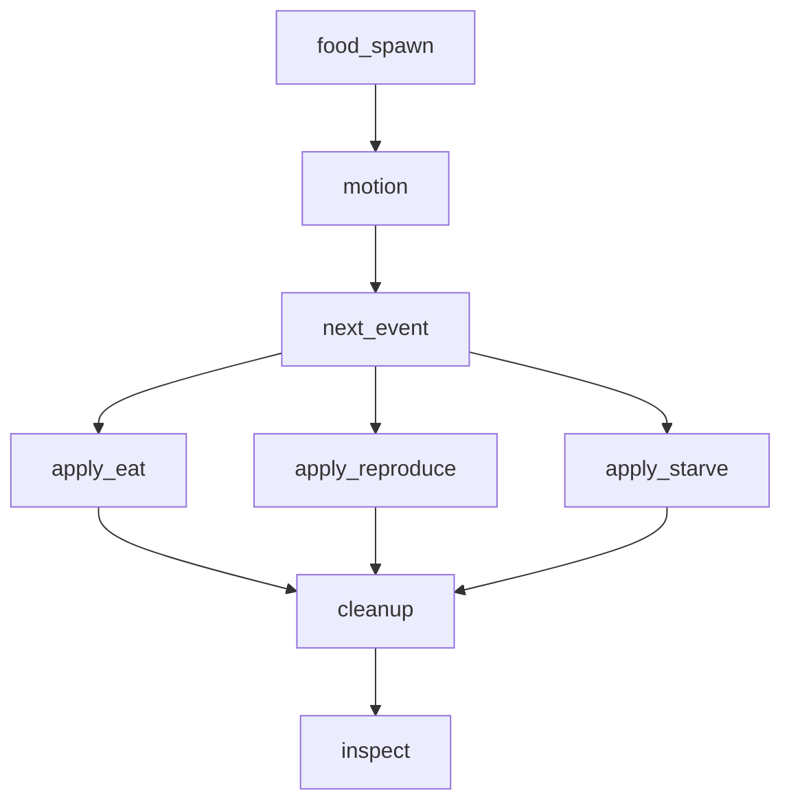

# 14 - Systems compose into a DAG

> *Concept node: see the [DAG](../../concepts/dag.md) and [glossary entry 14](../../concepts/glossary.md#14--systems-compose-into-a-dag).*

A program with one system is uninteresting; a program with many systems must say *what runs in what order*. The order is given by data dependencies: a system that reads a table must run *after* every system that writes that table within the same tick. No ordering is fixed by intuition; everything is given by the read-sets and write-sets.

Draw the dependency graph. Each system is a node. For every system that reads table `T` and every system that writes `T`, draw an edge `writer → reader`. The result is a directed acyclic graph (the DAG). A topological sort gives a valid execution order: any sort that respects the edges is correct. The program executes one such sort.

The simulator's tick from `code/sim/SPEC.md`:

`food_spawn` runs first because its output is `food`, which `motion` and `next_event` read. `next_event` produces `pending_event`, which the three appliers consume in parallel (their write-sets are disjoint). `cleanup` runs after all of them because its read-set includes their writes. `inspect` runs last because it reads everything and writes nothing.

This is the same shape as a *query plan* in a database. The query optimiser takes a SQL statement, builds a graph of relational operations (each one a system!), and topo-sorts them into an execution plan. A simulator is a query plan running every tick.

The reason the graph must be acyclic is that a cycle is a contradiction. Suppose system A writes table T, system B reads T and writes U, system A reads U. Now A both produces T (which B reads) and consumes U (which B writes). A and B cannot both run before each other in the same tick. A cycle in the system graph is a design bug; it must be broken - usually by buffering one system's write so it is consumed *next* tick instead of *this* tick.

Designing system order is therefore the same problem as designing a database query plan. Each system is a stage; the DAG is the plan; the program executes the plan. Students who follow this thread end up writing their own minimal query engine without realising it.

The cost of getting the DAG wrong is concrete. A reader that runs *before* its writer reads stale data - yesterday's snapshot of a table that was supposed to have been updated. A reader that runs *after* its consumer reads garbage - a half-written table mid-update. The DAG is the contract that prevents both.

A subtle benefit: once the DAG is explicit, parallelism becomes trivial. Any two systems on the same DAG level - neither one a transitive dependency of the other - can run on different threads. The schedule is implied by the graph. [§31](31_disjoint_writes_parallelize.md) picks this up.

## Exercises

1. **Draw the DAG.** Take the eight simulator systems (motion, food_spawn, next_event, apply_eat, apply_reproduce, apply_starve, cleanup, inspect) and draw the dependency graph yourself, deriving the edges from each system's read-set and write-set in `code/sim/SPEC.md`. Compare with the diagram above.
2. **Spot the cycle.** Suppose `apply_starve` writes to `food` (returning fuel to the world when a creature dies). Now `apply_starve` writes `food`, which `food_spawn` reads. `food_spawn` writes `food`, which `next_event` reads. `next_event` writes `pending_event`, which `apply_starve` reads. Where's the cycle? How would you break it?
3. **Topological sort by hand.** Given:

   - A writes X
   - B reads X, writes Y
   - C reads X, writes Z
   - D reads Y and Z, writes W

   Which systems can run in parallel? What's a valid execution order? Are there multiple valid orders?
4. **Compose two systems.** Write `motion` (operation, writes `pos`) and `next_event` (operation, writes `pending_event`). Wire them into a tick that runs `motion` then `next_event`. Inspect `pending_event` after the tick.
5. **Add `cleanup`.** Add a `cleanup` system that processes `to_remove` and `to_insert` (both initially empty `Vec`s). Wire it after `next_event`. Confirm the DAG remains acyclic.
6. *(stretch)* **A query planner.** Take five hand-written SQL queries (each one a system shape) and draw the relational-algebra plan for each. Compare with how `motion → next_event → apply_*` decomposes the simulator. The shape is the same.

Reference notes in [14_systems_compose_into_a_dag_solutions.md](14_systems_compose_into_a_dag_solutions.md).

## What's next

[§15 - State changes between ticks](15_state_changes_between_ticks.md) is the rule that makes the DAG actually work: mutations buffer; the world transitions atomically.
