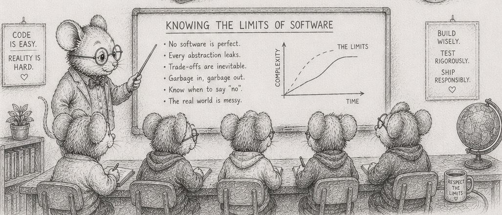

# 51 - Knowing the limits

[§45](45_living_with_it.md) put five questions to a system that has to survive, and the fourth was the one that turns the book on itself: do you know where your own advice stops? For forty chapters the advice was to lay the data out flat and stream it, and on the simulator it has been right every time. This part is where you find the edge of it, and finding that edge is the whole job.

The simulator itself cannot show you the edge, because its world is the one structure-of-arrays was built for: rows of positions and a few scalars, read in bulk. Put the question to it and it answers, honestly, that flat-and-stream never breaks down, because for that shape it does not. The limits live on shapes the simulator never has, so the only way to reach them is to go and build those shapes on purpose.

That is what the five chapters here do. Each one leaves the simulator for a small, self-contained project in a domain the trunk never visited - a weekend's work, with its own reference crate - and each was chosen because it is a place the flat-and-stream default meets a genuine limitation.

| The project | Where the default meets a limit |
|---|---|
| An expression evaluator | A recursive structure is all shape and no rows. Flat storage on its own buys nothing; the win is the order you walk the data, not the array it sits in. |
| A scenegraph | A hierarchy whose shape changes every frame. Recomputing only the part that moved beats recomputing all of it, but only up to a point, and only when the moved part is packed together. |
| A spreadsheet | Dependencies that form a graph rather than a tree. The stale set becomes a cone you have to compute, and an aggregate stays expensive even when a single cell changed. |
| A floating-point ledger | A column ill-conditioned enough that the total comes out wrong. The order of the additions decides the answer, and no layout corrects it. |
| A bandwidth wall | Work that outgrows one core. The ceiling is the memory channel, not the core count, and reaching for more hardware is rarely what helps. |

Every chapter has the same shape. You take something small enough to hold in your head - an expression, a jointed arm, a five-cell sheet, three numbers, one pass over memory - work it through by hand, and then measure where it bends. The project is the experiment and the measurement is the verdict, so you end up watching the limit happen rather than taking it on trust.

What the measurement gives back is a crossover. The columnar layout wins up to some size, or some rate of change, and past that point it stops winning; each chapter finds where, and prints the number. A default you can bound that way is one you can keep trusting. Knowing where "lay it out flat and stream it" stops paying is the rest of what it means to own the advice instead of merely repeating it.

The five build on one another. The expression evaluator shows that flattening a structure is really compiling it, which holds until the structure starts to change; the scenegraph picks up what happens when it changes a little; the spreadsheet, when that little runs through a graph; the ledger, when the sums underneath all of it were wrong to begin with; and the last, when the work finally outgrows the single machine. Each one closes on the difficulty the next one opens with.

## What's next

[§52](52_flattening_is_compiling.md) begins with the smallest of the five: one arithmetic expression, three ways to hold it in memory, and the discovery that the layout you choose matters far less than the order you read it in.
