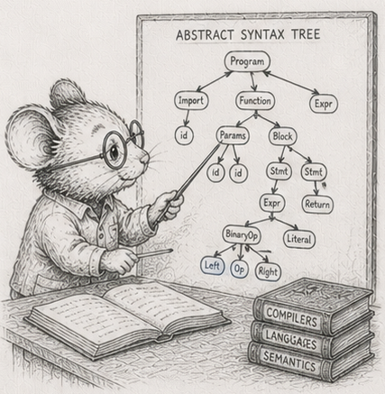

<!-- DRAFT, §52, first chapter of the "where SoA does not pay" arc (§52-§56), built on the
reference crate code/exprtree. Concept-node line, glossary entry, DAG node are placeholders to be filled. Numbers are the dev-box (Ryzen 9 270) figures;
cross-machine capture (Pi/i7/i3) is pending, so the Measurements table has one column. When
the arc and the finale land, §50's "The book ends here" line moves to the finale. -->

# 52 - Flattening a tree is compiling it

> *Concept node: see the [DAG](../../concepts/dag.md) and [glossary entry 52](../../concepts/glossary.md#52---flattening-a-tree-is-compiling-it).*

<p align="center"></p>

[§3](03_the_vec_is_a_table.md) said the Vec is a table, and the trunk took it as a default: lay the data out flat and stream it. That earned its place across forty chapters of rows-of-scalars. But the simulator's world is unusually kind to columns, and the honest question this arc asks is where the default stops paying. Start with the structure that looks least like a table: a tree.

Take a small arithmetic expression, `(x + 2) * 3`. It is a tree:

```
        ( * )
       /     \
    ( + )    [ 3 ]
   /     \
 [ x ]   [ 2 ]
```

To evaluate it you work from the bottom up, because every node needs its children's values before it can do its own bit of arithmetic. At `x = 4`: the `x` is 4, the `2` is 2, the `+` makes 6, the `3` is 3, the `*` makes 18.

There are three honest ways to store that tree and walk it, and the differences between them are the chapter. Take them one at a time.

**Boxes and arrows.** Each node is a little record sitting wherever the allocator happened to put it, holding *arrows* (pointers) to its children.

```rust,no_run
enum Expr {
    Const(f64),
    Var,
    Add(Box<Expr>, Box<Expr>),
    Mul(Box<Expr>, Box<Expr>),
    // ...
}
```

To evaluate the `*`, you follow its arrow to the `+` node - somewhere else in memory - evaluate that (which follows two more arrows, to `x` and `2`), then follow the arrow to `3`. You hop around memory chasing arrows. This is the representation most people reach for, and the one the trunk taught you to be wary of.

**The same shape, in one array.** Put all the nodes in a single `Vec`, and let each node name its children by their *position* in that Vec instead of by an arrow.

```rust,no_run
struct Node { tag: Tag, lhs: u32, rhs: u32, val: f64 } // children are indices
```

The nodes now sit together in memory, which is the layout the trunk prefers. But evaluating still hops from a node to its children in tree order, jumping around the array by index. The arrows became indices; the hopping stayed.

**The steps, written in the order you do them.** Here is the different idea. Instead of storing the tree and walking it, write the nodes down in the order you would actually compute them, every child before its parent:

```
x   2   +   3   *
```

Now you do not walk a tree at all. You read that list straight through, left to right, with a scratch pad - a *stack*, which just means you add to the top and take from the top:

```
x  ->  push its value           pad: [4]
2  ->  push                     pad: [4, 2]
+  ->  pop two, add, push        pad: [6]
3  ->  push                     pad: [6, 3]
*  ->  pop two, multiply, push   pad: [18]
```

The answer is what is left on the pad. No hopping: you touched the list once, front to back. If you have ever used a calculator with an "Enter" key, you have run a list like this; it has a name, but the mechanic is the point.

All three compute 18. That they agree, bit for bit, on every input is the floor this whole chapter stands on.<sup>1</sup>

## The array on its own buys nothing

You would expect the two flat layouts to beat the boxes-and-arrows tree; the trunk spent forty chapters showing that contiguous beats scattered. Measured, only one of them does.

The **one-array version does not beat the pointer tree at any size**.<sup>2</sup> Putting the nodes side by side bought nothing, because the walk still jumps from a node to its children in tree order. It just jumps by index now, and pays a bounds check on top. Index-hopping is pointer-hopping in a different coat.

The **written-in-order version** is the one that pulls ahead: about 1.25x faster at a hundred thousand nodes, widening to nearly 2x at two million,<sup>2</sup> because it is the one that stops hopping and reads straight through.

The lesson, then, is **the access pattern, not the array**. A flat layout walked in a scattered order is scattered access with extra steps. The win was never the Vec; it was the straight-through walk.

## The win has a floor and a cliff

The straight-through version does not win everywhere, and where it loses is worth being exact about.

In a band from roughly a few hundred to a thousand nodes, the straight-through version is a little *slower* than the pointer tree.<sup>2</sup> The whole tree fits in cache there, so hopping between nodes is nearly free, and the scratch-pad's push and pop is overhead with nothing to hide behind. Below the band, at a few dozen nodes, everything is small enough that the tight straight loop wins again. Above it, once the tree outgrows cache, every hop pays a cache-miss tax the straight walk avoids, and it pulls away for good.

The carve-out is usually stated as "small trees", but it is really a **cache-resident band**: a tree that fits in cache does not care how you lay it out, because the expensive thing, going to memory, is free while everything is close. The flat layout starts paying only once the data is big enough that the trip to memory costs something.

## That third form is compiled code

Look again at the written-in-order version. Nodes in compute order, run straight through with a scratch stack: that is a *stack machine*, and the list is its program. Writing a tree out as a run-it-straight list is **compiling** it, turning something you walk into something you run.

Compiled code has a famous weakness: you cannot edit it in place. Change the tree and the boxes-and-arrows version swings a single arrow, in time set by how deep the changed node sits - about 150 nanoseconds.<sup>3</sup> The one-array version is cheaper still, an index repointed in about 18 nanoseconds. The written-in-order version has no cheap edit: any change to the shape breaks the order, so you write the whole list out again, about half a millisecond at a hundred thousand nodes<sup>3</sup> - thousands of times the cost of swinging one arrow.

So the choice turns on what you *do* with the tree: **how often do you change its shape, versus how often do you just compute it?**

## The crossover

Put a number on it. Any real workload is some edits and some evaluations. The pointer tree has the cheap edit and the slow walk; the compiled list has the slow edit and the fast walk. They break even at the point where the list's faster walks stop paying back its expensive rebuilds. On this machine, that is about **one edit for every four evaluations**.<sup>4</sup> Change the shape more often than that, keep the pointers. Compute it more often than that, compile it.

The break-even barely moves as the tree grows, because both the walk savings and the rebuild cost scale with the number of nodes; their ratio does not. So it is a fact about your *workload*, not your tree size. A spreadsheet formula typed once and recomputed on every edit elsewhere, a database query planned once and run over millions of rows, a shader built once and run per pixel: all sit far out at the compute-many end, which is exactly where the compiled form wins and exactly why those systems compile.

That is the first place the column default does not simply carry over, and a tree is what makes you say what you actually do with it. The flat array on its own buys nothing; the straight-through walk buys a lot, but only once the tree outgrows cache, and only if you will recompile when its shape changes. The reference crate is [`code/exprtree`](https://github.com/root-11/intro-book/tree/main/code/exprtree); the prose here is the shape of its output, and the exercises are how you make it yours.

The catch is the word "recompile." It assumes the shape changes rarely, and all at once. The next chapter is what happens when it changes a little, and constantly.

## Measurements

Dev box: Ryzen 9 270, rustc 1.94.0, `--release`, median of 5. Cross-machine capture (the Pi 4 / i7 / i3 columns the rest of `code/` carries) is pending, so treat the shape as the claim, not the digits.

| # | what | measured |
|---|---|---|
| 1 | all three forms agree, bit for bit | contract test passes |
| 2 | straight-through vs pointer tree: tiny / cache-resident band / past cache | ~1.5x / **0.85x** / 1.25x at 131K nodes, ~1.9x at 2M |
| 2 | one-array (arena) vs pointer tree | does not beat it at any size |
| 3 | one shape-change: pointer / one-array / straight-through (131K nodes) | 150 ns / 18 ns / ~496,000 ns |
| 4 | edit-to-evaluation break-even (straight-through vs pointer) | ~1 edit per 4 evaluations, ~size-independent |

## Exercises

1. **Three forms, one number.** Build the boxes-and-arrows tree, the one-array version, and the written-in-order list for the same small expression. Write the evaluator for each and check all three return the same value, bit for bit, at many values of `x`. Every later exercise leans on this agreement; if it ever breaks, you are timing three different sums.
2. **Trace the stack by hand.** For `(x + 2) * 3`, write out the run-in-order list and trace the scratch pad step by step, as in the chapter. Then do it for an expression of your own with at least one subtraction. Convince yourself the list never needs to look back.
3. **The size sweep.** Evaluate each form in bulk across tree sizes from a few dozen nodes to a few million. Plot nanoseconds per evaluation. Find the three regimes: the straight-through form winning when tiny, losing in a cache-resident band of a few hundred nodes, and winning more and more once the tree is too big for cache.
4. **The array is the control.** Confirm the one-array version does not beat the pointer tree at any size. In one sentence, say why putting the nodes side by side bought nothing - what does its evaluator still do on every node? Then say, in one sentence, what the actual win was.
5. **The cost of editing compiled code.** Implement the same shape-change - swap out a subtree - on each form, and time it at a hundred thousand nodes. Reproduce the arrow-swing, the index-repoint, and the full rewrite. Explain why the run-in-order form has no cheap edit.
6. **The break-even.** From your edit and evaluation timings, work out the edit fraction where the run-in-order form stops being worth it. Reproduce the roughly one-edit-per-four-evaluations figure. Then, from how each cost grows with the number of nodes, argue why that break-even hardly depends on tree size.
7. *(stretch)* **Find the regime in the wild.** Name three real things made of expression trees (a spreadsheet cell, a database query, a shader) and place each on the change-it-versus-compute-it line. For one, build it once and evaluate it a million times; confirm you are far out at the compute-many end, where the one-time cost of writing the list out has long since paid for itself.

Reference notes in [52_flattening_is_compiling_solutions.md](52_flattening_is_compiling_solutions.md).

## What's next

The run-in-order form assumes the shape changes rarely and all at once. [§53](53_dirty_propagation.md) is what happens when it changes a little and often: a hierarchy where one node moves and only the nodes beneath it go stale. Recomputing everything is the compiled form's only move; recomputing *just the stale part* is the next discipline - and it has a break-even of its own.
