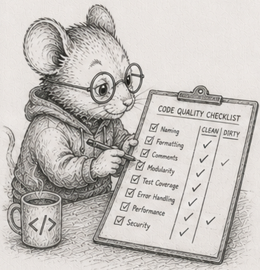

<!-- DRAFT, §53, second chapter of the "where SoA does not pay" arc (§52-§56), built on the
reference crate code/scenegraph. Concept-node line, glossary entry, DAG node are placeholders. Numbers are the dev-box (Ryzen 9 270) figures; cross-machine
capture is pending, so the Measurements table has one column. -->

# 53 - Staleness flows downhill

> *Concept node: see the [DAG](../../concepts/dag.md) and [glossary entry 53](../../concepts/glossary.md#53---staleness-flows-downhill).*

<p align="center"></p>

[§52](52_flattening_is_compiling.md) left on a catch: compiling a tree is worth it only when the shape changes rarely and all at once. This chapter is the other case, the common one - the shape changes a little, and constantly.

Picture a jointed arm: a shoulder, an elbow hanging off it, a hand hanging off the elbow. Each joint knows only where it sits *relative to its parent* - its *local* offset. Where it actually is in the room - its *world* position - is its parent's world position plus its own local offset. Lay it out and compute it bottom of the chain to top:

```
shoulder   local 0    world 0
  elbow    local +2    world 2     (0 + 2)
    hand   local +1    world 3     (2 + 1)
```

Now swing the elbow out: change its local offset from +2 to +5.

```
shoulder   local 0    world 0      (unchanged)
  elbow    local +5    world 5      (0 + 5)   <- moved
    hand   local +1    world 6      (5 + 1)   <- dragged along
```

The elbow moved, and the hand moved with it, because the hand hangs off the elbow. The shoulder did not move at all. **A change flows downhill to everything beneath it, and stops there.** That is the whole idea of this chapter. (Real scenes compose full rotate-scale-translate transforms instead of adding offsets, but the shape is identical: a node's world position depends only on itself and the chain of parents above it.)

Every frame, things move, and the world positions below them go stale. There are two ways to set them right.

**Recompute everything.** Walk the whole hierarchy top-down and recompute every world position from scratch. If you store the nodes flat in top-down order - every parent before its children, the [§52](52_flattening_is_compiling.md) trick again - this is a single straight sweep: each node reads a parent that was already done a moment ago. Branchless, sequential, cache-friendly.

**Recompute only the stale part.** When the elbow moves, mark the elbow and everything beneath it as *dirty*, and recompute only those. The flat top-down layout has a gift here: lay the nodes out so a node is immediately followed by all of its descendants, and a whole subtree becomes a *contiguous slice*. "Everything beneath the elbow" is then just a range of array positions - easy to find, and packed together in memory.

Which one wins? It depends on how much went stale, and the answer is a crossover, not a rule.

## The straight sweep wins again

[§52](52_flattening_is_compiling.md)'s lesson reappears first. Recomputing *everything* the flat top-down way, one straight sweep, beats walking the same hierarchy as a boxes-and-arrows pointer tree by **2.3x to 2.8x** from a hundred thousand to a million nodes.<sup>1</sup> Same work, same answers; the flat sweep just reads memory in order while the pointer walk hops around it. Even the dumb option, recompute-all, is cheap because of the layout. Hold that as the baseline.

## Recompute-only-what-moved has a ceiling

Now mark a fraction of the tree dirty and recompute only that part, against recomputing all of it. When little has moved, recomputing only the stale part wins enormously: at a tenth of a percent dirty it is about **900x** faster, at ten percent about **5.7x**, at twenty percent about **1.7x**.<sup>2</sup>

It does not win forever. Past roughly **forty to fifty percent dirty**, recompute-everything takes the lead.<sup>2</sup> Recomputing only the dirty part means carrying a list of which nodes are dirty and skipping the rest, and that bookkeeping costs more than it saves once you are touching most of the tree anyway. At a hundred percent dirty the incremental version is *slower* than the straight sweep: all the same work, plus the bookkeeping. **Recompute only what changed is a default with a ceiling** - when most of it changed, stop being clever and sweep.

## Whether it pays depends on whether the stale set is packed

A second axis matters more for the next chapter. Take the *same number* of dirty nodes and arrange them two ways: as one contiguous subtree (a joint and everything below it), and scattered all over the tree (a dirty leaf here, a dirty leaf there).

The contiguous subtree recomputes about **13x faster than a full sweep**. The same count of scattered leaves is about **as slow as a full sweep** - the two arrangements are more than **10x apart**, at identical work.<sup>3</sup> The dirty *count* was the same; only the *packing* differed. Recomputing the stale part pays only when the stale part is packed together in memory, so the recompute streams instead of hopping. That sharpens [§28](28_proximity.md)'s "recompute beats maintain": recompute beats maintain *when the thing you recompute is local*.

A scenegraph is kind to this. It is a tree: every node has exactly one parent, so "everything beneath a node" is one packed slice, and the common edit - move a joint - dirties exactly such a slice. The reference crate is [`code/scenegraph`](https://github.com/root-11/intro-book/tree/main/code/scenegraph).

But that kindness is the tree's, not the world's. The moment a thing can feed *many* things instead of hanging off one parent - the moment your dependencies form a graph rather than a tree - there is no single "everything beneath it," no contiguous slice to recompute, and the packing you just relied on is gone. That graph is a spreadsheet, and it is the next chapter.

## Measurements

Dev box: Ryzen 9 270, rustc 1.94.0, `--release`, median of 5. Cross-machine capture is pending; treat the shape as the claim.

| # | what | measured |
|---|---|---|
| 1 | full recompute, flat straight sweep vs pointer-tree walk (100K-1M nodes) | 2.3x - 2.8x |
| 2 | recompute-dirty vs recompute-all, by how much is dirty | ~900x at 0.1%, 5.7x at 10%, 1.7x at 20%, **loses past ~40-50%** |
| 2 | recompute-dirty at 100% dirty | 0.77x (slower than the sweep: pure bookkeeping overhead) |
| 3 | same dirty count: one contiguous subtree vs scattered leaves | 13x vs ~1x against full; ~10x apart from each other |

## Exercises

1. **Move a joint by hand.** Take the three-node arm from the chapter. Pick local offsets, compute the world positions, then change one joint's local offset and recompute by hand. Write down which world positions changed and which did not, and state the rule in one sentence.
2. **Flat, top-down.** Store a hierarchy as flat arrays with each node's parent recorded, laid out so every parent comes before its children. Write the full recompute as a single forward loop. Confirm each node's parent is always already done by the time you reach it.
3. **The straight sweep vs the pointer walk.** Build the same hierarchy a second way, as boxes-and-arrows. Recompute both at a hundred thousand and a million nodes and reproduce the roughly 2.3x-2.8x gap. Say in one line why it appears, in the words of [§52](52_flattening_is_compiling.md).
4. **The subtree is a slice.** With the top-down layout, show that a subtree occupies a contiguous range of positions. Given a node, find "everything beneath it" as a slice, with no tree-walking.
5. **The dirty crossover.** Mark a fraction of the tree dirty (a joint and everything below it), recompute only that, and compare against a full sweep. Sweep the fraction and find where recompute-everything takes over. Explain why the incremental version is slower than the sweep when everything is dirty.
6. **Packed versus scattered.** Hold the dirty count fixed and compare one contiguous subtree against the same number of scattered single nodes. Reproduce the order-of-magnitude gap. State the condition under which recomputing the stale part is worth doing at all.
7. *(stretch)* **Break the tree.** Let one node be read by two parents (so it is no longer a tree). Show that "everything beneath a node" is no longer a single contiguous slice, and that the packed recompute you relied on no longer applies. You have just discovered the next chapter's problem.

Reference notes in [53_dirty_propagation_solutions.md](53_dirty_propagation_solutions.md).

## What's next

In a tree, the stale set is always one packed slice, because everything has exactly one parent. [§54](54_recompute_the_cone.md) is what happens when that is no longer true: a spreadsheet, where one cell feeds many, the dependencies form a graph, and "what went stale" is a shape you have to compute rather than a slice you can point at.
