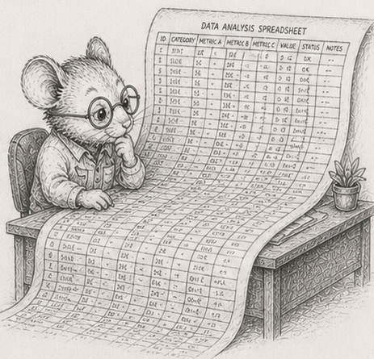

<!-- DRAFT, §54, third chapter of the "where SoA does not pay" arc (§52-§56), built on the
reference crate code/spreadsheet (incl. the `scale` binary). Concept-node line, glossary
node, DAG node are placeholders. Numbers are dev-box (Ryzen 9
270 + NVMe); cross-machine capture is pending. This is the longest chapter of the arc; it is
sectioned so each idea stands alone. -->

# 54 - A spreadsheet is a dependency graph

> *Concept node: see the [DAG](../../concepts/dag.md) and [glossary entry 54](../../concepts/glossary.md#54---a-spreadsheet-is-a-dependency-graph).*

<p align="center"></p>

[§53](53_dirty_propagation.md) ended where the tree did: in a hierarchy, "everything beneath a node" is one packed slice, because each thing has exactly one parent. Take that away - let one thing feed *many* - and you have a spreadsheet.

Here is a tiny one. Two inputs and three formulas:

```
A1 = 2            (an input you type)
A2 = 3            (an input you type)
B1 = A1 * A2      = 6
B2 = B1 + A1      = 8
T  = B1 + B2      = 14
```

Draw who-reads-whom and it is not a tree: `A1` feeds *both* `B1` and `B2`, `B1` feeds both `B2` and `T`. It is a graph - a *dependency graph*. Now edit `A1` from 2 to 10. What has to be recomputed?

```
A1  changed
B1  uses A1   -> stale
B2  uses B1 and A1   -> stale
T   uses B1 and B2   -> stale
A2  uses nothing that changed   -> still correct
```

Three of the four formulas go stale. Not because they sit "below" `A1` in some layout - there is no below in a graph - but because the change *reaches* them along the feeds-into edges. That reachable set is the **cone** of the edit. And you must recompute it in the right order: `B1` before `B2` before `T`, because each needs the fresh value of the ones it reads. Recomputing a spreadsheet is exactly that - sorting the cells so every cell comes after the ones it depends on, then computing them in that order. ([§14](14_systems_compose_into_a_dag.md) called this a topological sort and said the program *is* one; a recalc engine is that sentence made literal.)

So the move from [§53](53_dirty_propagation.md) survives: recompute only the stale part. But "the stale part" is no longer a slice you point at. It is a cone you compute.

## The change has a shape the UI gives you

[§53](53_dirty_propagation.md) could scatter dirt anywhere across the tree. A spreadsheet cannot. The only edits a person can make are a single cell, or a *fill-down* - drag a formula down a contiguous run of cells. So the dirty set is never random; it is the cone of one of those edits, and its size is set by how the formulas are wired, not by chance.

That is what to sweep, then: a fill-down of `k` cells, a real action, growing the cone. And the result is the familiar shape - recomputing the cone wins big when `k` is small, and the win shrinks as the fill-down covers more of the sheet, until somewhere near "most of it" the plain full recompute takes over again.<sup>1</sup> Same crossover as the scenegraph, driven this time by how much you actually edited.

## "Incremental" does not make a sum incremental

The cone hides a twist, and it is the most useful thing in the chapter. Add one ordinary feature, a column total `=SUM(B1:B1000000)`, and edit *one* cell in that column.

The cone is tiny: the one cell, the total, and whatever reads the total, a handful of cells. Recomputing it should be almost free, but recomputing the total means reading the **entire** column again, because a sum keeps no memory of its old value - one changed cell forces a million additions. The cone was small in *count* and huge in *work*.<sup>2</sup>

This is why "just recompute what changed" is not the end of the story for aggregates. A real engine either keeps the sum up to date by hand as cells change (add the new value, subtract the old - and watch [§55](55_floating_point_fragility.md) for why that is dangerous), or it accepts the re-scan and makes the re-scan cheap (the streaming patch at the end of this chapter). Either way, the lesson stands: **an aggregate is not incremental just because you only touched one input.** A cone can be cheap to find and expensive to pay.

## Early cutoff: do not push a change that did not happen

The sharpest version replaces the sum with a `MAX`. Suppose the formula downstream is a `MAX` over a column, feeding a dashboard of a hundred thousand cells that all read that maximum, and you edit a cell that is *not* the maximum, to a value still below it.

Walk the cone the obvious way and you recompute the `MAX`, find it feeds the dashboard, and recompute all hundred thousand dashboard cells. But the `MAX` *did not change* - you edited a number below it. None of the dashboard needed touching. So add one check: when you recompute a cell, if its new value equals its old value, **stop** - do not mark its dependents stale, because nothing reached them. The change was absorbed.

Measured, on exactly that sheet: the obvious cone recomputes two hundred thousand cells; with the cutoff it recomputes sixteen, and runs about **54x faster**.<sup>3</sup> The principle is worth a name: **validation is cheaper than recomputation.** Checking "did this actually change?" costs almost nothing; recomputing everything downstream on the assumption that it did costs everything. Following the cone blindly would have recomputed the lot; the cutoff is what saves it.

## At a billion cells, the program goes flat

A million cells is small. A billion is where this gets honest, and it forces a change that is itself the lesson.

The natural way to hold a formula is as a little tree of its own (it is an [§52](52_flattening_is_compiling.md) expression, after all), one object per cell. At a billion cells that is roughly **160 GB** of formula objects before a single value - it cannot be built. So you do what a real big sheet already is: you notice that a billion cells are not a billion different formulas. They are a *handful of formulas stamped across huge ranges* - a fill-down is one formula, repeated. Store the formula once per column - a *template* - and the cells become plain columns of numbers. A billion-cell sheet's entire "program" is then a few hundred templates, a couple of kilobytes.<sup>4</sup>

That is the arc's whole thesis turning up one level higher than expected. [§52](52_flattening_is_compiling.md) flattened the *data*; at scale you flatten the *program* too - the formula graph collapses from a tree-per-cell into a template-per-column, and the dependency graph from a stored list of edges into an implicit rule ("this column reads that one, row by row"). Columns are the default for the program, not just the data.

## Leave the RAM, and peg the memory

A billion `f32` values is four gigabytes; bigger sheets are bigger than RAM. So the data lives on disk, laid out one column after another. Now the column total from earlier is the whole game, told in bytes moved.

Recompute every total and you read the **entire file** off disk. At a 36 GB sheet on a 30 GB machine that is about **sixteen seconds** of real disk reading.<sup>5</sup> But after a real edit, only a few columns are dirty - so read only *those* columns back (each is a contiguous stretch of the file) and re-sum them: about **a tenth of a second**, a couple of hundred megabytes instead of thirty-six gigabytes.<sup>5</sup> The patch from §28's "recompute beats maintain," now measured in disk traffic.

Few programs are built for the next part. Re-summing a column does not need the whole column in memory at once; read it in fixed-size **tiles** and add as you go. Set the tile once - say sixteen megabytes - and the program's memory is *pegged*: it never holds more than a tile, no matter how tall the column or how large the sheet.<sup>6</sup> Running out of memory stops being something you hope to avoid and becomes something that **cannot happen** - the process has no way to ask for more than a tile. That is the move in its purest form, and you will meet it again as a named idea in the finale: an entire class of failure made structurally impossible, not merely unlikely.

To size such a thing for your own machine, the rule is just the arithmetic: each gigabyte of RAM is 250 million `f32` cells, so choose a sheet a little bigger than your RAM and smaller than your free disk. RAM < problem < disk. The reference crate is [`code/spreadsheet`](https://github.com/root-11/intro-book/tree/main/code/spreadsheet); its `scale` binary is the billion-cell version.

The cone, the cutoff, the templates, the pegged tiles - all of it rests on a quiet assumption: that adding the numbers up gives the right answer. The next chapter is where that assumption breaks.

## Measurements

Dev box: Ryzen 9 270 + NVMe, rustc 1.94.0, `--release`. Cross-machine capture is pending; treat the shape as the claim.

| # | what | measured |
|---|---|---|
| 1 | recompute the cone vs recompute all, by fill-down size | wins small, loses once the fill-down covers most of the sheet |
| 2 | one-cell edit under a column SUM | tiny cone, but re-reads the whole column - not incremental |
| 3 | edit absorbed by a MAX, with vs without early cutoff | 16 cells vs 200,000; ~54x faster |
| 4 | the "program" for 1e9 cells: templates vs one object per cell | ~2 KB vs ~160 GB (cannot allocate) |
| 5 | disk pivot, 36 GB > RAM: full vs dirty-columns patch | ~16 s (whole file) vs ~0.1 s (a few columns) |
| 6 | working set, tiled | a fixed 16 MB tile, independent of column height or sheet size |

## Exercises

1. **The cone by hand.** Take the five-cell sheet from the chapter. Edit `A1` and list exactly which cells go stale and in what order they must be recomputed. Then edit `A2` instead and do the same. Explain why the two cones differ.
2. **Recompute in order.** Store cells so every cell comes after the ones it reads, and recompute a whole sheet as one forward pass. Then, given an edited cell, compute its cone (the cells it reaches) and recompute only those, in order. Check the result matches a full recompute.
3. **The fill-down crossover.** Sweep a fill-down from one cell to the whole column and compare cone-recompute against full-recompute. Find where full takes over. Note that you cannot make a *random* dirty set with real edits - the cone's shape comes from the formulas.
4. **The sum that is not incremental.** Put a `SUM` over a million-row column. Edit one cell and measure the cone recompute. Show that the cost is the whole column, not the one cell, and explain why a sum cannot be patched by touching only what changed - without keeping a running total.
5. **Early cutoff.** Build a `MAX` over a column feeding many downstream cells. Edit a below-maximum cell. Recompute the cone with and without the "stop if the value did not change" check. Reproduce the large gap and state the principle in one line.
6. **The program goes flat.** Estimate the memory of one formula-object per cell at a billion cells. Then represent the same sheet as one template per column and report its size. Say what collapsed, and into what.
7. *(stretch)* **Peg the memory.** Take a column sum and rewrite it to read the column in fixed-size tiles, summing as it goes, so peak memory is a constant you set. Prove it: feed it ten times the data and watch the footprint not move. Then size a sheet for your machine with RAM < problem < disk and confirm the patch reads only the dirty columns.

Reference notes in [54_recompute_the_cone_solutions.md](54_recompute_the_cone_solutions.md).

## What's next

Every total in this chapter trusted that adding the numbers gives the right total. [§55](55_floating_point_fragility.md) is where that trust fails: floating-point addition is not associative, so the order you add in changes the answer, a naive sum of a real column can lose everything, and no layout in the world fixes it.
