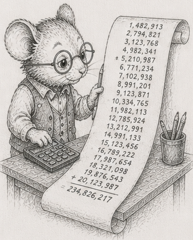

<!-- DRAFT, §55, fourth chapter of the "where SoA does not pay" arc (§52-§56), built on the
reference crate code/fpfragility. Concept-node line, glossary node, DAG node are placeholders. The error figures are properties of IEEE-754 and portable;
the timings are dev-box (Ryzen 9 270) and cross-machine capture is pending. -->

# 55 - The same numbers, a different total

> *Concept node: see the [DAG](../../concepts/dag.md) and [glossary entry 55](../../concepts/glossary.md#55---the-same-numbers-a-different-total).*

<p align="center"></p>

[§54](54_recompute_the_cone.md) made the spreadsheet incremental, took it past RAM, and pegged its memory. Every total along the way trusted one thing: that adding the numbers gives the right answer. This chapter is where that trust breaks, and the unsettling part is that no layout fixes it. A perfectly columnar sum can still be wrong.

Add three numbers by hand, in two different orders.

```
  1e16  +  (-1e16)  +  1
= ( 1e16 + -1e16 ) + 1   =  0 + 1   =  1      (the giants cancel, then the 1 lands)

  1e16  +  1  +  (-1e16)
= ( 1e16 + 1 ) + -1e16   =  1e16 + -1e16  =  0   (the 1 is lost, then the giants cancel)
```

Same three numbers. Two answers. The middle step is the culprit: `1e16 + 1` cannot be stored, because a `double` near ten quadrillion has no room left for a difference of one - the gap between representable numbers there is larger than 1. So the `1` is rounded away, and by the time the `-1e16` arrives there is nothing left of it. **Floating-point addition is not associative: the order you add in changes the sum.** This is not a bug in your machine; it is how every conforming machine works, and it is the same hazard every total in the last chapter was quietly exposed to.

## A real column, added naively, loses everything

Picture a ledger column, the kind any business has: a few million small entries, cents either way, and one big matching pair, a large credit and the debit that cancels it. The true total is the sum of the small entries; the giants cancel out.

Add it left to right and the running total climbs to the big number, sits there while every small entry is added and *lost* under it - each one below the gap, just like the `1` above - and then the big debit cancels the big credit back to near zero. The naive sum reports roughly **nothing**, where the true answer was the accumulated cents.<sup>1</sup> Reverse the column and you get a *different* wrong answer, because a different set of small entries gets swallowed. The order decided the result, and neither order was right.

Two fixes recover the true total. **Add in pairs** - sum halves and halves of halves, so small entries meet each other before they ever meet the giant - and the error shrinks dramatically. Or carry the lost low-order bits in a second running term and fold them back at the end (a *compensated* sum). Both land on the right answer; the compensated sum costs a little more arithmetic per element.<sup>1</sup>

The timings give away a bonus: adding in pairs is also **faster** than the naive left-to-right sum,<sup>1</sup> because the naive version is one dependent chain (each add waits for the last) while the paired version splits into independent pieces the machine runs at once. The accurate method is the fast one, and it is the same tree-shaped reduction the next chapter leans on.

## Maintaining a total quietly drifts

Recall [§54](54_recompute_the_cone.md)'s temptation: rather than re-read a whole column to recompute a sum, keep a running total and patch it on each edit - add the new value, subtract the old. It is cheap. It also drifts.

Start a running total from the exact sum and then maintain it only by those add-the-new, subtract-the-old steps. After millions of edits it no longer matches a fresh recomputation. The absolute gap stays small, but as a *fraction* of the answer it blows up exactly when the true total is itself near zero from cancellation.<sup>2</sup> The maintained total is never quite the recomputed one, and you cannot tell by looking. This is why a real system periodically re-anchors its aggregates with a fresh recompute instead of trusting the running patch forever: the incremental total buys speed by spending correctness, a little at a time.

## Layout cannot make it correct

Columns are a default, not a law - and this is the version of that with nothing to do with speed at all.

Ask a simple geometric question: given three points, does the third lie to the left or the right of the line through the first two? It is one subtraction-and-multiply formula (the sign of a cross product), and it is the atom under every triangulation, every convex hull, every "is this point inside" test in CAD and mapping and path planning.

Lay the points out in perfect columns and compute that formula in `f64`. For three points that are *nearly* in a straight line, the two big products that should almost cancel are each rounded first, and the rounded difference is dominated by noise - so the sign comes out **wrong**, on the order of **99% of near-collinear cases** in a sweep of large-coordinate triples.<sup>3</sup> The exact answer, computed in wide integers, is right every time, and costs about the same.<sup>3</sup> A flawless SoA layout changed nothing: the bug was in the arithmetic, not the storage. **Correctness is orthogonal to layout** - you can lay the data out perfectly and still compute the wrong thing.

The fixes are real arithmetic, not real layout: add in a defined order, compensate, accumulate in a wider type, or compute the predicate exactly. None of them is what this book has been selling, and that is the point of putting them here. The reference crate is [`code/fpfragility`](https://github.com/root-11/intro-book/tree/main/code/fpfragility).

So the totals are correctable, and once corrected and incremental the spreadsheet is honest. It is still, though, adding its numbers on a single core, and the accurate sum made the work a little heavier. The last chapter asks the question that finishes the arc: when do you actually need more hardware?

## Measurements

Error figures are IEEE-754 and portable; timings are dev-box (Ryzen 9 270, `--release`). Cross-machine capture is pending.

| # | what | measured |
|---|---|---|
| 1 | a real ill-conditioned column: naive sum vs the true total | loses essentially the whole answer; reversing gives a different wrong answer |
| 1 | paired / compensated sum vs naive | recovers the true total; paired is also ~2x *faster* than naive |
| 2 | a running total maintained by deltas vs a fresh recompute | never matches; relative error explodes when the true total nearly cancels |
| 3 | left-or-right-of-line for near-collinear points: naive `f64` vs exact integer | naive wrong ~99% of the time; exact correct, at ~the same cost |

## Exercises

1. **Two orders, two answers.** Add `1e16`, `-1e16`, and `1` in both orders by hand, as in the chapter. Then find a triple of your own where the order changes the result, and explain which addition loses information and why.
2. **Lose a column.** Build a column of many small values with one large offsetting pair. Sum it left to right, then reversed. Show the two sums disagree and that both miss the true total (the sum of the small values, which the giants do not touch).
3. **Get it back.** Sum the same column two better ways: in pairs, and with a compensated running term. Show both recover the true total. Time all three and note that the paired sum is not slower than the naive one - explain why, in terms of dependent versus independent additions.
4. **Watch it drift.** Start a running total from the exact sum, then maintain it through many random edits by adding the new value and subtracting the old. Compare against a fresh recompute periodically. Show the gap never closes, and that as a fraction it is worst when the true total is near zero.
5. **The wrong side of the line.** Implement "is the third point left or right of the line through the first two" in `f64`, and again in exact integer arithmetic. Feed both many nearly-collinear triples with large coordinates and count how often they disagree. Confirm the exact one costs about the same.
6. *(stretch)* **A layout cannot save you.** Take any one of the above and store the inputs in perfect SoA columns. Confirm the wrong answer is exactly as wrong as before. Write one sentence on why the arc's usual move - fix the layout - does nothing here, and what does.

Reference notes in [55_floating_point_fragility_solutions.md](55_floating_point_fragility_solutions.md).

## What's next

The numbers are correct now, and the sum is still one core reading memory in order - and the accurate version made it a little heavier. [§56](56_bandwidth_is_the_ceiling.md) finishes the arc with the question the whole second act has been circling: when the work outgrows one core, what actually helps - and what only looks like it does.
