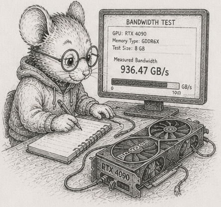

<!-- §56, last chapter of the "where SoA does not pay" arc (§52-§56), built on the
reference crate code/heterogeneous. Concept-node line, glossary node, DAG node are placeholders. CPU numbers are dev-box (Ryzen 9 270, 16 threads);
cross-machine numbers are in code/README.md. GPU round-trip + resident numbers from a community run (RTX 4070 Ti, PCIe 3.0, Ryzen 7 5800X host). The CAP
sidebar is Bjorn's to write (flagged against framing-overclaim); left as a placeholder. -->

# 56 - The ceiling is bandwidth, not cores

> *Concept node: see the [DAG](../../concepts/dag.md) and [glossary entry 56](../../concepts/glossary.md#56---the-ceiling-is-bandwidth-not-cores).*

<p align="center"></p>

[§55](55_floating_point_fragility.md) left the work correct and incremental, and still being done by one core reading memory in order. The reviewer's instinct at this point is loud and common: a simulation this size *needs* a GPU. This chapter is the honest answer, and it is mostly "no, and here is exactly why."

Start with the simplest pass there is - advance some particles: each new position is the old position plus the velocity, times a timestep. Two multiply-adds per particle. Almost no arithmetic; the cost is entirely in moving the numbers - read a position and a velocity, write a position back. So the speed of this pass is the speed of *memory*, not the speed of the *core*.

Run it on one core across sizes and you can watch the memory hierarchy in the numbers: while the data fits in cache it runs at nearly 190 GB/s; once it spills to main memory it settles to about 23 GB/s.<sup>1</sup> That floor - main-memory bandwidth - is the thing that matters, because real working sets do not fit in cache.

## More cores stop helping

The obvious move is more cores. Split the particles across threads and measure:

```
 1 thread    23 GB/s    1.0x
 2 threads   28 GB/s    1.2x
 4 threads   46 GB/s    2.0x
 8 threads   51 GB/s    2.2x
16 threads   51 GB/s    2.2x
```

Sixteen cores do no better than eight, and the whole machine tops out around **2.2x**.<sup>2</sup> The reason is the one above: this pass is limited by the memory channel, and a single channel feeds all the cores. Past about four threads they are not computing in parallel; they are queueing for memory. **The ceiling is bandwidth, not core count.** You cannot out-core a memory-bound pass, and you cannot out-accelerator it either. The way to go faster is to *touch less data*, not to add compute - which is exactly what [§53](53_dirty_propagation.md) and [§54](54_recompute_the_cone.md) spent their chapters doing. The whole arc has been pulling this way, and now you can see why it had to.

## How much can one box keep current?

Turn the bandwidth into the number that actually decides things. In a 33-millisecond frame (30 per second), one core can bring about **32 million** particles up to date; all cores together, about **70 million**.<sup>3</sup> That is the budget: how big an *active set* one box keeps current per frame.

Now the GPU argument falls apart on its own terms. The claim is that a billion-node world needs the GPU, but you never recompute a billion nodes: [§53](53_dirty_propagation.md) and [§54](54_recompute_the_cone.md) taught you to recompute only the part that changed, the active cone, and a cone of a few million cells fits one core's frame budget with room to spare. The GPU answers "how do I recompute *everything*, fast?", a question the incremental discipline already stopped asking. The GPU is not slow; it is solving a problem you arranged not to have.

## When the bus is the bottleneck

And when the active set genuinely is too big for the box - when you really do have more work than one machine's memory can feed in time - is the GPU the answer even then? For a pass like this one, often not, and the numbers say why.

To run the pass on the GPU you must first ship the data across the bus to it and read the result back. For this pass that round trip moves about the same number of bytes the computation itself needs, so the comparison is really the bus against the machine's own memory, and the cross-machine numbers make that literal. On a box whose memory feeds the pass faster than the bus moves it - the Ryzen and the 2012 i7 measured here - the round trip costs *more* per element than doing the pass in place, and offloading loses.<sup>4</sup> On a bandwidth-poorer box the simple model tips the other way: the 2015 i3's memory runs near 10 GB/s, below an assumed 16 GB/s bus, so the model reports the transfer as the cheaper option. That tip is the tell, not a win - the model charges only the bus and forgets that feeding the bus still reads the array out of that same slow memory first, so a real offload of resident data is dearer still. Either way the rule that survives every machine is the one to keep: offloading pays only when the data already lives on the GPU, or when there is enough arithmetic per byte that the compute, not the transfer, dominates. For a memory-bound elementwise pass, neither holds.

(The reference machines carry only integrated GPUs, which share the memory channel and so inherit its ceiling rather than crossing a bus. A reviewer contributed with a run of [`code/gpu_probe`](https://github.com/root-11/intro-book/tree/main/code/gpu_probe) on an RTX 4070 Ti, PCIe 3.0, hosted on a Ryzen 7 5800X: CPU all-core 0.882 ns/elem at 27.2 GB/s; GPU round-trip 5.836 ns/elem, 6.6x the CPU pass; GPU resident 0.118 ns/elem, 7.5x faster than the CPU pass. The silicon is fast when data already lives in VRAM. The bus crossing is what loses.)

<!-- Sidebar (Bjorn to write; flagged against framing-overclaim): fixate on the conditions
under which a problem occurs, not the problem itself. The "you must choose" tradeoffs often
dissolve once you arrange the conditions so the hard case cannot arise - the same move the
active-set budget just made against the GPU. -->

So the answer to "do you need the accelerator" is a measurement, not a reflex: you reach for more hardware only when the *active set itself* outgrows one box, not to brute-force away staleness an incremental design already avoids. Columns were the precondition for SIMD and cores and GPUs - but they are a default, not a law, and so is the accelerator.

That closes the arc. Five chapters of where the column default does not simply transfer: a recursive structure that makes you choose access pattern over storage; a hierarchy whose stale set has a ceiling and a shape; a graph whose aggregates are not incremental and whose memory you peg; arithmetic a layout cannot make correct; and a memory channel no core or bus can outrun. The honest counterweight to forty chapters of "lay it out flat and stream it" is that you now know, with numbers, where that stops being the answer.

## Measurements

CPU figures: dev box (Ryzen 9 270, 16 threads), `--release`, median of 5; the cross-machine numbers (2012 i7, 2015 i3, Pi 4) are in [`code/README.md`](https://github.com/root-11/intro-book/blob/main/code/README.md). GPU figure (row 4) from a community run on RTX 4070 Ti, PCIe 3.0, Ryzen 7 5800X host.

| # | what | measured |
|---|---|---|
| 1 | one core's pass, in cache vs in main memory | ~190 GB/s vs ~23 GB/s |
| 2 | the same pass across cores (RAM-resident) | 1 / 2 / 4 / 8 / 16 threads -> 1.0x / 1.2x / 2.0x / 2.2x / 2.2x; plateaus at the memory channel |
| 3 | active set kept current per 33 ms frame | ~32 M (one core), ~70 M (all cores) |
| 4 | GPU offload of a memory-bound pass | RTX 4070 Ti, PCIe 3.0: round-trip 5.836 ns/elem (6.6x CPU); resident 0.118 ns/elem (7.5x faster than CPU); offload pays only when data is resident or arithmetic-heavy |

## Exercises

1. **Watch the hierarchy.** Run the advance-the-particles pass on one core across sizes from a few thousand to tens of millions. Plot the bandwidth. Find the step down from cache speed to main-memory speed, and say roughly where your machine's last cache level ends.
2. **More cores, less help.** Split the same pass across 1, 2, 4, 8, and all your cores. Plot the speedup and find where it plateaus. Explain, in one sentence, why a memory-bound pass stops scaling well before you run out of cores.
3. **The frame budget.** From your single-core and all-core bandwidth, work out how many particles each can bring up to date in a 33 ms frame. This is your box's active-set budget. Compare it to the size of the *active* part of a large simulation (the part that changed this frame), not the whole thing.
4. **The argument against the GPU.** Using the budget from exercise 3, argue whether a million-cell active cone needs an accelerator. Then state precisely the case in which it would: when the active set itself, not the whole world, exceeds what the box can feed in a frame.
5. **The bus is the bottleneck.** Write the cost model for offloading the pass: bytes shipped to the device, plus bytes read back, at an assumed bus speed, versus the measured CPU time per element. Find the break-even arithmetic intensity. Confirm that for two multiply-adds per element, offloading a memory-bound pass loses.
6. *(stretch)* **Touch less, not more.** Take any pass from an earlier chapter and make it faster two ways: throw cores at it, and shrink the working set it touches (compute only the active part). Compare. Argue which lever the rest of this arc has been pulling, and why it beats the hardware lever for the workloads here.

Reference notes in [56_bandwidth_is_the_ceiling_solutions.md](56_bandwidth_is_the_ceiling_solutions.md).

## What's next

That is the last technique. What remains is to say what all of it was *for* - and it is not speed. [§57](57_what_cannot_happen.md) collects the whole book into a single claim: that the structure you have been building does not merely run fast, it makes whole categories of failure impossible to write. The arc's pegged memory was the freshest instance; the finale names the rest.
