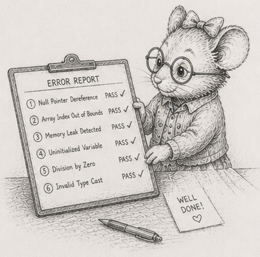

<!-- DRAFT FINALE (§57), the book's true last chapter: it generalises §50 (the operations
closer) and the §52-§56 limits arc to the whole book. OPEN RECONCILIATION with §50: §50's
ending is now a handoff into §52 (minimal edit made), but its "Where to go next" reading
list and this finale's ending should be reconciled so the list lives in one place - left for
Bjorn to place. -->

# 57 - What cannot happen

[§50](50_it_runs_without_you.md) closed the operations leg with a single observation: its four chapters were not four tricks but one move made four times - take a failure that used to need a person's vigilance, and turn it into a property the system holds. The limits arc that followed ([§52](52_flattening_is_compiling.md) to [§56](56_bandwidth_is_the_ceiling.md)) made a sharper version of the same move and left it fresh in your hands: a working set *pegged* to a tile, so running out of memory cannot happen - not "is unlikely," cannot. Step back from the whole book and that move is everywhere, and at its limit it is always the same. The weak version is "turn the failure into a property you assert." The strong version, the one worth ending on, is "choose a structure in which the failure cannot be written."

That is the quiet thesis of everything you have built, and the book has never stopped to say it plainly: not fewer bugs through care, but whole categories of bug *absent from the design space*, because the shape you chose has no room for them. You have met each one in passing, stated locally and left there. Here is the sum.

## The roll-call

Each line below is the same trade. On the left is what most systems do: meet the error at runtime and defend against it, on every request, for the life of the system. A lock around the shared write. A retry when the run will not reproduce. A null check before the dereference. A review comment asking where that `print` came from. A restart loop for the process that ran out of memory. The defenses are real work, they run forever, and they fail - a lock you forgot to take, a retry that hides the bug instead of fixing it, the one code path the null check missed.

On the right is what you did instead: pay once, in the structure, and the error class is gone.

| What can go wrong | The usual defense, paid every run | Why it cannot happen here |
|---|---|---|
| Two writers race the same data | locks, mutexes, careful review | a table has exactly one writer ([§25](25_ownership_of_tables.md)) - there is no second writer to race |
| The run will not reproduce | retries, "works on my machine" | order is defined, not incidental ([§16](16_determinism_by_order.md), [§48](48_reductions_dont_parallelize_freely.md)) - same seed, same bits |
| A function writes where you cannot see it | code review, grepping for `print` | systems declare their read and write sets, and I/O lives only at the boundary ([§13](13_system_as_function.md), [§35](35_boundary_is_the_queue.md)) - there is nowhere to hide one |
| A stale id reads the wrong entity | "is this handle still valid?" | the id carries a generation ([§23](23_index_maps.md)) - a recycled slot fails the check instead of answering wrongly |
| "Done" that was never saved; a torn write | hope, and a later incident review | acknowledge only once the write is durable; atomic rename and idempotent replay ([§46](46_log_survives_power_loss.md)) |
| Out of memory | a `try`/`catch` that cannot catch it; restart | the working set is pegged to a tile you choose ([§54](54_recompute_the_cone.md)) - the process cannot ask for more |

Six classes of failure that, in the structure this book builds, are absent rather than merely handled well.

## Capex, not opex - for correctness this time

This is the book's frame, leverage not virtue, in its last and sharpest form. [§45](45_living_with_it.md) argued that operating cost is capital paid once set against rent paid forever, and that the single-node in-memory discipline is, read off the balance sheet, a way to buy low rent. The roll-call is that argument made about *correctness*.

Defending against an error class at runtime is rent. It costs work on every request and a person's attention for as long as the system runs, and you never stop paying. Removing the error class in the structure is capital: bought once, and then free. You did not out-discipline the people fighting these bugs. You stopped paying the tax they pay, by choosing a shape where the bill never arrives. That is the same move [§45](45_living_with_it.md) made for the cost of *running* the system, now made for the cost of *trusting* it - the second act's economics, finishing their own sentence.

## The price, named exactly

None of this is magic, and an impossibility you cannot bound is advice you cannot trust, so be exact about what it costs. Each guarantee holds only while you hold its discipline.

Determinism is structural while the order is defined; let one `HashMap` iteration or one undefined reduction order slip in and "same seed, same bits" reverts to a coin you flip. Out-of-memory is impossible only in the part of the pipeline you actually pegged - [§54](54_recompute_the_cone.md) pegs the read and leaves the rest as an exercise on purpose, so you feel exactly where the guarantee starts and stops. The list of disciplines is short: one writer per table, a defined order, I/O at the boundary, a generation on every id, durable-before-acknowledged, a pegged working set. The leverage is that the same SoA and event-batch structure hands you all of them at once, for one decision. But they are disciplines, not defaults the language enforces for you. Drop one and its impossibility quietly becomes an ordinary bug again.

That is the honest shape of the claim: *these bugs cannot be written here, as long as you keep these six disciplines, and the structure makes keeping them the path of least resistance.*

## What you own

The book opened by promising you would build things you own. This is what that turned out to mean.

Not only that you wrote the code instead of renting it, though you did. The thing you own is the set of impossibilities: the bugs that cannot occur in the structure you chose, the failures you will never debug because there is no path to them. A framework gives you features and keeps the impossibilities for itself - you cannot see what it has ruled out, or where it has not, until the night it has not. You can see exactly what yours holds, because you can name each exclusion and the single discipline that buys it. That list - short, exact, and yours - is the asset. The code is only where it lives.

The simulator in the next room is still running. Nobody is watching it; it cannot run out of memory; it will give tomorrow the answer it gave today; and there is no version of it that quietly corrupts itself at 3 AM - not because you are vigilant, but because you built it where those things have no room to happen. That is the leverage this book was always about. Keep the discipline, and it keeps the promise.

## A last audit

1. **Take the roll-call to your own system** - or to the simulator, if it is the largest thing you own. For each of the six classes, write one sentence: is it *excluded by structure*, *defended at runtime*, or *still open*? Be ruthless about the difference between "we hold a lock" and "there is no second writer to race."
2. **Pick one row where you are defending at runtime.** Name the discipline that would turn the defense into an exclusion, and the cost of adopting it. Decide, on paper, whether that capital is worth the rent it retires. Sometimes it is not - and now you can say so in those words.
3. **Find one place where order is incidental** - a `HashMap` iterated, a reduction left unordered, a sum that changes with the thread count. Either define the order, or write down why nondeterminism is acceptable there. There is no third option that is honest.
4. *(stretch)* **Peg something.** Take one unbounded buffer in code you own - a read, a batch, an accumulation - and convert it to a fixed-size tile, so its peak memory is a constant you set rather than a function of the input. Then prove it: feed it ten times the data and watch the footprint not move.

## Where to go next

- **Read Mike Acton's "Data-Oriented Design and C++"** (CppCon 2014). Forty-five minutes; the most concentrated case for this approach you will find.
- **Read Casey Muratori's *Handmade Hero*** episodes on grid storage and cache locality. Another route to the same conclusions.
- **Open Bevy's `bevy_ecs` crate.** You will recognise every pattern. The names will differ; the shapes are identical.
- **Extend the simulator.** The genetics and predator-prey extensions flagged in the [simulator spec](../../code/sim/SPEC.md) break new ground without leaving the framework you have already built.

The book ends here. The simulator does not - it runs as long as you keep the discipline.
