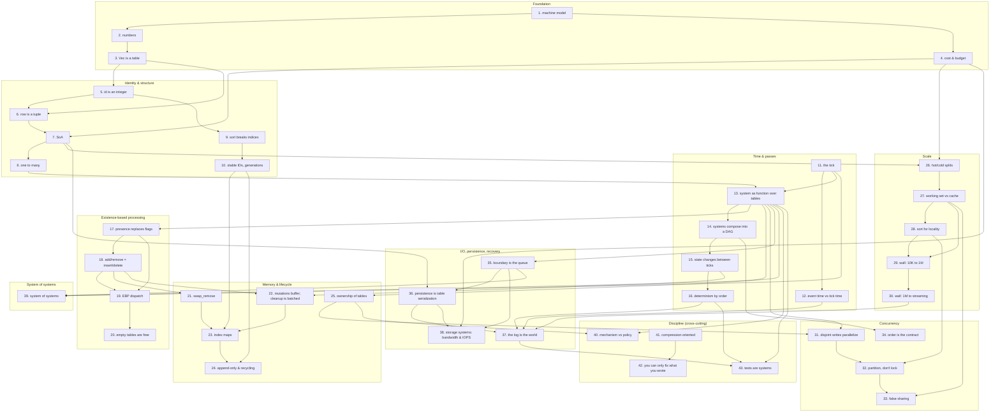

# The Concept DAG

Forty-three concepts the book teaches, with prerequisites drawn explicitly. This is the spine - every section, exercise, and track opening must trace back to a node here. If a candidate piece of content does not, it is either missing from this DAG (amend the DAG) or out of scope (drop the content).

## How to read this

Each numbered node is one concept the student must internalize. The text under each node is the definition we will use; it is not the prose the book will teach with. Edges express prerequisites: B depends on A means B's exercises only make sense once A has been *felt*, not just stated.

The DAG is published in the book's front matter. Students see it. Instructors use it to re-cut the book for shorter or longer courses.

## How to amend

Comment by node number (e.g. "node 17 - definition is too narrow") or edge (e.g. "edge 13 → 35 isn't a real prerequisite"). I'll revise this file before any prose is written.

---

## The diagram

---

## Nodes

### Foundation (1-4)

1. **The machine model.** Memory is one long array of bytes. The CPU does arithmetic on small numbers fast, fetches from cache fast, fetches from main memory roughly 100× slower, and chases pointers blindly. This asymmetry - not the algorithm - sets the speed of most real programs.

2. **Numbers and how they fit.** `u8`, `u16`, `u32`, `u64`, `i32`, `i64`, `f32`, `f64`. Width is a budget choice that decides how many things fit in a cache line. Floats are not real numbers; they have a finite set of values and edges where arithmetic stops behaving.

3. **The `Vec` is a table.** `Vec<T>` is a contiguous run of `T` in memory, addressed by index. It is the unit out of which the rest of the book is built.

4. **Cost is layout - and you have a budget.** The same algorithm runs at different speeds depending on where its data sits in memory; layout decides the constant factors that dominate at the scales we care about. Every program has a frequency target (a game runs at 30Hz; a market data system runs at 1kHz; a control loop at 1MHz) which sets a per-tick *budget* in milliseconds. Operations are counted against that budget - in microseconds, or nanoseconds for tight inner loops - and design choices set its upper bound.

### Identity & structure (5-10)

5. **Identity is an integer.** An entity is a `usize` (or `u32`). It names a slot in the world's tables, not a thing in itself. Pointers, references, and "the object" all dissolve into this.

6. **A row is a tuple.** A coherent set of values that describe one entity travel together - but only if you keep them together. If you split them across tables, you must keep their indices aligned.

7. **Structure of arrays (SoA).** Each field of a row gets its own `Vec`, indexed by entity. The opposite layout (`Vec<Struct>`, AoS) is a tradeoff to be earned, not the default.

8. **Where there's one, there's many.** Code is written for the array. The single-instance case is just N=1; it does not need its own abstraction. A card game with 52 cards is three arrays - suit, rank, location (deck/hand/discard) - not 52 objects.

9. **The sort breaks indices.** Rearranging rows for locality breaks any external reference that pointed at a slot. The student must feel this pain before the next node makes sense.

10. **Stable IDs and generations.** A separate `id` column gives a name that survives sorting. A `generation` counter on top gives a name that survives recycling, so an old reference cannot be confused with a new occupant.

> *Milestone after node 10 - the card-game project.* Three arrays of 52 (suit, rank, location); shuffle and sort by index. Frequently expected to take hours in OOP and to take minutes here. Students sometimes look at the result like it is cheating; that reaction *is* the conversion. The card game is also the simplest case of one design choice that shapes everything later: the table has a *constant quantity*. There are 52 cards, always; the array never grows or shrinks. *Variable-quantity* tables - creatures that are born and die, packets that arrive - come in Memory & lifecycle, and they are why `swap_remove`, dirty markers, and generational IDs exist. The card game primes the next phase: a turn is a tick, dealing is a system, the deck/hand/discard are tables.

### Time & passes (11-16)

11. **The tick.** Programs run in discrete passes. State at the start of a tick is read; state at the end is written; nothing is half-updated mid-tick. The tick has two natural shapes - *turn-based* (the loop advances when an event arrives, the next-event timestamp drives the schedule; a card game is the canonical example) and *time-driven* (the loop runs at a fixed rate, e.g. 30Hz, with a per-tick budget around 33ms). Both are tick loops; the difference is what drives the next pass. Even an interactive program is one of these.

12. **Event time is separate from tick time.** Events carry their own timestamps, independent of when the loop processes them. The tick rate is how often the loop runs; the *event clock* is the simulation's internal time, and it can be arbitrarily fine. A 30Hz loop can resolve microsecond-precision events because the clock lives on the data, not on the loop. Conflating the two is the most common error in event-driven and physical simulation work - students think their model is limited to the tick's resolution; it is not.

13. **A system is a function over tables.** Systems declare their inputs (read-set) and outputs (write-set). They have no hidden state. The signature is the contract. Every system takes one of three shapes: an *operation* (1→1, every input row produces one output row), a *filter* (1→{0,1}, every input row produces zero or one), or an *emission* (1→N, every input row produces zero or more). These are the same shapes as familiar database operations - `sort`, `groupby`, `filter`, `join`, `aggregate` - over component arrays. Even observability is a system: an inspection system holds read references to other systems' tables, instantiated only when transparency is needed; in production it is *absent*, not gated.

14. **Systems compose into a DAG.** The order of systems is given by who reads what who wrote. The program is a topological sort of this graph; choose the sort, and the program runs. Designing the system order is the same problem as designing a database query plan: each system is a stage, the DAG is the plan, and the program executes the plan. Students who follow this thread end up writing their own minimal query engine without realising it.

15. **State changes between ticks.** Mutations buffer; the world transitions atomically at tick boundaries. This is the structural reason systems compose at all.

16. **Determinism by order.** Same inputs + same system order = same outputs. Reproducibility is structural, not a quality goal. It is what makes replay, testing, and the simulator's sanity possible.

### Existence-based processing (17-20)

17. **Presence replaces flags.** "Is hungry" is membership in a `Hungry` table, not a `bool` on `Creature`. State is structural, not flagged. *If a peer is in `established_contacts`, it is admitted; if not, it is not - the check is O(1) and requires no I/O.*

18. **Add/remove = insert/delete.** A state transition is a structural move: insert a row in one table, remove a row from another. There is no `setHungry(true)`. Naive structural changes inside a system pass break iteration, which is what node 22 fixes.

19. **Existence-based dispatch.** A system iterates over the table whose presence defines its applicability. There is no per-row branch checking "does this case apply to me".

20. **Empty tables are free.** No rows means no work. A simulation with 90% inactive entities does no work for the inactive ones - the dispatch never visits them.

### Memory & lifecycle (21-25)

21. **`swap_remove`.** Deletion in O(1) by moving the last row into the deleted slot. Order is sacrificed for speed; the next two nodes fix the consequences. This phase only matters for *variable-quantity* tables - those that grow and shrink at runtime (creatures, packets, in-flight tasks). Constant-quantity tables like the 52-card deck need none of it.

22. **Mutations buffer; cleanup is batched.** Adds and removes during a tick are not applied immediately; they are recorded as dirty markers in side tables (`to_insert`, `to_remove`). At the tick boundary, a single sweep applies them all. This is the implementation of node 15: structural changes happen *between* passes, not during them. Without it, naive mutation inside a system causes O(N) reallocations per tick and breaks the iteration the system is in the middle of.

23. **Index maps.** When external references must survive reordering, an `id_to_index` map maintains the mapping. It is updated on every move - whether by `swap_remove` or by the buffered-cleanup sweep.

24. **Append-only and recycling.** Two strategies for slot reuse, with opposite tradeoffs in memory and reference stability. The choice is decided by access pattern, not taste.

25. **Ownership of tables.** Each table has exactly one writer; many readers are fine. This is the rule that makes parallelism possible without locks, and it is the precondition for the inspection-system pattern (read-only access to all tables, no risk of races).

### Scale (26-30)

26. **Hot and cold splits.** Fields touched in the inner loop go in one table; metadata read rarely goes in another. The inner loop's footprint shrinks; cache works.

27. **Working set vs cache.** The size of the data the inner loop touches per pass decides speed more than the algorithm. If it fits in L1/L2, the loop is fast; if it does not, no algorithm saves you.

28. **Sort for locality.** Reordering rows so that frequently co-accessed entities sit together turns random access into sequential access. This is the technique that node 9 was the prerequisite pain for.

29. **The wall at 10K → 1M.** What changes when allocations cannot be casual: pre-sized buffers, no per-frame heap traffic, `swap_remove` instead of `remove`, batched cleanup, consciously chosen layouts. The design budget from node 4 starts to bind.

30. **The wall at 1M → streaming.** What changes when the table no longer fits: snapshots, sliding windows, log-orientation. The world becomes a window over the log.

### Concurrency (31-34)

31. **Disjoint write-sets parallelize freely.** Two systems that write to disjoint tables can run in parallel without coordination. No locks, no atomics. This is what node 25's ownership rule buys.

32. **Partition, don't lock.** When one system must write a single table from multiple threads, split the table by entity range. You partition the data, not the access.

33. **False sharing.** Two threads writing to different fields in the same cache line slow each other down through hardware. Discovered, not avoided in advance.

34. **Order is the contract.** Parallelism is allowed *inside* a step (between systems with disjoint writes), never *across* steps. Determinism (16) depends on this discipline.

### I/O, persistence, recovery (35-38)

35. **The boundary is the queue.** Events flow into the world on one queue, results flow out on another. Inside, the world is pure transformation - no I/O, no time, no environment. Everything that crosses the boundary goes through a storage system (38).

36. **Persistence is serialization of tables.** A snapshot is the world's tables written as a stream of (entity, key, value) triples - the same shape the world has in memory. Recovery is reading them back. There is no separate "domain model" to map.

37. **The log is the world.** An append-only log of events is the canonical state; the world's tables are the log decoded into SoA. The log's structure is *literally the same* as the world's: rows with field codes, values, and presence - the same `(rid, key, val)` triples either way. Replay reconstructs the tables; serialise the tables and you produce a log. They are two views of one thing, not two related things.

38. **Storage systems: bandwidth and IOPS.** A storage system is the part of the program that crosses I/O - to disk (HDD/SSD/NVMe), to network, to a service. Its limits are *bandwidth* (bytes per second) and *IOPS* (operations per second), and both must be counted against the tick budget from node 4. SQLite is one specimen of a storage system; a TCP socket is another; a network filesystem is a third. The pattern - single owner, batched writes, asynchronous flush - is the same.

### System of systems (39)

39. **System of systems.** Not all systems run every tick to completion. Some computations exceed the tick budget, run on their own cadence, or live entirely outside the simulator. Three patterns handle this. *Anytime algorithms* return their best current answer when the deadline arrives; quality scales with time available (CP-SAT, Monte Carlo Tree Search). *Time-sliced computation* divides work across ticks with progress as part of the system's state (a spatial search that scans cells across many ticks). *Out-of-loop computation* runs on a separate thread, process, or machine, and delivers results into the input queue when ready (game AI, optimisation services). The unifying principle: a system has a *cadence*, and the cadence does not have to be one tick.

### Discipline (cross-cutting, 40-43)

40. **Mechanism vs policy.** The kernel of a system exposes raw verbs. Rules - what is allowed, what triggers what - live at the edges, not in the kernel. Confusing the two is how systems calcify.

41. **Compression-oriented programming.** Write the concrete case three times before extracting. Don't pre-architect. The from-scratch version is also the dependency-pricing test: most crates lose the comparison.

42. **You can only fix what you wrote.** Foreign libraries are allowed; this is not a prohibition. But every dependency is a bet that someone else will keep it working. If the bet loses, you cannot fix it - you can only replace or fork it. The discipline is to take the bet *consciously*, knowing that the from-scratch version (node 41) is the cheapest way to find out whether the dependency is worth it.

43. **Tests are systems; TDD from day one.** From the first exercise onward, every concept is approached test-first: *what's the smallest case? what's the largest? what should the answer be for `u8`, for `u32`, for 10 000 agent ids?* Tests are not a separate framework - they are systems that read tables and assert. A test rig is structurally identical to an inspection system. Property tests over component arrays and integration tests by replay log fall out of the structure, rather than being a separate effort.

---

## Track delivery

Each of the five M5 track openings (multicore, data, multiplayer, twitter, multi-agent) must deliver the student to **at least nodes 1-16** (foundation through determinism by order) in domain-native language, without naming the concepts. From there the trunk takes over.

Each track touches different downstream nodes in passing - those are previewed, not taught. The trunk is where they get named and connected.

| track       | naturally previews                  |
|-------------|-------------------------------------|
| multicore   | 25, 27, 31, 32, 33, 34              |
| data        | 7, 26, 27, 28, 35, 38               |
| multiplayer | 12, 15, 16, 22, 34, 37              |
| twitter     | 7, 8, 19, 24, 35, 36, 38            |
| multi-agent | 12, 13, 17, 18, 19, 20, 22          |

A node previewed in a track must still be properly taught in the trunk; the preview gives the trunk something to *recognise*, not something to skip.

## What this book covers, and what it does not

In scope and developed in full:
- All 43 nodes above, including event-clock simulation, log-as-world recovery, deterministic parallelism, and storage-system thinking.
- The student finishes the book able to design and implement a real single-node, in-memory ECS application - including persistence, replay, parallel execution, and an inspection system for observability.

The book stands alone. The student does not need any prior reading and does not need follow-up reading to use what they have learned.

Adjacent topics deliberately not in scope, with the monograph (`MONOGRAPH_PATH`) as natural further reading for those who want them:
- Distributed ECS across multiple machines (state partitioning, ownership transfer, cross-node synchronisation).
- The API-Compiler - compile-time enforcement of system contracts.
- Advanced temporal patterns: rollback, rewind, time-travel debugging, multi-timescale integration.

The afterword names the monograph as a sequel for the curious, not as a continuation the book depends on.

---

## Changes since v1

- **Added node 12** (event time vs tick time) - discrete-event clock framing now in scope, in response to "this book should stand on its own."
- **Added node 22** (mutations buffer; cleanup is batched) - dirty-markers / batched cleanup as the implementation of node 15, with the O(N)-allocation pitfall called out.
- **Reframed node 4** (was "cost is layout") - coupled with the budget framing: tick rate sets ms-budget per tick, operations count in ppm of a second.
- **Reframed node 13** (system as function) - inspection-system named as canonical example, drawing on the InspectionSystem pattern in `~/code/ppdn/SYSTEMS.md`.
- **Strengthened node 17** (presence replaces flags) - added the `established_contacts` admission example from SYSTEMS.md as a concrete one-liner.
- **Strengthened node 37** (log is the world) - explicit structural-equivalence framing observed in [`science/simlog/logger.py`](../simlog/logger.py): the log's `(rid, key, val)` triples are the same shape as the world's SoA tables. Title changed from "log is truth" to "log is the world".
- **Reframed node 38** (was "SQLite as boundary store") - generalised to "Storage systems: bandwidth and IOPS"; SQLite demoted to a specimen alongside sockets and network filesystems.
- **Reframed node 41** (was "you own what you wrote") - discipline as recommendation, not prohibition: foreign libraries allowed, but you can only fix what you wrote.
- **Reframed node 42** (was "tests are tables and replays") - TDD-from-day-one framing; tests are systems; same code path for inspection in debug and assertions in tests.
- **Replaced "Handoff to the monograph"** with "What this book covers, and what it does not" - book stands alone; monograph is further reading, not the destination.
- All nodes in phases T, M, SC, C, IO, D renumbered to accommodate the two new nodes. Track-delivery table and edges updated.
- v1 open issues 1-6 resolved in conversation.

## Changes since v2

- **Refined node 11** (the tick): added the turn-based vs time-driven distinction explicitly, framing both as tick loops, with the card game as the turn-based exemplar.
- **Refined node 13** (system as function over tables): added the database-operations analogy - every system is a `sort`/`groupby`/`filter`/`join`/`aggregate` over component arrays.
- **Refined node 14** (systems compose into a DAG): added the query-plan framing - designing system order is the same problem as designing a query plan; following this thread gets students to a minimal query engine.
- **Added phase milestone after node 10**: the card-game project - three arrays of 52, index-based shuffle/sort. Bridges Identity & structure into the turn-based shape of node 11.

## Changes since v3

- **Refined node 13** (system as function): added the *operation / filter / emission* shape vocabulary (1→1, 1→{0,1}, 1→N) before the database-operations list, drawn from Fabian's EBP chapter.
- **Strengthened the card-game milestone**: introduced *constant-quantity vs variable-quantity tables* as the design distinction the rest of the book leans on. Card game = constant; creatures and packets = variable. This labels the entire Memory & lifecycle phase as the variable-quantity phase.
- **Strengthened node 21** (`swap_remove`): added a one-liner labelling the phase as variable-quantity-only - constant-quantity tables don't need any of it.
- **Considered and rejected** Fabian's "data is type, frequency, quantity, shape and probability" as a node - too academic for entry-level; the constant/variable distinction does the same pedagogical work concretely.

## Changes since v4

- **Reframed node 4** (cost & budget): dropped the *parts per million of a second* framing in favour of plain microseconds (and nanoseconds for inner loops). Pure stylistic simplification, no semantic change. Propagated through node 4's definition, the §4 chapter prose and exercises, the §4 solutions, and the glossary entry.

## Changes since v5

- **Added node 39** (System of systems) as a new phase between I/O & persistence and Discipline. The new node names the patterns for work that does not fit the standard tick model (anytime algorithms, time-sliced computation, out-of-loop computation). Discipline shifts from 39-42 to 40-43; the trunk now has 43 nodes instead of 42.
- **Renumbering propagated** through the §38 forward link (now points at the new §39), every cross-reference in chapters and solutions, the glossary's entries 40-43 (was 39-42), all see-also lines that named the renumbered concepts, and the closing chapter §43's "forty-three nodes" / "forty-three concepts" framing.
